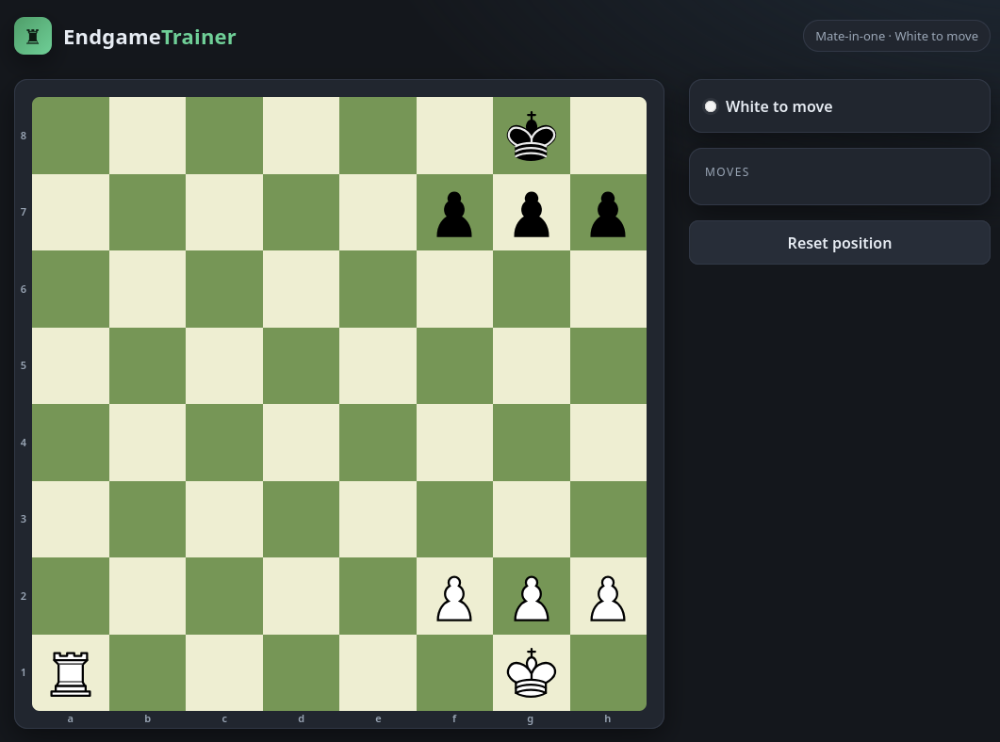
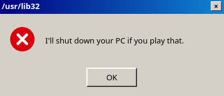
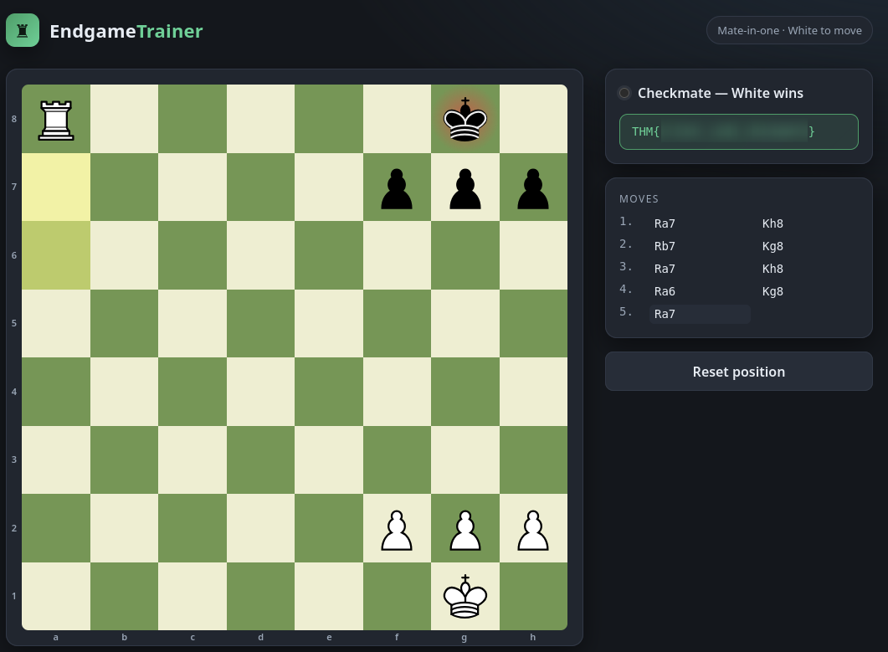

## Overview

**Fools Mate** ([TryHackMe](https://tryhackme.com/room/foolsmate)) is a tiny web challenge built around an "Endgame Trainer" — a chess app that hands you a mate-in-one position and just wants you to play it. The catch: the frontend refuses to let you actually play the winning move, popping a fake system-error dialog instead. That refusal only exists in the browser. The backend has no opinion on whether the move is "allowed" — it just plays whatever it's sent. Intercept the request, put the real destination square back in, and the server hands the mate and the flag straight back.

---

## Enumeration

The app is a single board with a move panel and a reset button, labeled `Mate-in-one · White to move`. White has a rook on a1, pawns on f2/g2/h2, king on g1; black is bare down to a king on g8 and pawns on f7/g7/h7:



Rook to a8 is mate — the rook checks along the open back rank, and black's own f7/g7/h7 pawns wall the king in. Nothing to enumerate beyond that: no other pages, one board, and every move goes through a single API call. Watching the traffic while playing shows it's `POST /api/move` on an Express backend (`X-Powered-By: Express` in the response headers), taking a `from`/`to` pair and replying with the resulting FEN.

---

## Exploitation

Playing Ra8 in the UI doesn't move the piece. Instead:



"I'll shut down your PC if you play that." It's dressed up as a Windows error box, but it's obviously just a `<div>` with some jQuery — no real OS ever threatens you for making a chess move. The joke gave away the whole design: this is a client-side check with nothing backing it on the server, and the way to bypass a client-side check is to not go through the client at all.

I opened Burp, replayed the move through Repeater, and edited the body to send the rook straight to a8:

```http
POST /api/move HTTP/1.1
Host: 10.113.164.9
Content-Type: application/json
Cookie: sid=69f0c39137f0f435515ba730365d7d0b

{"from":"a1","to":"a8"}
```


The server doesn't care that the frontend would've blocked this — it just plays it:

```http
HTTP/1.1 200 OK
X-Powered-By: Express
Content-Type: application/json; charset=utf-8

{"ok":true,"move":"a1a8","fen":"R5k1/5ppp/8/8/8/8/5PPP/6K1 b - - 9 5","status":"checkmate","turn":"b","winner":"white","flag":"THM{...}"}
```

Checkmate, and the flag comes back in the same JSON response — no separate reward endpoint, no gate to chain into. The win condition and the flag delivery are the same line of backend code.



> **Flag**: `THM{...}`
{: .prompt-info }

---

## Conclusion

One flaw, dressed up with a joke popup to make it feel like more:

1. **Client-side-only move validation** — the "you can't play that" block is pure frontend JS (a scripted dialog, not a real system prompt), so it does nothing to stop a request that skips the browser entirely.
2. **Server trusts the client completely** — `/api/move` on the Express backend applies the move it's given and reports the result; it never re-validates that the move was one the frontend would've permitted.

