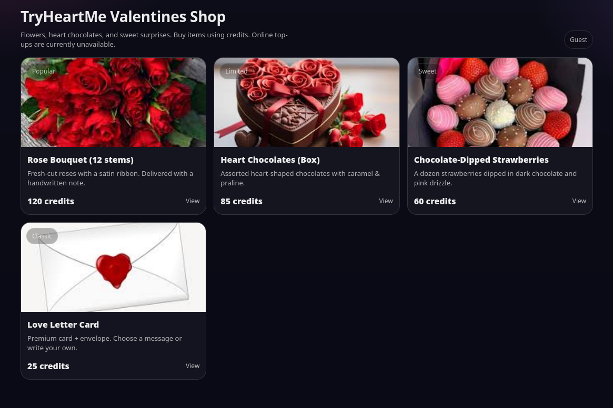
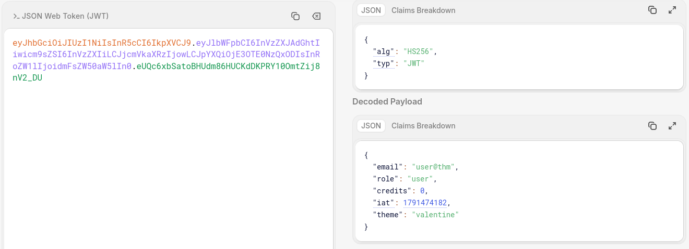
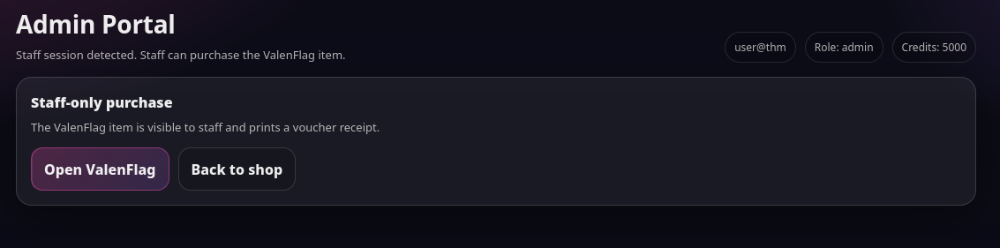
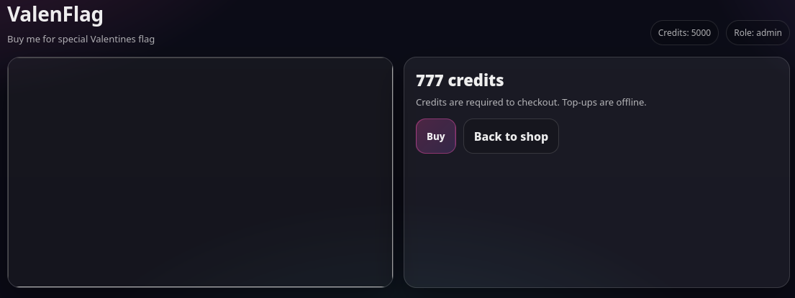
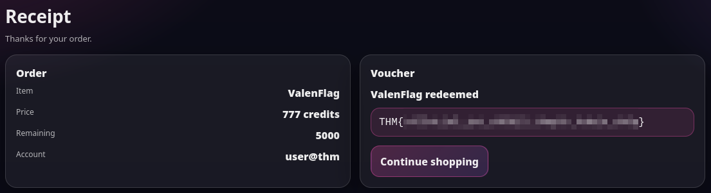

## Overview

[TryHeartMe](https://tryhackme.com/room/lafb2026e5) is a small web box built around a Valentine's-themed shop that runs on credits. The whole thing hinges on one mistake: the session is a JWT, and the server trusts whatever claims the token carries without checking that the signature is still valid. Rewrite `role` to `admin`, top the credit balance up to something that clears checkout, swap the cookie back in, and the staff-only flag item is yours.

## Enumeration

The landing page is the shop itself — flowers, chocolates, a love-letter card, each priced in credits. The header shows a `Guest` badge and a line that top-ups are offline, so there's no obvious way to actually earn credits in-app.



Two auth pages hang off the shop: a registration form ("Create an account to attempt purchases") and a login form. Both take an email and a password, nothing else. I registered a throwaway account and logged in.

The interesting part lands the moment you're authenticated. The session is held in a cookie named `tryheartme_jwt`, and the value is a standard three-part JSON Web Token. A credit economy you can't top up, gated behind a token you fully control on the client side — that's the shape of the box right there.

## Exploitation

### Reading the token

I pulled the cookie value and dropped it into a JWT decoder. Header and payload come straight out:

```json
{
  "alg": "HS256",
  "typ": "JWT"
}
```

```json
{
  "email": "user@thm",
  "role": "user",
  "credits": 0,
  "iat": 1791474182,
  "theme": "valentine"
}
```



So the server is making authorization decisions off `role` and spending decisions off `credits`, and both live in a token the browser hands back on every request. The token is signed with HS256, which *should* mean I can't touch those fields without the server's secret — a tampered payload would fail signature verification and get rejected.

### Forging admin

The only way to know if that verification actually happens is to try it. I rebuilt the payload with the two claims that matter flipped:

```json
{
  "email": "user@thm",
  "role": "admin",
  "credits": 5000,
  "iat": 1791474182,
  "theme": "valentine"
}
```

Re-encoded the token, pasted it back over the `tryheartme_jwt` cookie in the browser's storage, and refreshed. The server took it. No secret, no cracking the HS256 signature — the signature just isn't checked. The header now reads `Role: admin` with a 5000-credit balance, and an **Admin Portal** appears that wasn't there before, advertising a staff-only ValenFlag item.



> The two claims aren't independent. Flipping `role` alone gets you into the portal, but ValenFlag costs 777 credits and the admin view still enforces the price at checkout — so the `credits` bump is what actually completes the exploit. Edit both in the same pass.
{: .prompt-tip }

### Cashing out the flag

The ValenFlag page is a single item priced at 777 credits, with top-ups helpfully marked offline — which is exactly why the forged balance matters.



Hitting **Buy** charges the 777 against the balance I invented and prints a voucher receipt with the flag.



> The voucher reads `THM{...}`.
{: .prompt-info }

## Conclusion

The box is one flaw with two consequences:

1. The app keeps the user's `role` and `credits` in a client-side JWT, trusting the token as the source of truth for both authorization and spending.
2. It never verifies the HS256 signature, so any claim in that token can be rewritten and the server accepts it — turning a guest account into an admin with an arbitrary balance.

Forge the token once and you hold both the privilege and the currency the flag item needs.

| Stage | Tools |
| --- | --- |
| Enumeration | Browser, dev tools |
| Token analysis | JWT decoder |
| Exploitation | JWT payload edit, cookie replacement |
